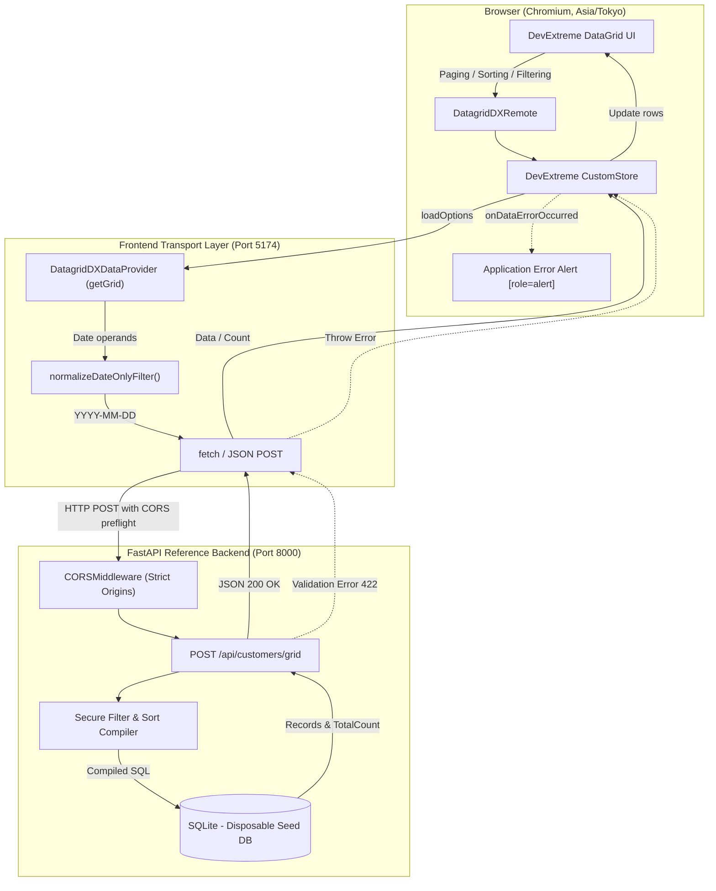

# Requirements

### Overview & Goals
Phase 7 established and validated `DatagridDXRemote`, DevExtreme `CustomStore`, `dataProvider.getGrid()`, and a secure FastAPI/SQLModel query compiler. Phase 7B proves the complete real browser integration across the full stack:
```text
Browser -> React -> React-Admin -> DatagridDXRemote -> DevExtreme CustomStore ->
dataProvider.getGrid() -> date-only transport normalization -> fetch/JSON ->
CORS -> FastAPI -> SQLAlchemy filter compiler -> SQLite -> JSON response -> DevExtreme DataGrid
```
The goal is to deliver a dedicated FastAPI-backed frontend example (`examples/remote-fastapi/frontend`), configure development CORS on the backend, implement a real HTTP `getGrid()` DataProvider with date normalization, establish an automated Playwright E2E suite testing all grid interactions in a non-UTC timezone, integrate E2E into CI, and verify clean isolation.

### Scope
- **In Scope**:
  - Dedicated frontend application under `examples/remote-fastapi/frontend/` reusing root pnpm dependencies.
  - Fixed development ports: Vite frontend on `http://127.0.0.1:5174` (with `--strictPort`), FastAPI backend on `http://127.0.0.1:8000`.
  - Narrow development CORS middleware on FastAPI (`127.0.0.1:5174` and `localhost:5174`, `POST` and preflight `OPTIONS`, `Content-Type` header, no wildcards).
  - Real `DatagridDXDataProvider` implementing `getGrid()` with HTTP `fetch`, error parsing, and non-mutating `normalizeDateOnlyFilter()`.
  - Application-level error display via DevExtreme `onDataErrorOccurred` into an accessible `role="alert"` element.
  - Native DevExtreme columns for 8 customer fields with compiler-supported filter operations.
  - Playwright Test setup using Chromium only, dual `webServer` orchestration, and `Asia/Tokyo` timezone.
  - 13 required E2E test scenarios covering initial load, page size persistence (10 -> 5 -> 25), page navigation, string filtering, numeric filtering, Boolean filtering, multi-sorting, combined queries, date filtering, 422 error display, error recovery, native loading panel, and CORS headers.
  - Disposable, deterministic SQLite database isolation for E2E runs.
  - CI job in `.github/workflows/ci.yml` running `pnpm test:e2e`.
  - Documentation updates in `examples/remote-fastapi/README.md`, root `README.md`, and report in `docs/phase-7b-report.md`.
- **Out of Scope**:
  - No modification or repurposing of `examples/basic/` (retained for in-memory remote demonstration).
  - No new npm package or pnpm workspace creation for the frontend example.
  - No modifications to core package code in `src/` (the adapter remains backend-agnostic).
  - No modifications to the Phase 7 compiler (`filtering.py`, `fields.py`, `query.py`) unless a genuine bug is uncovered.
  - No Grouping, Group Summaries, Total Summary, or Group Paging (Phase 8 scope).
  - No Header Filter, Filter Builder UI, or Search Panel.
  - No CRUD operations, inline editing, or data mutation.
  - No authentication, authorization, or production deployment topology.
  - No Firefox or WebKit cross-browser testing (deferred to release hardening).

### User Stories
- **Developer / Evaluator**: As a developer evaluating `ra-devextreme-grid`, I want to run a real browser application backed by FastAPI so that I can observe remote paging, multi-sorting, filtering, and date handling over genuine HTTP connections.
- **Library Maintainer**: As a maintainer, I want automated Playwright E2E tests validating the browser-to-FastAPI integration in CI so that regressions in transport normalization, pagination state, or compiler integration are detected automatically.
- **Frontend Engineer**: As a frontend engineer, I want clear guidance and a working reference implementation of a React-Admin `DataProvider` consuming `DatagridDXRemote` without leaky abstractions.

### Functional Requirements
- **FR-1 (Frontend Example Structure)**: Create `examples/remote-fastapi/frontend/` with `index.html`, `src/main.tsx`, `src/App.tsx`, `src/dataProvider.ts`, and `src/vite-env.d.ts`.
- **FR-2 (Direct Resource Mounting)**: The remote grid must mount directly inside `<Resource name="remote-customers" list={RemoteCustomerList} />` without being wrapped in React-Admin's `<List>` or calling `getList()`.
- **FR-3 (Real HTTP DataProvider)**: `dataProvider.getGrid(resource, { loadOptions })` must send `POST /api/customers/grid` with payload `{ "loadOptions": { ... } }`, passing filter expressions through `normalizeDateOnlyFilter()`.
- **FR-4 (Minimal Standard Provider Methods)**: Unused standard React-Admin DataProvider methods (`getList`, `getOne`, `create`, `update`, `delete`, etc.) must reject with `"Not implemented in this read-only remote example."`.
- **FR-5 (Native DevExtreme Columns)**: Configure 8 Customer fields (`id`, `name`, `company`, `city`, `country`, `active`, `age`, `joined_on`) with native DevExtreme types and restricted filter operations matching Phase 7 supported operators.
- **FR-6 (Remote Paging & Multi-Sort)**: Configure default page size 10 with selector options `[5, 10, 25]`, and multi-column sorting mode `multiple`.
- **FR-7 (Error Handling & Display)**: Parse FastAPI 422 JSON errors (`detail[0].msg`) into thrown `Error` instances, catch via `onDataErrorOccurred`, and render into an accessible container (`role="alert"`).
- **FR-8 (CORS Configuration)**: FastAPI backend must accept requests from `http://127.0.0.1:5174` and `http://localhost:5174`, responding with `Access-Control-Allow-Origin` without wildcard origins.
- **FR-9 (Deterministic E2E Database)**: E2E runs must use a dedicated, disposable SQLite database initialized with the deterministic 100-row seed dataset via `GRID_DATABASE_URL`.
- **FR-10 (Playwright E2E Suite)**: Execute all 13 required scenarios under Chromium with `Asia/Tokyo` timezone, verifying network payloads and DOM states.

### Non-Functional Requirements
- **NFR-1 (Package Cleanliness)**: `pnpm pack --json` must contain only library distribution files (`dist/`, `README.md`, `LICENSE`, `package.json`). No example code, backend code, or test artifacts may be packaged.
- **NFR-2 (Test Non-Regression)**: All existing 369 Vitest frontend tests and 1,515 Python backend tests must continue passing without weakening.
- **NFR-3 (Cross-Platform Portability)**: Launch commands and path handling must execute seamlessly on both Windows and Linux CI environments.
- **NFR-4 (No Process Leaks)**: Playwright's `webServer` lifecycle must cleanly start and stop Vite and Uvicorn test servers without orphaned processes.
- **NFR-5 (Deterministic Date Transport)**: Date Filter Row inputs must produce `YYYY-MM-DD` strings at the wire boundary, preventing calendar date drift in positive-offset timezones.

# Technical Design

### Current Implementation
- `src/DatagridDXRemote.tsx`: Implements remote grid component consuming `createGridStore`, configuring native DevExtreme `remoteOperations` (paging, sorting, filtering enabled; grouping, summaries disabled), and delegating props to DevExtreme `DataGrid`.
- `src/remote/types.ts`: Defines `DatagridDXDataProvider`, `GetGridParams`, `GetGridLoadOptions`, and `GetGridResult`.
- `examples/remote-fastapi/dateOnlyFilter.ts`: Validated helper converting `joined_on` Date objects to `YYYY-MM-DD` strings locally while preserving operators and next-day exclusive boundaries.
- `examples/remote-fastapi/backend/`: FastAPI backend with `SQLModel`, SQLite database (`customers.db`), and secure query compiler (`filtering.py`, `fields.py`, `query.py`). `create_app(engine)` currently does not configure CORS middleware.

### Key Decisions
1. **Frontend Architecture & Tooling**:
   - *Decision*: Maintain `examples/remote-fastapi/frontend` within the root pnpm project rather than creating a separate `package.json` or pnpm workspace.
   - *Rationale*: Reuses root React, React-Admin, DevExtreme, and Vite dependencies, eliminating redundant lockfiles and workspace overhead.
2. **Backend CORS Architecture**:
   - *Decision*: Inject configurable `cors_origins: Sequence[str] = ()` into `create_app()`, defaulting the standalone dev app to `("http://127.0.0.1:5174", "http://localhost:5174")` while unit tests default to empty CORS.
   - *Rationale*: Preserves backend testability without modifying existing isolated tests while cleanly enabling browser access for the example.
3. **Database Isolation for E2E**:
   - *Decision*: Support an environment variable `GRID_DATABASE_URL` in `app/database.py`. The Playwright backend `webServer` command specifies a temporary, disposable SQLite path seeded fresh on startup.
   - *Rationale*: Prevents pollution or deletion of the developer's default `customers.db` and guarantees deterministic 100-row test state across repeated runs.
4. **Coordinated Dual WebServer Lifecycle**:
   - *Decision*: Use Playwright's built-in `webServer` array in `playwright.config.ts` to launch both Uvicorn and Vite.
   - *Rationale*: Avoids fragile custom Node process management scripts and guarantees clean process startup, readiness polling, and teardown across Windows and Linux.
5. **Deterministic Date Verification**:
   - *Decision*: Set Chromium context `timezoneId: 'Asia/Tokyo'`.
   - *Rationale*: Forces a +9h timezone offset where midnight local time converts to the previous day in UTC (`T15:00:00Z`), definitively verifying that `normalizeDateOnlyFilter()` preserves the calendar date.

### Proposed Changes
- **Backend (`examples/remote-fastapi/backend`)**:
  - `app/main.py`: Update `create_app` signature to accept `cors_origins`. Add `CORSMiddleware` when `cors_origins` is provided with `allow_methods=["POST", "OPTIONS"]`, `allow_headers=["Content-Type"]`, `allow_credentials=False`. Define `LOCAL_DEVELOPMENT_ORIGINS` for module-level `app`.
  - `app/database.py`: Check `os.environ.get("GRID_DATABASE_URL")` before falling back to `DEFAULT_DATABASE_URL`.
  - `tests/test_api.py`: Add test suite verifying CORS headers on allowed origins, preflight `OPTIONS` responses, rejection of unauthorized origins, and absence of wildcards.
- **Frontend Example (`examples/remote-fastapi/frontend`)**:
  - `index.html`: Entry HTML page loading `src/main.tsx`.
  - `src/vite-env.d.ts`: Vite client environment typings.
  - `src/main.tsx`: Mounts `App` in React root with `devextreme/dist/css/dx.light.css`.
  - `src/dataProvider.ts`: Implements `DatagridDXDataProvider` sending `POST /api/customers/grid` with normalized date filters and structured error extraction.
  - `src/App.tsx`: Renders React-Admin `Admin` with `Resource name="remote-customers"`, `DatagridDXRemote`, 8 typed columns, filter row operations, pagination (`[5, 10, 25]`), multi-sorting, and an accessible error alert banner.
- **Playwright Configuration & Tests**:
  - `playwright.config.ts`: Configures Chromium project, `Asia/Tokyo` timezone, readiness URLs (`http://127.0.0.1:8000/openapi.json` and `http://127.0.0.1:5174`), and dual `webServer`.
  - `tests/e2e/grid.spec.ts`: Implements all 13 E2E test scenarios.
  - `tests/e2e/helpers.ts`: Encapsulates reusable DOM selectors for DevExtreme column filter row inputs and row data readers.
- **Root Scripts & CI**:
  - `package.json`: Add `dev:remote-fastapi`, `build:remote-fastapi`, `test:e2e`, and `test:e2e:headed`.
  - `.github/workflows/ci.yml`: Add `e2e` job with pnpm, uv, and Playwright Chromium setup.
  - `.gitignore`: Add Playwright test artifacts and disposable SQLite databases.

### Architecture Diagram


### Data Models / Contracts
- **Wire Request**:
  ```json
  {
    "loadOptions": {
      "skip": 0,
      "take": 10,
      "requireTotalCount": true,
      "sort": [{ "selector": "name", "desc": false }],
      "filter": [["country", "=", "UK"], "and", ["joined_on", ">=", "2021-01-01"]]
    }
  }
  ```
- **Wire Response**:
  ```json
  {
    "data": [
      {
        "id": 8,
        "name": "Henry Smith",
        "company": "Globex",
        "city": "London",
        "country": "UK",
        "active": true,
        "age": 57,
        "joined_on": "2021-04-23"
      }
    ],
    "totalCount": 10
  }
  ```
- **Error Response (422)**:
  ```json
  {
    "detail": [
      {
        "msg": "Unknown filter selector: 'invalid_col'",
        "type": "grid_query_error"
      }
    ]
  }
  ```

### File Structure
```text
ra-devextreme-grid/
├── .github/workflows/
│   └── ci.yml                             [Modified: add e2e job]
├── .junie/plans/
│   └── 010-phase-7b-browser-fastapi-e2e.md [Added: formal phase plan]
├── docs/
│   └── phase-7b-report.md                 [Added: final completion report]
├── examples/
│   └── remote-fastapi/
│       ├── README.md                      [Modified: add browser demo docs]
│       ├── dateOnlyFilter.ts              [Existing: used by frontend]
│       ├── backend/
│       │   ├── app/
│       │   │   ├── main.py                [Modified: configurable CORS]
│       │   │   └── database.py            [Modified: GRID_DATABASE_URL env]
│       │   └── tests/
│       │       └── test_api.py            [Modified: add CORS tests]
│       └── frontend/                      [Added: dedicated example]
│           ├── index.html
│           └── src/
│               ├── App.tsx
│               ├── dataProvider.ts
│               ├── main.tsx
│               └── vite-env.d.ts
├── playwright.config.ts                   [Added: Playwright test configuration]
├── tests/
│   └── e2e/                               [Added: browser test suite]
│       ├── grid.spec.ts
│       └── helpers.ts
├── package.json                           [Modified: add scripts & @playwright/test]
└── .gitignore                             [Modified: add Playwright and test DBs]
```

### Risks & Mitigations
- **Port Conflict in Local Development**: Developer may have other services on 5174 or 8000.
  *Mitigation*: Use `--strictPort` in Vite test commands to fail loudly rather than silently switching ports; configure `reuseExistingServer: !process.env.CI` for developer convenience.
- **DevExtreme Date Editor Locale Formatting**: Browser date pickers may format text differently across environments.
  *Mitigation*: Interact directly with DevExtreme's date picker popup or supply standardized ISO date inputs through public editor APIs; assert on outgoing HTTP request payloads rather than visual date text rendering.
- **DevExtreme Evaluation Warnings in Console**: Console errors fail Playwright tests by default.
  *Mitigation*: Filter known DevExtreme evaluation/trial warnings (`W0019`, `W0021`) in the test error listener while asserting zero application-level exceptions.
- **Process Cleanup on Windows**: Uvicorn/Vite processes lingering if Playwright aborts abruptly.
  *Mitigation*: Rely on Playwright's native process-tree management; use UV's native `--directory` execution flag without subshell chaining.

# Testing

### Validation Approach
Verification combines backend unit tests for CORS/database isolation with an automated Playwright browser test suite executing all real user interactions against live Vite and Uvicorn servers. Outgoing HTTP requests are intercepted and inspected to guarantee payload contract compliance.

### Key Scenarios
1. **Initial Real HTTP Load**:
   - Navigate to `http://127.0.0.1:5174`.
   - Intercept initial `POST /api/customers/grid`.
   - Verify request has `skip: 0`, `take: 10`, `requireTotalCount: true`.
   - Verify grid displays 10 customer rows and pager displays total count.
   - Verify no application error alert is displayed.
2. **Page-Size Selection Persistence (Regression Test)**:
   - Select page size `5` in the visible pager selector.
   - Assert `take: 5` in outgoing request, 5 rows displayed, and selector value stays `5`.
   - Select page size `25`.
   - Assert `take: 25` in outgoing request, 25 rows displayed, and selector value stays `25` without rolling back.
3. **Paging Navigation**:
   - On page size 10, click pager next-page button to move to page 2.
   - Assert `skip: 10`, `take: 10` in outgoing request.
   - Assert row IDs differ from page 1.
4. **String Filtering**:
   - Enter `UK` in the Country column filter row.
   - Assert filter expression `["country", "=", "UK"]` (or `contains`) in outgoing request.
   - Assert all visible rows have country `UK` and totalCount equals 10.
5. **Numeric Filtering**:
   - Select `>=` and enter `50` in Age column filter row.
   - Assert outgoing JSON request has numeric scalar `50` (not `"50"`).
   - Assert visible non-null customer ages are `>= 50`.
6. **Boolean Filtering**:
   - Filter `active = true`.
   - Assert outgoing JSON request contains boolean literal `true` (not `"true"` or `1`).
   - Assert all visible rows have active status `true`.
7. **Multi-Column Sorting**:
   - Sort by Country ASC, then Shift-click Company ASC.
   - Assert outgoing request has `sort: [{"selector": "country", "desc": false}, {"selector": "company", "desc": false}]`.
8. **Combined Query Execution**:
   - Combine filter (`active = true`, `country = UK`), multi-sort (`company ASC`, `name DESC`), page size `5`, and page index `2`.
   - Assert all parameters are represented together in a single request and returned rows match the compound query.
9. **Date Filtering in Non-UTC Timezone**:
   - In `Asia/Tokyo` browser context, select/input `2021-04-23` in Joined Date filter row.
   - Intercept POST body and verify operands are string formatted `YYYY-MM-DD`.
   - Assert no ISO timestamps (`YYYY-MM-DDTHH:mm:ss.sssZ`) cross the wire.
10. **Backend 422 Error Display**:
    - Intercept grid request and inject an invalid selector (`invalid_column`).
    - Forward to real FastAPI backend and verify 422 response.
    - Assert `onDataErrorOccurred` triggers and application displays an alert element with the FastAPI error message.
11. **Error Recovery**:
    - Clear the modified route handler and change filter to a valid condition.
    - Assert the grid successfully loads rows and the error alert is cleared.
12. **Native Loading Indication**:
    - Route a request with a brief simulated delay (e.g., 300ms) before forwarding to FastAPI.
    - Assert DevExtreme's native loading panel (`.dx-loadpanel`) becomes visible during the request and disappears upon resolution.
13. **CORS Response Header Verification**:
    - Inspect the HTTP response headers for `/api/customers/grid`.
    - Assert `Access-Control-Allow-Origin: http://127.0.0.1:5174` is present and matches the frontend origin.

### Edge Cases
- **DevExtreme Date Range Expansion**: Native DevExtreme date equality expands to `>= Jan 15 AND < Jan 16`. The test must assert both boundary operands are normalized date-only strings without asserting obsolete direct equality syntax.
- **Negative and Null Filter Handling**: Numeric filter on nullable `age` must correctly omit `null` entries on greater-than comparisons in accordance with SQL semantics.
- **Rapid Pager Clicks**: Ensuring DevExtreme store cancellations or rapid page changes do not break pager display or leave stale state.

### Test Changes & Verification Matrix
- **Backend Tests**: Add CORS test suite in `examples/remote-fastapi/backend/tests/test_api.py`.
- **E2E Tests**: Add Playwright test suite in `tests/e2e/grid.spec.ts`.
- **Full Verification Suite**:
  1. `pnpm install --frozen-lockfile`
  2. `pnpm lint`
  3. `pnpm format:check`
  4. `pnpm typecheck`
  5. `pnpm test` (369 frontend unit tests)
  6. `pnpm build`
  7. `pnpm build:example`
  8. `pnpm build:remote-fastapi`
  9. `pnpm test:e2e` (Chromium E2E suite)
  10. `pnpm pack --json` (Package file verification)
  11. `uv sync --locked --directory examples/remote-fastapi/backend`
  12. `uv run --directory examples/remote-fastapi/backend ruff check .`
  13. `uv run --directory examples/remote-fastapi/backend ruff format --check .`
  14. `uv run --directory examples/remote-fastapi/backend pytest` (1,515+ backend tests)

# Delivery Steps

### ✓ Step 1: Configure FastAPI CORS and E2E Database Isolation
FastAPI backend supports configurable CORS for Vite frontend origins and allows disposable database configuration for E2E isolation, verified by new unit/integration tests.

- Update `create_app` in `examples/remote-fastapi/backend/app/main.py` with `cors_origins: Sequence[str] = ()` and add FastAPI `CORSMiddleware`.
- Restrict development CORS to `http://127.0.0.1:5174` and `http://localhost:5174`, allowing only `POST` and `OPTIONS` preflight, `Content-Type` header, and no wildcard origins or credentials.
- Update `app.database.py` to allow environment override `GRID_DATABASE_URL` (falling back to `DEFAULT_DATABASE_URL`) to support disposable SQLite databases.
- Add backend CORS and isolation unit tests in `examples/remote-fastapi/backend/tests/test_api.py` verifying allowed origins, preflight `OPTIONS`, `Content-Type` acceptance, disallowed origin rejection, and regression-free standard query execution.
- Run `uv run pytest` to ensure all 1,515+ backend tests pass.

### ✓ Step 2: Implement Dedicated FastAPI Frontend Example
A lightweight, standalone React-Admin example application under `examples/remote-fastapi/frontend` connecting to FastAPI via a real HTTP `DatagridDXDataProvider`.

- Create `examples/remote-fastapi/frontend/index.html` with viewport and CSS styling, and `examples/remote-fastapi/frontend/src/vite-env.d.ts`.
- Create `examples/remote-fastapi/frontend/src/dataProvider.ts` implementing `DatagridDXDataProvider`:
  - `getGrid` maps `remote-customers` to `POST /api/customers/grid`.
  - Normalizes `loadOptions.filter` non-mutatingly using `examples/remote-fastapi/dateOnlyFilter.ts`.
  - Handles HTTP errors by extracting `detail[0].msg` from the FastAPI JSON response and throwing an `Error`.
  - Rejects unused standard DataProvider methods with `"Not implemented in this read-only remote example."`.
- Create `examples/remote-fastapi/frontend/src/App.tsx`:
  - Mounts `RemoteCustomerList` using `DatagridDXRemote` inside `<Admin>` and `<Resource name="remote-customers" />` (without `<List>`).
  - Configures DevExtreme columns matching the 8 customer fields (`id`, `name`, `company`, `city`, `country`, `active`, `age`, `joined_on`) with native DevExtreme types and Phase 7 compiler-supported filter operations.
  - Configures paging (`pageSize: 10`, `allowedPageSizes: [5, 10, 25]`), multi-sort (`mode: 'multiple'`), and filter row (`visible: true`).
  - Hooks `onDataErrorOccurred` to render an accessible alert container (`role="alert"`).
- Create `examples/remote-fastapi/frontend/src/main.tsx` importing DevExtreme theme styles and mounting `App`.
- Add npm scripts to `package.json`: `dev:remote-fastapi` (Vite on `127.0.0.1:5174 --strictPort`) and `build:remote-fastapi`.

### ✓ Step 3: Configure Playwright and Implement Browser E2E Test Suite
Playwright is configured with dual-server startup and a complete Chromium E2E suite covering all 13 required browser scenarios.

- Add `@playwright/test@1.63.0` as root devDependency.
- Create `playwright.config.ts`:
  - Configure Chromium project with `timezoneId: 'Asia/Tokyo'`.
  - Configure two `webServer` entries: FastAPI backend (`127.0.0.1:8000`, readiness at `/openapi.json`, setting `GRID_DATABASE_URL` to disposable db) and Vite frontend (`127.0.0.1:5174`, readiness at root `/`).
  - Enable `reuseExistingServer: !process.env.CI` and conservative worker count (`workers: 1`).
- Implement E2E test scenarios in `tests/e2e/grid.spec.ts` with helper selectors in `tests/e2e/helpers.ts`:
  - Initial load and request payload verification (`skip`, `take`, `requireTotalCount`).
  - Page-size selection switching (10 -> 5 -> 25) asserting persistent `take` values without rollback.
  - Page navigation asserting `skip: 10` on page 2 and row ID changes.
  - String filtering (`country = UK` and `country contains UK`).
  - Numeric filtering (`age >= 50`) asserting numeric JSON scalar typing.
  - Boolean filtering (`active = true`) asserting boolean JSON literal typing.
  - Multi-column sorting asserting ordered sort descriptors.
  - Combined filter, multi-sort, and paging in a single request.
  - Date filtering asserting `YYYY-MM-DD` operands without UTC timestamp rollover in Tokyo timezone.
  - Real backend HTTP 422 error interception and application alert display.
  - Error recovery verifying valid interactions restore grid rows after a failure.
  - Native loading panel indication during delayed requests.
  - CORS response header verification (`Access-Control-Allow-Origin: http://127.0.0.1:5174`).
  - Page error listeners rejecting unhandled browser errors while ignoring documented DevExtreme trial warnings.
- Add `test:e2e` and `test:e2e:headed` scripts to `package.json`.

### ✓ Step 4: Integrate CI Workflow and Enforce Package Isolation
GitHub Actions CI workflow executes the E2E browser test suite in an isolated runner job, and build artifacts/databases are cleanly separated.

- Add an `e2e` job to `.github/workflows/ci.yml` setting up Node/pnpm, Python/uv, installing Chromium (`pnpm exec playwright install --with-deps chromium`), syncing backend dependencies (`uv sync --locked`), and executing `pnpm test:e2e`.
- Configure failure artifact upload (traces, screenshots) for the `e2e` CI job.
- Update `.gitignore` to ignore Playwright artifacts (`test-results/`, `playwright-report/`) and disposable test databases (`*.db`, `*.db-journal`).
- Verify npm pack output (`pnpm pack --json`) to confirm no test, backend, or example frontend files leak into the library distribution package.

### ✓ Step 5: Document, Verify, and Generate Phase 7B Report
Project documentation is updated, the plan document is created, and the complete verification suite passes with a comprehensive Phase 7B report.

- Create `.junie/plans/010-phase-7b-browser-fastapi-e2e.md` recording the approved design and delivery architecture.
- Update `examples/remote-fastapi/README.md` with two-terminal development instructions, CORS explanation, date-only transport documentation, and E2E test commands.
- Update root `README.md` marking Phase 7B as completed and linking to the FastAPI browser example.
- Create `docs/phase-7b-report.md` documenting implementation details, network request evidence (paging, sorting, filtering, dates, errors), CORS headers, test results, and Phase 8 readiness.
- Execute full verification: `pnpm lint`, `pnpm format:check`, `pnpm typecheck`, `pnpm test`, `pnpm build`, `pnpm build:example`, `pnpm build:remote-fastapi`, `pnpm test:e2e`, `uv run ruff check .`, `uv run ruff format --check .`, `uv run pytest`.
