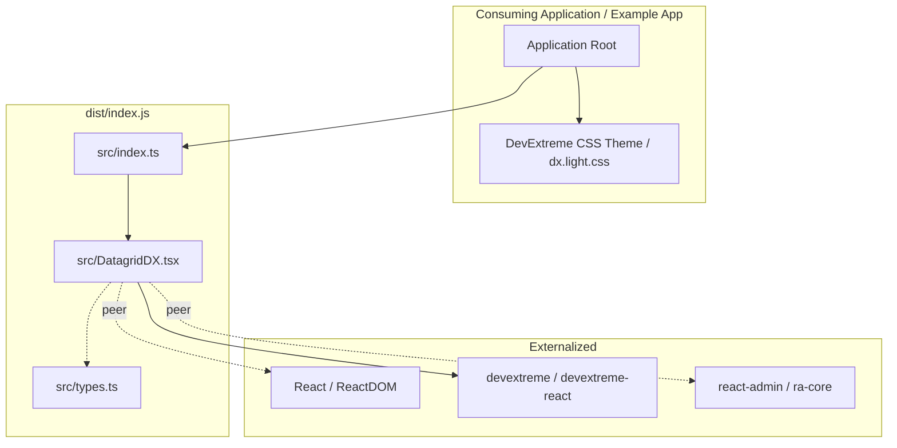

# Requirements

### Overview & Goals
The objective of Phase 0 is to establish a rock-solid, production-grade repository and toolchain foundation for `ra-devextreme-grid`. The project bridges React-Admin and DevExpress DevExtreme React DataGrid. Before implementing managed list adapters, remote data providers, selection, or backend integrations in subsequent phases, this phase establishes:
- Strict TypeScript library build targeting modern ES modules.
- Clean externalisation of all peer dependencies (`react`, `react-dom`, `react-admin`, `devextreme`, `devextreme-react`).
- Zero theme enforcement inside the library, leaving CSS theme selection to the consuming application.
- Comprehensive automated testing using Vitest, React Testing Library, and jsdom.
- Modern code hygiene toolchain (ESLint flat config, Prettier, strict TypeScript).
- A minimal interactive proof-of-concept example.
- GitHub Actions CI workflow for pull requests and pushes.

### Scope
#### In Scope (Phase 0)
- Repository hygiene: `.gitignore`, MIT `LICENSE`, `README.md`.
- Package configuration: `package.json` with metadata, pnpm package manager, peer dependencies, and `pnpm-lock.yaml`.
- Tooling: Strict `tsconfig.json`, Vite library bundling with TypeScript declaration generation (`vite-plugin-dts`), ESLint flat config, Prettier.
- Implementation: Proof-of-installation `DatagridDX` component accepting static data and passing through DevExtreme DataGrid props.
- Packaging: Exporting `DatagridDX` and related prop types from `src/index.ts`.
- Example: Standalone dev example (`examples/basic`) importing `DatagridDX` and a DevExtreme theme.
- Testing: Vitest + React Testing Library unit tests verifying component rendering and exports.
- CI: GitHub Actions workflow running `install`, `lint`, `format:check`, `typecheck`, `test`, `build`, and package dry-run verification.
- Documentation: Phase 0 Implementation Plan (`.junie/plans/001-phase-0-repository-foundation.md`) and comprehensive Final Report.

#### Out of Scope (Deferred to Later Phases)
- React-Admin `ListContext` consumption or managed list state (Phase 1).
- React-Admin pagination and single/multi-column sorting (Phase 2).
- Selection and row click navigation (`selectedIds`, `onSelect`) (Phase 3).
- React-Admin filter row and DevExtreme grid filtering synchronization (Phase 4).
- Remote operations mode (`DatagridDXRemote`, `CustomStore`, `getGrid()`) (Phase 5).
- Python backend reference implementation (FastAPI, SQLModel, UV) (Phase 6+).
- Inline editing, grouping, summaries, and advanced export features.
- Publishing to npm registry (dry-run inspection only).

### User Stories
- **As a library maintainer**, I want a deterministic, reproducible pnpm build and test pipeline so that subsequent integration phases can be implemented against tested foundational standards.
- **As a React-Admin developer**, I want to install `ra-devextreme-grid` without bundling redundant copies of React, React-Admin, or DevExtreme, so that bundle size and runtime instance collisions are avoided.
- **As a consumer of the library**, I want the library to remain theme-agnostic so that my application can choose and configure whichever DevExtreme theme fits our brand.

### Functional Requirements & Acceptance Criteria
1. **Package Exports**:
   - `src/index.ts` must export `DatagridDX` and `DatagridDXProps`.
   - Built output in `dist/` must include ES module JavaScript (`index.js`) and TypeScript declarations (`index.d.ts`).
2. **DatagridDX Component**:
   - Accepts static data via a typed `data` or `dataSource` prop.
   - Forwards additional native DevExtreme `IDataGridOptions` props cleanly.
   - Supports child components (e.g., DevExtreme `<Column />`).
   - Does not import or bundle any DevExtreme CSS files.
3. **Example Application**:
   - Provides an interactive dev server (`pnpm dev`) rendering `DatagridDX` with sample records.
   - Imports DevExtreme CSS (`dx.light.css`) at the application entry level.
4. **Automated Testing**:
   - Tests verify that `DatagridDX` renders without crashing, displays static data, and accepts native props.
   - Vitest runs in non-watch mode via `pnpm test`.
5. **Quality Checks**:
   - `pnpm lint`, `pnpm format:check`, `pnpm typecheck`, `pnpm test`, and `pnpm build` must pass with zero errors.
   - `pnpm pack --dry-run` must verify that the published tarball contains only `dist/`, `package.json`, `README.md`, and `LICENSE`.

### Non-Functional Requirements
- **Strict Typing**: TypeScript `strict: true`, no implicit `any`, and generic types for record payloads.
- **Package Hygiene**: Single package repository layout (avoiding premature monorepo complexity), using `pnpm` exclusively.
- **Legal Compliance**: Explicit MIT licence with Copyright (c) 2026 Paul Cunningham, disclaimers clarifying independence from DevExpress and Marmelab, and noting DevExtreme licensing obligations.

# Technical Design

### Current Implementation
The repository is newly initiated on branch `main` with no existing code, containing only IDE configuration (`.idea/`) and the product specification (`.junie/plans/000-prd.md`). There is currently no `package.json`, build configuration, or source tree.

### Key Decisions
1. **Repository Layout: Single-Package Layout over Monorepo**
   - *Decision*: Maintain a single root package with `src/` for library code and `examples/basic/` for the interactive demonstration.
   - *Rationale*: A monorepo introduces workspace coordination, version synchronization, and multi-package publish overhead unnecessary for Phase 0. Using `"files": ["dist"]` in `package.json` cleanly isolates the published library from example and test files.
2. **Build Tool: Vite Library Mode with `vite-plugin-dts`**
   - *Decision*: Use Vite 8 with Rollup externalization and `vite-plugin-dts` for declaration bundling.
   - *Rationale*: Vite provides unmatched build speed and native ES module bundling while allowing `rollupOptions.external` to cleanly exclude peer dependencies (`react`, `react-dom`, `react-admin`, `devextreme`, `devextreme-react`).
3. **Peer Dependency Version Alignment**
   - *Decision*: Support React 18/19 and DevExtreme 24-26 in peer dependencies, with pinned modern versions for dev/testing:
     - `react`: `^19.3.0` (peer: `^18.0.0 || ^19.0.0`)
     - `react-dom`: `^19.3.0` (peer: `^18.0.0 || ^19.0.0`)
     - `react-admin`: `^5.15.3` (peer: `^5.0.0`)
     - `devextreme`: `^26.1.4` (peer: `^24.0.0 || ^25.0.0 || ^26.0.0`)
     - `devextreme-react`: `^26.1.4` (peer: `^24.0.0 || ^25.0.0 || ^26.0.0`)
     - `typescript`: `~5.7.0` / `^7.0.0`
     - `vite`: `^8.2.0`
     - `vitest`: `^5.0.0`
   - *Rationale*: Confirmed via npm registry metadata that React 19 is officially supported by both React-Admin 5.15 and DevExtreme React 26.1.
4. **Theme Decoupling**
   - *Decision*: Never import `devextreme/dist/css/*` in library code; document application-level import in `README.md` and implement it in `examples/basic/main.tsx`.
   - *Rationale*: Consuming applications must have complete control over styling, custom themes, and light/dark mode switching without library CSS overriding user styles.

### Component Contracts
#### DatagridDX Props
```typescript
import type React from 'react';
import type { IDataGridOptions } from 'devextreme-react/data-grid';

export interface DatagridDXProps<RecordType = Record<string, unknown>>
  extends Omit<IDataGridOptions, 'dataSource'> {
  /**
   * Static or pre-loaded record array.
   */
  data?: RecordType[];
  /**
   * DevExtreme native dataSource (passed through if `data` is omitted).
   */
  dataSource?: IDataGridOptions['dataSource'];
  /**
   * Child elements, such as DevExtreme <Column /> configurations.
   */
  children?: React.ReactNode;
}
```

### Component Implementation (`src/DatagridDX.tsx`)
```tsx
import React from 'react';
import DataGrid from 'devextreme-react/data-grid';
import type { DatagridDXProps } from './types';

export function DatagridDX<RecordType = Record<string, unknown>>({
  data,
  dataSource,
  children,
  ...restProps
}: DatagridDXProps<RecordType>): React.JSX.Element {
  const resolvedDataSource = data ?? dataSource;

  return (
    <DataGrid dataSource={resolvedDataSource} {...restProps}>
      {children}
    </DataGrid>
  );
}
```

### File Structure
```text
ra-devextreme-grid/
├── .github/
│   └── workflows/
│       └── ci.yml
├── .junie/
│   └── plans/
│       ├── 000-prd.md
│       └── 001-phase-0-repository-foundation.md
├── examples/
│   └── basic/
│       ├── index.html
│       ├── main.tsx
│       └── App.tsx
├── src/
│   ├── index.ts
│   ├── DatagridDX.tsx
│   └── types.ts
├── tests/
│   ├── setup.ts
│   ├── index.test.ts
│   └── DatagridDX.test.tsx
├── .gitignore
├── .prettierignore
├── .prettierrc
├── eslint.config.js
├── LICENSE
├── package.json
├── pnpm-lock.yaml
├── README.md
├── tsconfig.json
├── vite.config.ts
└── vitest.config.ts
```

### Architecture Diagram


### Risks, Constraints & Mitigations
- **jsdom Limitations with DevExtreme DOM**: DevExtreme's DataGrid calculates dimensions and attaches DOM event listeners that require `window.matchMedia` and `ResizeObserver`.
  *Mitigation*: Provide mocks in `tests/setup.ts` and test structural presence, properties, and cell contents without relying on layout-dependent DOM measurements.
- **Accidental Peer Bundling**: Including React or DevExtreme inside `dist/index.js` causes dual-instance runtime errors in consuming applications.
  *Mitigation*: Configure `rollupOptions.external` with regex matching `/^react\//`, `/^devextreme\//`, `/^react-admin\//`, and verify bundle output using `pnpm pack --dry-run`.

# Testing

### Validation Approach
Automated verification is conducted at three levels:
1. **Static Analysis & Compilation**: Strict TypeScript checking (`tsc --noEmit`), ESLint flat config analysis, and Prettier style checks.
2. **Unit & Component Testing**: Vitest running in `jsdom` testing package exports and `DatagridDX` rendering behavior using `@testing-library/react`.
3. **Package Distribution Audit**: Automated build via Vite and package dry-run inspection via `pnpm pack --dry-run` to confirm package hygiene and absence of bundled peer dependencies.

### Key Scenarios
1. **Public API Exports (`tests/index.test.ts`)**:
   - Verify that `DatagridDX` is exported as a valid React component from `ra-devextreme-grid`.
2. **Component Mounting & Baseline Render (`tests/DatagridDX.test.tsx`)**:
   - Verify that `<DatagridDX />` mounts in the DOM without throwing runtime exceptions.
3. **Data Binding (`tests/DatagridDX.test.tsx`)**:
   - Render static records (`[{ id: 1, name: 'Alice' }, { id: 2, name: 'Bob' }]`) and assert that table elements or cell contents display the expected data.
4. **Column & Child Element Support (`tests/DatagridDX.test.tsx`)**:
   - Verify that child DevExtreme `<Column />` components are accepted and processed.
5. **Native Prop Passthrough (`tests/DatagridDX.test.tsx`)**:
   - Verify that native DevExtreme properties (such as `showBorders={true}`, `keyExpr="id"`, or `aria-label`) are passed through to the underlying DevExtreme DataGrid instance.

### Edge Cases & jsdom Setup
- **Missing Browser APIs**: DevExtreme requires `window.matchMedia` and `ResizeObserver`.
  - In `tests/setup.ts`, stub `window.matchMedia` and `global.ResizeObserver` to prevent unhandled exceptions during test execution.
- **DOM Layout Rendering**: DevExtreme does not compute full pixel column widths in headless jsdom. Tests will avoid brittle assertions on pixel widths or internal DevExtreme class hierarchies, focusing instead on semantic DOM content and props.

### Verification Commands & Checkpoints
All of the following commands must execute cleanly with zero exit code:
```bash
pnpm install --frozen-lockfile
pnpm lint
pnpm format:check
pnpm typecheck
pnpm test
pnpm build
pnpm pack --dry-run
```

# Documentation & Reporting

### Phase 0 Implementation Plan Document
As required by Section 4 of the PRD task, the delivery includes generating:
`.junie/plans/001-phase-0-repository-foundation.md`

This document will explicitly record:
1. Current repository baseline and initial git status.
2. Proposed file and directory layout.
3. Concrete dependency and version selections (React 19, React-Admin 5, DevExtreme 26, Vite 8, Vitest 5, TypeScript 5.7+).
4. Build configuration and externalisation rules.
5. Testing setup with jsdom and polyfill details.
6. Linting and formatting rules.
7. Package export contracts.
8. Interactive example architecture.
9. GitHub Actions CI pipeline structure.
10. Exact list of files created or modified.
11. Risks, limitations, and mitigations.

### Final Review & Reporting Strategy
Upon completion of the Phase 0 implementation and verification, a structured report will be delivered covering all 14 required sections:
1. **Implementation summary**: Concrete outcomes of Phase 0.
2. **Repository structure**: Directory tree of the resulting repository.
3. **Dependency and version decisions**: Precise versions selected and compatibility findings.
4. **Files changed**: Comprehensive ledger of created and modified files.
5. **Public API**: Complete declaration of exported symbols from `src/index.ts`.
6. **Design decisions**: Rationale for single-package layout, Vite lib mode, and theme decoupling.
7. **Tests added**: Inventory of unit tests and what they prove.
8. **Verification**: Command execution outputs for lint, format, typecheck, test, and build.
9. **Current test count**: Total number of passing unit tests.
10. **Package contents**: Breakdown of tarball contents from `pnpm pack --dry-run`.
11. **CI**: GitHub Actions workflow details and local verification parity.
12. **Deviations from Phase 0 plan**: Any adjustments made during implementation.
13. **Known limitations**: Intentional Phase 0 exclusions (deferred to Phases 1-5).
14. **Risks or concerns**: Candidate issues to address before Phase 1.
15. **PRD feedback & Recommended next step**: Feedback on `.junie/plans/000-prd.md` and green light assessment for Phase 1 (Read-Only Managed Grid).

# Delivery Steps

### ✓ Step 1: Initialise repository foundation, licensing, and package metadata
The repository has valid licensing, metadata, and git hygiene configurations ready for pnpm package management.
- Create `.gitignore` tailored for Node, pnpm, TypeScript/Vite build artifacts (`dist`), coverage, environment files, and IDE configs.
- Create `LICENSE` using the MIT licence with `Copyright (c) 2026 Paul Cunningham`.
- Initialize `package.json` with package metadata (`name`: `ra-devextreme-grid`, initial version `0.0.0`, type `module`, peer dependencies, license, files list restricted to `dist/`).
- Commit `.junie/plans/001-phase-0-repository-foundation.md` outlining the repository state, architecture choices, and Phase 0 roadmap.

### ✓ Step 2: Configure TypeScript, Vite library build, and linting/formatting toolchain
TypeScript, Vite library bundling, ESLint, and Prettier are configured and callable via standard package scripts.
- Create `tsconfig.json` configuring strict TypeScript, modern ES module resolution, JSX preservation/react-jsx, and declaration output settings.
- Create `vite.config.ts` configuring library mode targeting `src/index.ts` with ES format output (`dist/index.js`), `vite-plugin-dts` for declaration generation (`dist/index.d.ts`), and strict Rollup externalisation for React, React DOM, React-Admin, and DevExtreme.
- Create `eslint.config.js` with ESLint flat configuration for TypeScript, React, and React Hooks.
- Create `.prettierrc` and `.prettierignore` for code formatting.
- Add standard scripts to `package.json`: `lint`, `format:check`, `format`, `typecheck`, `test`, `build`, and `dev`.

### ✓ Step 3: Implement minimal DatagridDX component and public package exports
The library exports a functioning proof-of-installation DatagridDX component and clean public TypeScript declarations.
- Create `src/DatagridDX.tsx` accepting static `data`, DevExtreme native grid options (`IDataGridOptions`), and child elements (such as native `<Column />`), without prematurely coupling to React-Admin `ListContext`.
- Ensure `src/DatagridDX.tsx` uses generic record typings (`RecordType = Record<string, unknown>`) and does not import global DevExtreme CSS themes.
- Create `src/index.ts` as the primary library entry point, exporting `DatagridDX` and its prop interfaces (`DatagridDXProps`).
- Run `pnpm build` to verify compilation, declaration generation in `dist/`, and externalisation of peer dependencies.

### ✓ Step 4: Create automated testing suite and jsdom compatibility configuration
Vitest and React Testing Library run in jsdom with necessary browser polyfills, verifying the component without fragile DOM assertions.
- Create `vitest.config.ts` configuring Vitest with `jsdom` environment and test setup scripts.
- Create `tests/setup.ts` installing `@testing-library/jest-dom` matchers and mock polyfills for `window.matchMedia` and `ResizeObserver` needed by DevExtreme.
- Create `tests/index.test.ts` verifying entry point exports.
- Create `tests/DatagridDX.test.tsx` verifying component mounting, static data rendering, column display, and native prop passthrough.
- Verify test suite runs via `pnpm test`.

### ✓ Step 5: Build minimal interactive development example and documentation
A lightweight interactive example application runs in dev mode, and README.md documents usage and licensing.
- Create `examples/basic/index.html` and `examples/basic/main.tsx` demonstrating `DatagridDX` with static records and columns, importing a DevExtreme theme (`dx.light.css`) at the application layer.
- Add `examples/tsconfig.json` or configure root tsconfig/vite to seamlessly resolve `ra-devextreme-grid` during development.
- Write `README.md` documenting project purpose, early status, installation notes, basic example, development commands, independent project disclaimer, and DevExpress licensing notice.
- Run `pnpm dev` or example build to ensure the example renders correctly.

### ✓ Step 6: Set up GitHub Actions CI workflow, run complete verification, and perform package dry-run audit
The automated CI pipeline runs on GitHub Actions and all local quality and package dry-run checks pass.
- Create `.github/workflows/ci.yml` triggering on push and pull request to `main`, executing pnpm install (`--frozen-lockfile`), lint, format check, typecheck, test, and build.
- Execute local verification run: `pnpm lint`, `pnpm format:check`, `pnpm typecheck`, `pnpm test`, and `pnpm build`.
- Perform package publication dry-run via `pnpm pack --dry-run` and inspect tarball contents to confirm that only `dist/`, `README.md`, `LICENSE`, and `package.json` are packaged.
- Produce the required Phase 0 final review report addressing all 14 criteria in Issue #24.