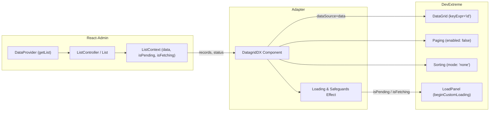

# Requirements

### Overview & Goals
Phase 1 transitions `DatagridDX` from the Phase 0 proof-of-installation standalone component into the first genuine React-Admin managed grid integration.

In this phase:
- **React-Admin owns the records**: The surrounding React-Admin `<List>` controller fetches and provides the records via `useListContext<RecordType>()`.
- **DevExtreme renders the records**: The grid faithfully renders the records supplied by React-Admin without reshaping them.
- **Standalone props are retired**: The temporary `data` and `dataSource` props are removed. `DatagridDX` becomes exclusively a managed component.
- **Canonical record identity**: DevExtreme `keyExpr` is locked to `"id"` matching React-Admin's canonical identifier model (`record.id`).
- **Data shaping is guarded**: DevExtreme's independent client-side paging and interactive column sorting are explicitly disabled to prevent misrepresenting server-ordered pages.

### Scope

#### In Scope
- **Managed ListContext integration**: Consuming `data`, `isPending`, and `isFetching` from React-Admin's `useListContext<RecordType>()`.
- **Breaking API cleanup**: Removing provisional Phase 0 `data`, `dataSource`, and public `keyExpr` props from `DatagridDXProps`.
- **Record typing**: Supporting generic records `RecordType extends RaRecord = RaRecord` with string or numeric `id`.
- **Loading lifecycle**: Handling initial pending states cleanly (suppressing premature "No data" flashes and displaying DevExtreme's loading UI) and preserving visible rows during background refetches.
- **Data-shaping safeguards**: Disabling DevExtreme paging (`paging.enabled = false`) and sorting (`sorting.mode = "none"`).
- **Column projection**: Continuing support for DevExtreme `<Column>` child elements.
- **Peer dependency review**: Tightening DevExtreme peer dependencies to tested versions (`^26.1.0`).
- **Example app & README**: Updating the basic example to a genuine React-Admin `<List>` with in-memory data, and documenting the managed API in `README.md`.
- **Phase 1 Plan Document**: Creating `.junie/plans/002-phase-1-read-only-managed-grid.md`.

#### Out of Scope
- **Phase 2 (Paging & Sorting)**: Wiring React-Admin `page`, `perPage`, `sort`, `setPage`, `setPerPage`, `setSort`, or DevExtreme pager controls.
- **Phase 3 (Selection & Navigation)**: Checkbox selection, bulk actions, row clicks (`rowClick="edit"`), navigation.
- **Phase 4 (Filtering)**: Filter row, header filters, search panel, filter translation.
- **Phase 5 (Remote Mode & CustomStore)**: `DatagridDXRemote`, `CustomStore`, `remoteOperations`.
- **Field abstraction**: Custom cell wrappers like `<TextField />` or `<ReferenceField />`.
- **Editing / Mutations**: Cell or row editing, create, update, or delete operations.
- **Backend / Python**: Reference backends (FastAPI / SQLModel).

### User Stories
- **As a React-Admin developer**, I want to place `<DatagridDX>` inside a standard `<List>` component so that my records are rendered using DevExtreme's DataGrid without duplicate network requests.
- **As a developer**, I want `<DatagridDX>` to use `record.id` as the row key by default so that I don't have to configure `keyExpr="id"` manually on every list.
- **As an end user**, I want to see a clear loading indicator instead of a flash of "No data" when the list is initially loading.
- **As an end user**, I want to keep seeing existing data while background refreshes occur without UI flicker.
- **As an end user**, I do not want column headers to trigger misleading local sorts that only reorder the current page.

### Functional Requirements
1. **Single Data Fetch Owner**:
   - `DatagridDX` must NOT call `dataProvider.getList()`, `dataProvider`, or maintain duplicate record state.
   - Initial loading must trigger exactly one `getList()` call from React-Admin's list controller.
2. **Prop Contract (`DatagridDXProps`)**:
   - Omits `dataSource` and `keyExpr` from native DevExtreme `IDataGridOptions`.
   - Omits Phase 0 `data` prop.
   - Forwards harmless native DevExtreme props (e.g. `showBorders`, `showRowLines`, `hoverStateEnabled`, `height`, `width`, `columnAutoWidth`).
3. **Record Keys & Types**:
   - Row key is fixed internally to `keyExpr="id"`.
   - Records with string IDs (e.g. `'cust-001'`) and numeric IDs (e.g. `42`) must render and be identified properly.
4. **Loading & Empty State**:
   - When `data === undefined` and `isPending === true`: grid renders without throwing, DevExtreme loading indicator is activated via `beginCustomLoading()`, and `noDataText` is suppressed (`""`) to prevent premature "No data" messages.
   - When `data === []` and `isPending === false`: grid displays configured `noDataText` (or DevExtreme default).
   - When `data` is populated and `isFetching === true` (background refetch): existing rows remain visible, unobtrusive loading indication is shown, and data is not cleared.
5. **Data-Shaping Safeguards**:
   - DevExtreme paging is explicitly set to `enabled: false`.
   - DevExtreme sorting mode is explicitly set to `mode: "none"`.
   - These settings win over any user-passed configuration to maintain single-page fidelity until Phase 2.

### Non-Functional Requirements
- **Bundle Externalization**: `react`, `react-dom`, `react-admin`, `ra-core`, `devextreme`, and `devextreme-react` must remain externalized in Vite library build.
- **TypeScript Declarations**: Generated `.d.ts` files must preserve generic `RecordType extends RaRecord`, avoid `any` degradation, and cleanly omit internal or adapter-owned properties.
- **No CSS Bundling**: The library does not import or bundle DevExtreme CSS; theme selection remains the application's responsibility.

# Technical Design

### Current Implementation
In Phase 0:
- `DatagridDX` accepted standalone `data?: TRow[]` or `dataSource?: IDataGridOptions['dataSource']`.
- `keyExpr` was optionally passed by the consumer.
- No React-Admin hooks or contexts were consumed.
- DevExtreme DataGrid options for paging and sorting remained at DevExtreme defaults.

### Key Decisions
1. **End Standalone API in DatagridDX**:
   - *Decision*: Remove `data` and `dataSource` props; consume `useListContext<RecordType>()` directly.
   - *Rationale*: React-Admin components designed for `<List>` must have a single source of truth. Dual-mode components introduce ambiguous data ownership, conditional hook antipatterns, and maintenance burden. Remote mode will later be implemented cleanly as `DatagridDXRemote`.
2. **Lock `keyExpr` to `"id"`**:
   - *Decision*: Omit `keyExpr` from `DatagridDXProps` and configure `keyExpr="id"` internally.
   - *Rationale*: In React-Admin, `record.id` is the canonical identifier. Allowing an arbitrary `keyExpr` would create desynchronization between React-Admin selection/mutations and DevExtreme row state.
3. **Loading Strategy**:
   - *Decision*: Use DevExtreme's `beginCustomLoading()` / `endCustomLoading()` wrapped in a `useEffect` on `[isPending, isFetching]`, combined with dynamic `noDataText={isPending ? '' : (props.noDataText ?? 'No data')}`.
   - *Rationale*: Avoids custom DOM spinners, leverages DevExtreme's native load panel, prevents "No data" flashing during initial fetch, and keeps rows visible during background refetch.
4. **Data-Shaping Safeguards**:
   - *Decision*: Enforce `paging={{ enabled: false }}` and `sorting={{ mode: 'none' }}` unconditionally.
   - *Rationale*: DevExtreme's client-side paging and interactive column sorting would otherwise reorder or slice only the current server page fetched by React-Admin. This preserves data integrity until Phase 2 implements bidirectional synchronization.
5. **Peer Dependency Narrowing**:
   - *Decision*: Narrow DevExtreme peer dependencies from `">=24.0.0 <27.0.0"` to `"^26.1.0"`.
   - *Rationale*: Only DevExtreme 26.1.4 has been installed and tested. The PRD principle states: "Peer dependency ranges should only be widened when tested."

### Proposed Changes
#### 1. `src/types.ts`
```ts
import type { IDataGridOptions } from 'devextreme-react/data-grid';
import type { RaRecord } from 'react-admin';

export type DatagridDXProps<RecordType extends RaRecord = RaRecord> =
  Omit<IDataGridOptions<RecordType, RecordType['id']>, 'dataSource' | 'keyExpr'>;
```

#### 2. `src/DatagridDX.tsx`
```tsx
import { forwardRef, useEffect, useImperativeHandle, useRef, type ForwardedRef } from 'react';
import { DataGrid, type DataGridRef } from 'devextreme-react/data-grid';
import { useListContext, type RaRecord } from 'react-admin';
import type { DatagridDXProps } from './types';

const DEFAULT_EMPTY_ARRAY: any[] = [];

export const DatagridDX = forwardRef(function DatagridDX<
  RecordType extends RaRecord = RaRecord,
>(
  props: DatagridDXProps<RecordType>,
  ref: ForwardedRef<DataGridRef<RecordType, RecordType['id']>>,
) {
  const { data, isPending, isFetching } = useListContext<RecordType>();
  const innerRef = useRef<DataGrid<RecordType, RecordType['id']> | null>(null);

  useImperativeHandle(ref, () => innerRef.current as any, []);

  useEffect(() => {
    const grid = innerRef.current?.instance();
    if (!grid) return;

    if (isPending || isFetching) {
      grid.beginCustomLoading();
    } else {
      grid.endCustomLoading();
    }
  }, [isPending, isFetching]);

  const {
    children,
    noDataText,
    paging: _userPaging,
    sorting: _userSorting,
    ...restProps
  } = props;

  return (
    <DataGrid<RecordType, RecordType['id']>
      ref={innerRef}
      keyExpr="id"
      dataSource={data ?? DEFAULT_EMPTY_ARRAY}
      noDataText={isPending ? '' : (noDataText ?? 'No data')}
      paging={{ enabled: false }}
      sorting={{ mode: 'none' }}
      {...restProps}
    >
      {children}
    </DataGrid>
  );
});
```

#### 3. Architecture Diagram


### File Structure
- `src/DatagridDX.tsx` - Managed React-Admin grid component consuming `useListContext`.
- `src/types.ts` - Clean public `DatagridDXProps` definition extending `IDataGridOptions` without `dataSource` or `keyExpr`.
- `src/index.ts` - Public exports: `DatagridDX` and `DatagridDXProps`.
- `tests/DatagridDX.test.tsx` - Integration and unit tests covering React-Admin context, typing, loading, empty states, and safeguards.
- `tests/setup.ts` - JSDOM test environment setup with custom element lifecycle teardown workaround.
- `examples/basic/src/App.tsx` - Working React-Admin example with in-memory data provider and DevExtreme theme.
- `.junie/plans/002-phase-1-read-only-managed-grid.md` - Phase 1 architecture and implementation record.
- `package.json` - Tightened DevExtreme peer dependencies.
- `README.md` - Managed grid usage documentation and roadmap.

### Risks & Mitigations
- **Risk**: DevExtreme instance not yet initialized on first render when `isPending` is true.
  *Mitigation*: The `useEffect` fires immediately after mount when `innerRef.current` is populated, calling `beginCustomLoading()`. In addition, setting `noDataText={isPending ? '' : ...}` guarantees no false "No data" text is shown even before the effect runs.
- **Risk**: User attempts to pass `dataSource` or `keyExpr` prop.
  *Mitigation*: TypeScript types strictly omit `dataSource` and `keyExpr` from `DatagridDXProps`. Runtime implementation binds `dataSource` and `keyExpr="id"` after prop spreading to ensure adapter ownership wins.
- **Risk**: Re-render loop from unstable empty array reference.
  *Mitigation*: Use a module-level constant `DEFAULT_EMPTY_ARRAY = []` instead of inline `[]`.

# Testing

### Validation Approach
Automated tests will exercise `DatagridDX` inside real React-Admin `ListContextProvider` wrappers, rendering against JSDOM with DevExtreme DataGrid. Tests will verify public contracts and behavior rather than mocking internal hooks.

### Key Scenarios (Covering Prompt Requirements A through J)

1. **Scenario A: React-Admin context records render**
   - Provide a sample list of records inside `<ListContextProvider value={...}>`.
   - Render `<DatagridDX><Column dataField="name" /></DatagridDX>`.
   - Verify rows appear in DevExtreme matching the context records.
   - Assert records are NOT passed directly via props.

2. **Scenario B: Different record types & generic typing**
   - Define a custom interface `interface Customer extends RaRecord { name: string; email: string; }`.
   - Render `<DatagridDX<Customer>>` with typed columns.
   - Verify TypeScript compilation and runtime rendering of typed properties.

3. **Scenario C: String identifiers**
   - Test records with string IDs (`id: 'cust-abc'`, `id: 'cust-def'`).
   - Verify DevExtreme assigns correct row keys and renders without errors.

4. **Scenario D: Initial pending state**
   - Provide context with `data = undefined` and `isPending = true`.
   - Verify component does not throw.
   - Verify "No data" message is suppressed.
   - Verify `beginCustomLoading()` is invoked on the DataGrid instance.

5. **Scenario E: Loaded empty data**
   - Provide context with `data = []` and `isPending = false`.
   - Verify grid renders cleanly and shows standard `noDataText` ("No data" or custom passed text).

6. **Scenario F: Background fetching**
   - Provide context with existing records (`data = [...]`) and `isFetching = true`, `isPending = false`.
   - Verify existing rows remain rendered and visible.
   - Verify DevExtreme custom loading indicator is displayed without clearing data.

7. **Scenario G: Native DevExtreme props passthrough**
   - Pass native props like `showBorders={true}` or `showRowLines={true}`.
   - Verify the props are forwarded to the DevExtreme DataGrid instance.

8. **Scenario H: Child columns projection**
   - Pass multiple DevExtreme `<Column>` children with varying props (`caption`, `width`, `dataField`).
   - Verify headers and column structure match in the rendered DOM.

9. **Scenario I: Single data owner verification**
   - Render `<DatagridDX>` inside a test harness using a spy `dataProvider`.
   - Verify that mounting the grid triggers exactly 1 `getList()` call via React-Admin, and 0 additional calls from `DatagridDX`.

10. **Scenario J: Data-shaping safeguards**
    - Inspect the rendered DataGrid instance options.
    - Verify `paging.enabled === false`.
    - Verify `sorting.mode === 'none'`.
    - Verify that passing user `paging={{ enabled: true }}` or `sorting={{ mode: 'single' }}` is overridden by the adapter.

### Edge Cases
- **Rapid transition between pending and resolved**: Ensure loading effects properly transition without leaving stuck spinners or calling methods on unmounted instances.
- **Teardown microtasks**: Maintain the narrowly scoped JSDOM custom element cleanup workaround in `tests/setup.ts` to prevent trial/licensing DOM warnings from failing tests.

### Build & Package Validation
- `pnpm lint`: Zero ESLint errors or warnings.
- `pnpm format:check`: Code formatted per Prettier rules.
- `pnpm typecheck`: Clean TypeScript check for library and tests.
- `pnpm test`: All tests passing.
- `pnpm build`: ESM and CJS builds succeed.
- `pnpm build:example`: Example app builds cleanly with Vite.
- `pnpm pack --dry-run`: Package tarball contents verify only intended files (`dist/*`, `package.json`, `README.md`, `LICENSE`).
- Declaration inspection: Verify `dist/index.d.ts` and `dist/types.d.ts` contain clean types without bundled dependencies.

# Peer Dependencies Review

### Peer Dependency Analysis

#### DevExtreme & DevExtreme React
- **Phase 0 Declaration**: `"devextreme": ">=24.0.0 <27.0.0"`, `"devextreme-react": ">=24.0.0 <27.0.0"`.
- **Installed Runtime**: `devextreme@26.1.4`, `devextreme-react@26.1.4`.
- **Review**:
  - The repository has only installed and executed tests against DevExtreme version 26.1.4.
  - DevExtreme releases major versions semiannually (24.1, 24.2, 25.1, 25.2, 26.1). Claiming support across three major versions without a compatibility test matrix directly conflicts with the PRD rule:
    > "Peer dependency ranges should only be widened when tested."
  - DevExtreme 24 and 25 may contain differences in React 19 support, TypeScript option generics (`IDataGridOptionsNarrowedEvents`), or CustomElement licensing behavior.
- **Decision for Phase 1**:
  - Tighten peer dependencies to `"devextreme": "^26.1.0"` and `"devextreme-react": "^26.1.0"`.
  - Document this tightening in `.junie/plans/002-phase-1-read-only-managed-grid.md` and the Phase 1 final report.
  - Widening to 24.x/25.x can be revisited in a future phase once an automated multi-version matrix is established.

#### React & React DOM
- **Declaration**: `"react": ">=18.2.0 <20.0.0"`, `"react-dom": ">=18.2.0 <20.0.0"`.
- **Review**:
  - React 18.2+ and React 19 are both actively supported by React-Admin 5.x.
  - The codebase does not use any React 19-only features (using standard `forwardRef`, `useRef`, `useEffect`, `useImperativeHandle`).
- **Decision**: Retain `">=18.2.0 <20.0.0"`.

#### React-Admin
- **Declaration**: `"react-admin": ">=5.0.0 <6.0.0"`.
- **Review**:
  - React-Admin version 5 introduces the stable `useListContext` and `ListContextProvider` contracts consumed by Phase 1.
- **Decision**: Retain `">=5.0.0 <6.0.0"`.

# Delivery Steps

### ✓ Step 1: Document Phase 1 architecture and review peer dependencies
The Phase 1 architecture document is created in the repository and peer dependencies are tightened to defensible tested versions.

- Create `.junie/plans/002-phase-1-read-only-managed-grid.md` capturing the repository state, managed API contract, record typing, loading lifecycle, and Phase 1 boundaries.
- Tighten `peerDependencies` in `package.json` for `devextreme` and `devextreme-react` from `">=24.0.0 <27.0.0"` to `"^26.1.0"` to align with the tested runtime version.
- Retain `react`, `react-dom` (`">=18.2.0 <20.0.0"`), and `react-admin` (`">=5.0.0 <6.0.0"`) peer ranges as officially supported combinations.
- Run `pnpm install` if needed to ensure lockfile consistency.

### ✓ Step 2: Convert DatagridDX to managed React-Admin component
DatagridDX is converted into a fully managed React-Admin component that reads records from ListContext with single data ownership.

- Update `src/types.ts` to redefine `DatagridDXProps<RecordType extends RaRecord = RaRecord>` by omitting `dataSource` and `keyExpr` from `IDataGridOptions<RecordType, RecordType['id']>`.
- Update `src/DatagridDX.tsx` to read `{ data, isPending, isFetching }` from `useListContext<RecordType>()`.
- Wire `dataSource` strictly to context `data` (defaulting to a stable empty array when undefined) and hardcode `keyExpr="id"`.
- Implement initial pending state handling by suppressing `noDataText` (`isPending ? '' : (props.noDataText ?? 'No data')`) to prevent misleading empty-state flashes.
- Implement DevExtreme custom loading integration via `innerRef.current?.instance().beginCustomLoading()` / `endCustomLoading()` across pending and background fetching states.
- Force DevExtreme data-shaping safeguards (`paging={{ enabled: false }}` and `sorting={{ mode: 'none' }}`) so the adapter strictly renders server-ordered records.
- Verify `src/index.ts` exports `DatagridDX` and `DatagridDXProps`.

### ✓ Step 3: Expand automated tests for React-Admin integration
Automated tests thoroughly cover the real React-Admin integration across all required scenarios without mocks of internal hooks.

- Update `tests/DatagridDX.test.tsx` to wrap components in public `ListContextProvider` fixtures and real React-Admin test harnesses.
- Add test scenarios for:
  - Context record rendering and native `<Column>` projection (Scenario A, H).
  - Strongly typed custom records extending `RaRecord` (Scenario B).
  - String identifiers and numeric identifiers (Scenario C).
  - Initial pending state (`data = undefined`, `isPending = true`) verifying loading indicator and no empty-text flash (Scenario D).
  - Empty data state (`data = []`, `isPending = false`) verifying `noDataText` rendering (Scenario E).
  - Background fetching (`data` exists, `isFetching = true`) verifying existing rows remain rendered (Scenario F).
  - Native DevExtreme props passthrough such as `showBorders` (Scenario G).
  - Single data fetch verification ensuring `dataProvider.getList` is called exactly once by React-Admin and zero times by `DatagridDX` (Scenario I).
  - Safeguard verification confirming DevExtreme paging is disabled and sorting mode is `"none"` (Scenario J).
- Confirm the jsdom trial/license cleanup workaround in `tests/setup.ts` remains scoped and functional.

### ✓ Step 4: Update example application, documentation, and verify release artifacts
The basic example application demonstrates genuine React-Admin List usage and the package passes all quality gates.

- Update `examples/basic/src/App.tsx` to use `<Admin>` / `<Resource>` or `<List>` with an in-memory `dataProvider` and DevExtreme theme imports (`dx.light.css`).
- Update `README.md` to reflect the managed `<List><DatagridDX /></List>` contract, row identity (`record.id`), and updated phase roadmap.
- Run complete verification suite: `pnpm lint`, `pnpm format:check`, `pnpm typecheck`, `pnpm test`, `pnpm build`, `pnpm build:example`, and `pnpm pack --dry-run`.
- Inspect generated `dist/*.d.ts` declarations and build bundle to ensure peer dependencies (`react`, `react-admin`, `ra-core`, `devextreme`, `devextreme-react`) are externalized and types are clean.