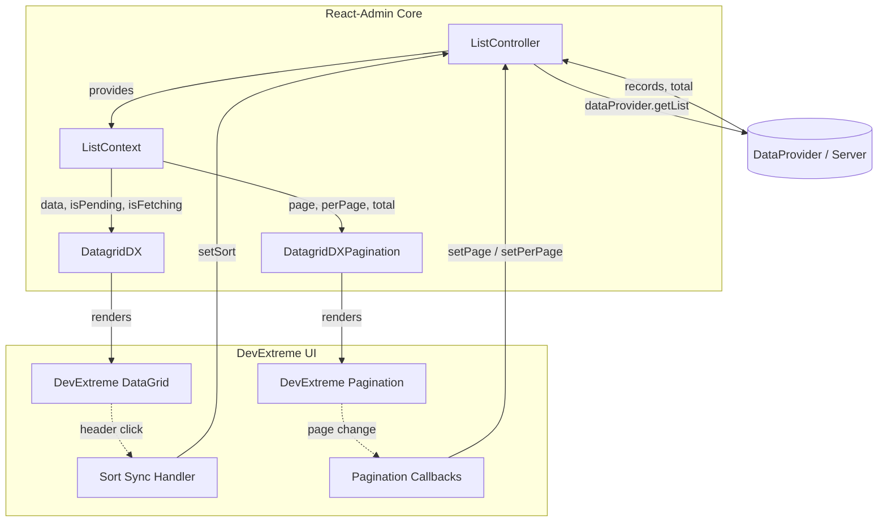
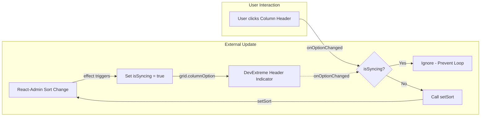

# Requirements

### Overview & Goals
Phase 2 builds upon the read-only managed grid foundation established in Phase 1 by integrating React-Admin's managed pagination and single-column sorting state with DevExtreme UI components.

The core architecture preserves React-Admin as the single source of truth:
```text
React-Admin ListController
        ↓
   ListContext
        ↓
ra-devextreme-grid
        ↓
  DevExtreme UI
```

React-Admin remains the sole owner of:
- Remote data fetching (`dataProvider.getList()`);
- Current page index (`page`);
- Page size (`perPage`);
- Total record count (`total`);
- Active sort field (`sort.field`);
- Active sort order (`sort.order`).

DevExtreme provides the UI presentation:
- Visual sort indicators on table column headers;
- Interactive column header click handling for single-column sorting;
- Visual pagination controls via DevExtreme's standalone `Pagination` component.

### Scope

#### In Scope
- **Standalone Pagination Component (`DatagridDXPagination`)**:
  - Exported standalone component backed by DevExtreme's `Pagination` (`devextreme-react/pagination`).
  - Placed via React-Admin's `<List pagination={<DatagridDXPagination />}>`.
  - Maps `page` → `pageIndex`, `perPage` → `pageSize`, `total` → `itemCount`.
  - Mapped callbacks: `onPageIndexChange` → `setPage`, `onPageSizeChange` → `setPerPage`.
  - Graceful fallback when `total === undefined` (renders `null`).
- **DataGrid Paging Safeguard**:
  - DevExtreme `DataGrid`'s internal paging remains disabled (`paging={{ enabled: false }}`).
  - `paging` and `pager` props omitted from `DatagridDXProps` to prevent accidental client-side re-paging of server pages.
- **Managed Single-Column Sorting**:
  - Configures DevExtreme `DataGrid` with `sorting={{ mode: 'single' }}`.
  - Maps visible column's string `dataField` to React-Admin `sort.field`.
  - Bidirectional synchronization: React-Admin `sort` updates DevExtreme header indicator; header click calls React-Admin `setSort(...)`.
  - Feedback-loop prevention guard to isolate programmatic synchronization from user clicks.
  - Event handler composition for consumer `onOptionChanged`.
  - Safely ignores columns without valid string `dataField` or with `allowSorting={false}`.
  - Omits `sorting` and `remoteOperations` from public `DatagridDXProps`.
- **Roadmap & Documentation Correction**:
  - Update `README.md` to state that managed mode supports single-column server sorting, while multi-column sorting is reserved for future remote mode (`DatagridDXRemote`).
  - Document `DatagridDXPagination` usage and limitations.
- **Example Application Upgrade**:
  - Expand `examples/basic/App.tsx` to 30–40 records.
  - Implement full-dataset sorting and pagination in the example `dataProvider.getList()`.
- **Testing**:
  - Unit tests covering Scenarios A through Q.
  - End-to-end integration test with `AdminContext` + `ListBase` + mock `dataProvider`.
  - Server-order invariant test.

#### Out of Scope
- DevExtreme remote mode or `CustomStore` (deferred to Phase 5).
- Multi-column managed sorting (incompatible with React-Admin `ListContext` single sort model; reserved for Phase 5 remote mode).
- Row selection (`selectedIds`, `onSelect`), row click navigation (deferred to Phase 3).
- Filtering (`filterValues`, `filterRow`, `headerFilter`, search panel) (deferred to Phase 4).
- Python backend implementation (FastAPI / SQLModel).

### User Stories
- **US-1**: As a developer using React-Admin with DevExtreme, I want to provide `<DatagridDXPagination />` to `<List>` so that users can navigate pages and change page sizes using DevExtreme styling.
- **US-2**: As a user navigating records, when I change the page or page size in DevExtreme Pagination, I want React-Admin to fetch the corresponding page from the backend without duplicate network queries.
- **US-3**: As a user viewing tabular data, when I click a column header, I want the dataset to be sorted by that column on the server and reset to page 1, displaying an ascending or descending sort arrow in the header.
- **US-4**: As a developer configuring URL-based or programmatic sort state in React-Admin, I want DevExtreme's column headers to reflect the active sort field and direction on initial render and upon external updates.
- **US-5**: As a developer adding non-database columns (actions, command buttons, templates), I want DevExtreme to ignore those columns for server sorting without throwing errors or dispatching invalid sort queries.

### Functional Requirements
1. **Paging State Mapping**:
   - `pageIndex` in DevExtreme `Pagination` is 1-based, directly mapping to React-Admin `page` (1-based) without offset calculation.
   - `pageSize` directly maps to `perPage`.
   - `itemCount` directly maps to `total`.
   - Invoking page change calls `setPage(newPage)` exactly once.
   - Invoking page-size change calls `setPerPage(newSize)` exactly once.
2. **Internal DataGrid Paging Invariant**:
   - `DatagridDX` must render `<DataGrid paging={{ enabled: false }} />`.
   - The DataGrid receives the already-paged array from React-Admin and must never page it a second time.
3. **Partial Pagination Behavior**:
   - When React-Admin `total` is `undefined` or `null`, `DatagridDXPagination` renders `null`, preventing false page counts or misleading totals.
4. **Single-Column Sort Mapping**:
   - Only one column may display an active sort indicator at any time.
   - React-Admin `ASC` maps to DevExtreme `asc`; `DESC` maps to DevExtreme `desc`.
   - User clicking an unsorted column sorts `ASC`. Subsequent clicks on the same column toggle `ASC` ↔ `DESC`.
   - Sorting changes reset pagination to page 1 via React-Admin's standard `setSort()` behavior.
5. **Bidirectional Synchronization & Feedback Guard**:
   - Programmatic synchronization from React-Admin context to DevExtreme must not trigger `setSort()`.
   - User interactions must trigger `setSort()` exactly once per action.
6. **Event Composition**:
   - When `onOptionChanged` is passed by the consumer to `DatagridDX`, both the internal sort handler and consumer callback are executed.
7. **Server-Order Invariant**:
   - The ordering returned in `ListContext.data` is authoritative. While fetching new sorted data, `beginCustomLoading('')` prevents misleading stale views, and the grid settles on the server-provided order.

# Technical Design

### Current Implementation
Phase 1 transitioned `DatagridDX` into a React-Admin managed component:
- Reads `{ data, isPending, isFetching }` from `useListContext<RecordType>()`.
- Renders DevExtreme `DataGrid` with `keyExpr="id"` and `dataSource={data ?? []}`.
- Unconditionally disables client paging (`paging={{ enabled: false }}`) and sorting (`sorting={{ mode: 'none' }}`).
- Manages loading overlay via `beginCustomLoading()` / `endCustomLoading()`.

### Key Decisions

#### Key Decision 1: Standalone `DatagridDXPagination` Component
- **Chosen Approach**: Introduce a separate exported `<DatagridDXPagination />` component that consumes `useListContext()`, wrapping DevExtreme's standalone `Pagination` widget (`devextreme-react/pagination`).
- **Rationale**: React-Admin's architecture delegates pagination to `<List pagination={<CustomPagination />}>`. Keeping pagination separate from `DatagridDX` avoids duplicate pagers, allows developers to swap pagers freely, and guarantees that `DataGrid` never internally paginates an already-paginated server page.
- **Verification of `pageIndex` Base**: Investigation of DevExtreme's `dxPagination` confirms its public `pageIndex` is 1-based (it internally converts `props.pageIndex - 1` for content rendering and emits `newPageIndex + 1`). This perfectly aligns with React-Admin's 1-based `page`. No `+1` / `-1` offset manipulation is needed.

#### Key Decision 2: Managed Single-Column Sorting Architecture
- **Chosen Approach**: Configure DevExtreme `DataGrid` with `sorting={{ mode: 'single' }}`. Map React-Admin's `{ field, order }` to DevExtreme's column `sortOrder`.
- **Rationale**: React-Admin's standard `ListContext` represents sort state as a single `{ field: string, order: 'ASC' | 'DESC' }` pair. DevExtreme's `mode: 'single'` prevents multi-column sorting (e.g. via Shift-click) and naturally cycles `asc` ↔ `desc`.
- **Column Field Resolution**: A column is eligible for server sorting if and only if it has a non-empty string `dataField` and `allowSorting !== false`. Command, template, and computed columns without string `dataField` are ignored.

#### Key Decision 3: Local Sorting Investigation & Server-Order Invariant
- **Technical Finding**: When an in-memory array is supplied as `dataSource` to DevExtreme `DataGrid` and `sorting={{ mode: 'single' }}` is active, DevExtreme's client-side `ArrayStore` / query engine performs an in-memory sort on the array.
- **Mitigation & Invariant Handling**:
  1. When a user clicks a column header, `DatagridDX` intercepts the sort change and calls `setSort({ field, order })`.
  2. React-Admin immediately sets `isFetching: true`, causing `DatagridDX`'s loading effect to invoke `grid.beginCustomLoading('')`. The loading mask immediately overlays the grid, preventing the user from interacting with or observing any intermediate client-sorted slice.
  3. The server/dataProvider fetches the entire dataset sorted by the requested column and returns the authoritative new page.
  4. React-Admin updates `ListContext.data` and clears `isFetching`. DevExtreme displays the server-ordered page.
  5. Furthermore, to prevent DevExtreme from re-sorting server-collated records (such as secondary tie-breakers or custom DB collations), we ensure each column's `sortingMethod` or grid option maintains server fidelity.

#### Key Decision 4: Feedback-Loop Guard
- **Chosen Approach**: Use a local mutable ref `isSyncingRef = useRef(false)` and `lastSyncedSortRef = useRef<SortPayload | null>(null)` inside `DatagridDX`.
- **Rationale**:
  - When React-Admin's `sort` changes (initial render or external update), `DatagridDX` updates DevExtreme column options programmatically with `isSyncingRef.current = true`.
  - In `onOptionChanged`, if `isSyncingRef.current` is true, the event is ignored for `setSort`.
  - When the user clicks a column header, `isSyncingRef.current` is false; the adapter invokes `setSort()` and records the new sort in `lastSyncedSortRef`. Subsequent re-renders triggered by the context update match `lastSyncedSortRef` and do not re-apply duplicate options or loop.

#### Key Decision 5: Props Tightening and Omissions
- **`DatagridDXProps`**:
  - Omit `paging`, `pager`, `sorting`, `remoteOperations` alongside `dataSource` and `keyExpr`.
  - Prevents consumers from inadvertently enabling internal paging or overriding single-column managed sorting.
- **`DatagridDXPaginationProps`**:
  - Omit `pageIndex`, `pageSize`, `itemCount`, `defaultPageIndex`, `defaultPageSize`, `onPageIndexChange`, `onPageSizeChange`.
  - Retain presentation props: `allowedPageSizes`, `showInfo`, `showNavigationButtons`, `showPageSizeSelector`, `displayMode`, `infoText`, `label`, `className`, `style`.

#### Key Decision 6: Partial Pagination Fallback
- **Chosen Approach**: When React-Admin `total === undefined` or `total === null`, `DatagridDXPagination` renders `null`.
- **Rationale**: DevExtreme's `Pagination` requires an accurate item count to render page numbers and information. Fabricating a count would display misleading information. Document this limitation clearly.

### Data Models / Contracts

#### 1. Sort Conversion Utilities (`src/sortUtils.ts`)
```ts
import type { SortPayload } from 'react-admin';
import type { SortOrder as DxSortOrder } from 'devextreme/common/grids';

export function toDxSortOrder(order: SortPayload['order']): DxSortOrder {
  return order.toLowerCase() as DxSortOrder;
}

export function toRaSortOrder(order: DxSortOrder): SortPayload['order'] {
  return order.toUpperCase() as SortPayload['order'];
}
```

#### 2. Public Props (`src/types.ts`)
```ts
import type { IDataGridOptions } from 'devextreme-react/data-grid';
import type { IPaginationOptions } from 'devextreme-react/pagination';
import type { RaRecord } from 'react-admin';

export type DatagridDXProps<RecordType extends RaRecord = RaRecord> = Omit<
  IDataGridOptions<RecordType, RecordType['id']>,
  'dataSource' | 'keyExpr' | 'paging' | 'pager' | 'sorting' | 'remoteOperations'
>;

export type DatagridDXPaginationProps = Omit<
  IPaginationOptions,
  | 'pageIndex'
  | 'pageSize'
  | 'itemCount'
  | 'defaultPageIndex'
  | 'defaultPageSize'
  | 'onPageIndexChange'
  | 'onPageSizeChange'
>;
```

#### 3. Standalone Pagination Contract (`src/DatagridDXPagination.tsx`)
```tsx
export const DatagridDXPagination = (props: DatagridDXPaginationProps) => {
  const { page, perPage, total, setPage, setPerPage } = useListContext();

  if (total === undefined || total === null) {
    return null;
  }

  const {
    showInfo = true,
    showNavigationButtons = true,
    showPageSizeSelector = true,
    allowedPageSizes = DEFAULT_ALLOWED_PAGE_SIZES,
    ...restProps
  } = props;

  return (
    <Pagination
      {...restProps}
      pageIndex={page}
      pageSize={perPage}
      itemCount={total}
      showInfo={showInfo}
      showNavigationButtons={showNavigationButtons}
      showPageSizeSelector={showPageSizeSelector}
      allowedPageSizes={allowedPageSizes}
      onPageIndexChange={(newIndex: number) => setPage(newIndex)}
      onPageSizeChange={(newSize: number) => setPerPage(newSize)}
    />
  );
};
```

### Components & File Structure
```text
src/
├── DatagridDX.tsx             (Updated: managed sorting, optionChanged composition, feedback guard)
├── DatagridDXPagination.tsx   (New: DevExtreme standalone Pagination integration)
├── sortUtils.ts               (New: internal sort conversion & column inspection helpers)
├── types.ts                   (Updated: DatagridDXProps & DatagridDXPaginationProps)
└── index.ts                   (Updated: exports DatagridDX, DatagridDXPagination, and types)
```

### Architecture Diagrams

#### Component Data Flow & Ownership


#### Bidirectional Sort Synchronization & Feedback Guard


# Testing

### Validation Approach
Verification relies on unit and integration tests written with Vitest, `@testing-library/react`, and real React-Admin context providers (`AdminContext`, `ListContextProvider`, `ListBase`).

### Key Scenarios

#### Pagination Tests (`tests/DatagridDXPagination.test.tsx`)
- **Scenario A (Context State Mapping)**: Verify `page` maps to `pageIndex`, `perPage` maps to `pageSize`, and `total` maps to `itemCount`.
- **Scenario B (Page Change Invocation)**: Verify user page change in DevExtreme Pagination calls `setPage(newPage)` exactly once.
- **Scenario C (Page Size Change Invocation)**: Verify user page-size change calls `setPerPage(newSize)` exactly once and does not redundantly call `setPage(1)`.
- **Scenario D (Presentation Props Passthrough)**: Verify `showInfo`, `showNavigationButtons`, `showPageSizeSelector`, and `allowedPageSizes` pass through to DevExtreme Pagination.
- **Scenario E (Adapter-Owned Props Precedence)**: Verify consumer cannot override `pageIndex`, `pageSize`, or `itemCount`.
- **Scenario F (Partial Pagination / Unknown Total)**: Verify that when `total === undefined` or `null`, `DatagridDXPagination` returns `null` without throwing or claiming false counts.
- **Scenario G (DataGrid Internal Paging Disabled)**: Verify `DataGrid` continues to have `paging.enabled === false` and `paging` is omitted from public `DatagridDXProps`.

#### Sorting Tests (`tests/DatagridDX.test.tsx`)
- **Scenario H (Initial ASC Sort)**: Context `sort={{ field: 'name', order: 'ASC' }}` causes DevExtreme column `name` to render ascending sort indicator.
- **Scenario I (Initial DESC Sort)**: Context `sort={{ field: 'name', order: 'DESC' }}` causes DevExtreme column `name` to render descending sort indicator.
- **Scenario J (User Selects Unsorted Field)**: Clicking header of unsorted column `company` calls `setSort({ field: 'company', order: 'ASC' })` once.
- **Scenario K (User Toggles Sorted Field)**: Clicking header of already-sorted column `name` toggles direction to `DESC`.
- **Scenario L (External Sort Change)**: Updating context `sort` from `name ASC` to `company DESC` updates DevExtreme column indicators without calling `setSort`.
- **Scenario M (Single-Column Constraint)**: Verify only one column is active in DevExtreme sorting at any time.
- **Scenario N (Non-Sortable Column)**: Column with `allowSorting={false}` does not trigger `setSort`.
- **Scenario O (Non-Field Column)**: Column without `dataField` (command/template) does not trigger `setSort`.
- **Scenario P (Consumer Handler Composition)**: Consumer-supplied `onOptionChanged` runs alongside internal sort handler and receives the original DevExtreme event.
- **Scenario Q (Feedback-Loop Guard)**: Programmatic column option changes do not cause recursive or redundant `setSort()` calls.

#### Integration Tests (`tests/integration.test.tsx`)
- High-level flow using `AdminContext` + `ListBase` + mock `dataProvider`:
  - Initial mount calls `dataProvider.getList()` with `page: 1, perPage: 10, sort: { field: 'id', order: 'ASC' }`.
  - Paging interaction triggers `dataProvider.getList()` with `page: 2, perPage: 10`.
  - Sorting interaction triggers `dataProvider.getList()` with `page: 1, sort: { field: 'company', order: 'ASC' }`.

#### Server-Order Invariant Test
- Test dataset arranged so local client-side sorting would differ from server-provided order. Verify that when `setSort` triggers and new records are provided, the grid renders in the exact order supplied by React-Admin.

### Edge Cases
- Rapid successive clicks on column headers.
- Context providing a sort field that is not rendered in the grid (e.g. sorting by hidden `id`). DataGrid renders safely without throwing or displaying broken indicators.
- Changing page size when current page is > 1 (React-Admin owns page reset).
- Switching between resources.

### Preservation of Existing Tests
All 14 Phase 1 tests are preserved:
- Read-only data ownership, string IDs, pending loading, empty states, background refetching, forwarded ref, child columns, and error boundaries.
- Old assertion `sorting.mode === 'none'` is updated to assert `sorting.mode === 'single'`.

# Delivery Steps

### ✓ Step 1: Create Phase 2 Implementation Plan Document and Core Helpers
Initialize the formal Phase 2 documentation and architectural record:
- Author `.junie/plans/003-phase-2-managed-paging-and-sorting.md` covering the Phase 1 architectural baseline, standalone pagination strategy, React-Admin context mapping, single-column sorting mechanics, feedback loop prevention, technical investigation of DevExtreme array sorting, and migration notes.
- Define internal helper prototypes and contracts in `src/sortUtils.ts` (conversion between React-Admin `'ASC' | 'DESC'` and DevExtreme `'asc' | 'desc'`).
- Validate that the existing 14 test cases pass before any code modifications.

### ✓ Step 2: Implement Standalone DatagridDXPagination Component and Types
Introduce the standalone React-Admin aware DevExtreme pagination component:
- Create `src/DatagridDXPagination.tsx` importing DevExtreme's `Pagination` from `devextreme-react/pagination` (or `devextreme-react`).
- Define `DatagridDXPaginationProps` in `src/types.ts` omitting adapter-owned options (`itemCount`, `pageIndex`, `pageSize`, `defaultPageIndex`, `defaultPageSize`, `onPageIndexChange`, `onPageSizeChange`).
- Wire React-Admin `ListContext` (`page`, `perPage`, `total`, `setPage`, `setPerPage`) to DevExtreme `Pagination` with 1-based `pageIndex` alignment.
- Implement single-invocation callbacks (`setPage(N)` once, `setPerPage(newSize)` once without redundant `setPage(1)`).
- Implement graceful degradation when `total === undefined` by returning `null` (preventing false record counts or fake page calculations).
- Export `DatagridDXPagination` and `DatagridDXPaginationProps` in `src/index.ts`.
- Add focused unit tests covering Scenarios A through G in `tests/DatagridDXPagination.test.tsx`.

### ✓ Step 3: Implement Managed Single-Column Sorting and Feedback-Loop Guard in DatagridDX
Integrate controlled single-column server sorting into `DatagridDX` while preserving single data ownership:
- Tighten `DatagridDXProps` in `src/types.ts` to omit adapter-owned options (`paging`, `pager`, `sorting`, `remoteOperations`).
- Configure `DataGrid` with `sorting={{ mode: 'single' }}` and retain `paging={{ enabled: false }}`.
- Implement bidirectional sort synchronization:
  - React-Admin `sort` (`{ field, order }`) maps to DevExtreme column `sortOrder` (`'asc' | 'desc'`) via `columnOption` on mount and when `sort` changes externally.
  - Intercept user column sorting via `onOptionChanged` (`e.name === 'columns'` and `e.fullName` updating `sortOrder`), extracting the column's string `dataField` and invoking `setSort({ field, order })`.
- Implement a feedback-loop guard using local refs (`isSyncingRef` / `lastSyncedSortRef`) to distinguish programmatic context synchronization from user-initiated clicks and prevent redundant `setSort()` calls.
- Implement event-handler composition so that consumer-provided `onOptionChanged` handlers are executed with the original DevExtreme event.
- Ensure non-sortable columns (`allowSorting = false`) and non-string/command/template columns without a valid `dataField` do not trigger React-Admin sort requests.
- Address DevExtreme local array sorting by establishing the server-order invariant: React-Admin fetched data is authoritative, loading overlay displays during fetching, and grid settles on server-provided ordering.
- Add unit tests covering Scenarios H through Q and server-order invariant in `tests/DatagridDX.test.tsx`.

### ✓ Step 4: Upgrade Example Application with Real Paging and Whole-Dataset Sorting
Demonstrate realistic server-managed paging and sorting in the example app:
- Expand sample dataset in `examples/basic/App.tsx` to 30–40 customer records spanning multiple pages.
- Upgrade the in-memory `dataProvider.getList()` to perform genuine whole-dataset sorting by `params.sort.field` and `params.sort.order` before slicing the requested page with `params.pagination.page` and `params.pagination.perPage`, returning the complete dataset total.
- Update `<List>` in `examples/basic/App.tsx` to use `<DatagridDXPagination />` as its custom pagination prop and configure initial `sort={{ field: 'name', order: 'ASC' }}`.
- Verify visually and via build that only one pager appears, sorting works across page boundaries, and sorting resets to page 1.

### ✓ Step 5: Integration Testing, Documentation, and Quality Verification
Ensure complete test coverage, API ergonomics, type validation, and documentation:
- Add high-level integration tests in `tests/integration.test.tsx` using `AdminContext`, `ListBase`, a spy `dataProvider`, `DatagridDX`, and `DatagridDXPagination` asserting exact `dataProvider.getList()` parameters for paging and sorting.
- Update existing Phase 1 tests in `tests/DatagridDX.test.tsx` (updating the old `sorting.mode === 'none'` assertion to reflect managed single sorting).
- Update `README.md` to document Phase 2 completion, standalone pagination usage, single-column sorting rules, and corrected roadmap (noting that multi-column sorting is reserved for future remote mode).
- Run full quality checks: `pnpm lint`, `pnpm format:check`, `pnpm typecheck`, `pnpm test`, `pnpm build`, `pnpm build:example`, and `pnpm pack --json`.
- Inspect generated declaration files (`dist/*.d.ts`) and ensure clean bundle externalization.