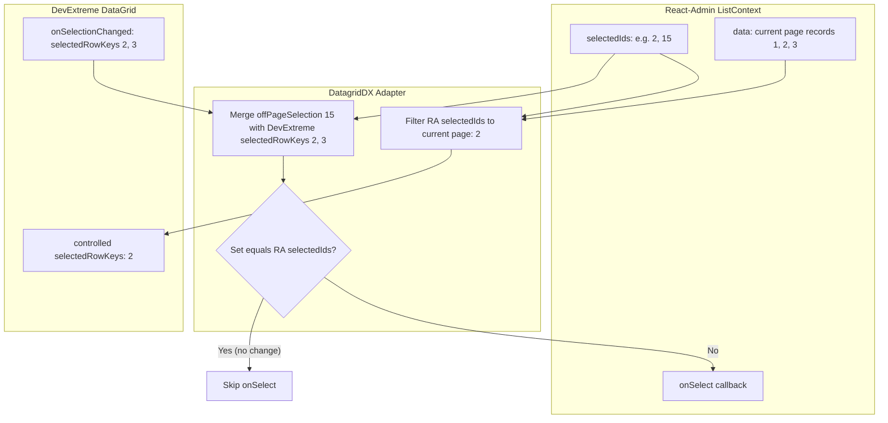

# Requirements

### Overview & Goals
Phase 3 expands the managed `DatagridDX` component by integrating React-Admin's multi-row selection and row-click navigation, while maintaining the strict architectural boundaries established in Phases 1 and 2:
```text
React-Admin ListController
        ↓
   ListContext
        ↓
    DatagridDX
        ↓
DevExtreme DataGrid
```
React-Admin remains the single source of truth for records, selected record IDs (`selectedIds`), paging, sorting, and navigation semantics. DevExtreme provides presentation and user interaction: row rendering, selection checkboxes, selection events, and row click events.

### Scope
#### In Scope
- **React-Admin Controlled Selection Bridge**: Controlled multi-row selection via React-Admin's `selectedIds` and `onSelect`.
- **Cross-Page Selection Preservation**: Selections spanning server pages are preserved. DevExtreme receives only current-page selected IDs as its controlled `selectedRowKeys`. When DevExtreme reports selection changes on the current page, the adapter merges visible changes with off-page selected IDs before calling React-Admin's `onSelect`.
- **Select-All Bound to Current Page**: Locking DevExtreme's `selectAllMode` to `"page"` to reflect that DevExtreme only contains the current server page.
- **Opt-In Selection API**: Selection is opt-in via `<DatagridDX selection />` or `<DatagridDX selection={options} />`. Existing grids remain unselected by default.
- **Adapter-Owned Selection Props**: Locking `mode: 'multiple'`, `deferred: false`, and `selectAllMode: 'page'`. Safe presentation options (`showCheckBoxesMode`, `allowSelectAll`, `sensitivity`) remain configurable by consumers.
- **Selection Feedback-Loop Protection**: Preventing spurious `onSelect` invocations via order-independent set comparison and strict type checking (distinguishing string from numeric IDs).
- **Row-Click Navigation**: Public `rowClick?: 'edit' | 'show' | false` prop utilizing React-Admin's `useRedirect` hook.
- **Data-Row Restriction**: Navigation only triggers for data rows (`e.rowType === 'data'`).
- **Interaction Isolation**: Selection checkbox clicks toggle selection only and never trigger row navigation.
- **Native Event Composition**: Composing native `onSelectionChanged` and `onRowClick` handlers, with consumer cancellation support via `e.handled = true`.
- **Example & Documentation Updates**: Updating `examples/basic` with working Edit/Show views, a selection counter, and updating `README.md`.
- **Pager Theme Verification**: Confirming DevExtreme light and dark theme variable support (`--dx-component-color-bg`, `--dx-color-text`) in `DatagridDXPagination`.

#### Out of Scope
- Filtering, SearchPanel, FilterRow, HeaderFilter (scheduled for Phase 4).
- Remote operations / CustomStore / server-side aggregations (scheduled for Phase 5).
- Inline editing, batch editing, cell editing, DevExtreme editing toolbar.
- Bulk mutation actions (`BulkDeleteButton`, `deleteMany`, `updateMany`).
- Function/callback variants for `rowClick` (e.g. `(id, resource, record) => 'edit'`).
- Automatic edit/show capability detection or per-row access control checks (`canAccess`).
- Python backend integrations.

### User Stories
- **As an admin user**, I want to select multiple records across different pages in the DataGrid so that bulk actions can operate on records across the entire dataset.
- **As an admin user**, I want clicking the header checkbox to select all records on the current page without losing selections made on other pages.
- **As an admin user**, I want clicking a table row to navigate directly to that record's Edit or Show view, while clicking the row's selection checkbox selects the row without navigating.
- **As a developer**, I want `DatagridDX` to automatically synchronize with React-Admin's `ListContext` selection without manual state wiring or conflicting DevExtreme selection options.

### Functional Requirements
1. **Authoritative Selection State**:
   - `selectedIds` in `useListContext()` is the sole canonical store of selected IDs.
   - The adapter must not create a duplicate canonical React state for selections.
2. **Current-Page Projection**:
   - DevExtreme `selectedRowKeys` must receive only the intersection of React-Admin's `selectedIds` and the current page's record IDs.
   - Off-page selected IDs must never be sent to DevExtreme as `selectedRowKeys`.
3. **Cross-Page Selection Merging**:
   - When DevExtreme reports selection changes via `onSelectionChanged`, the adapter derives `offPageSelection = selectedIds.filter(id => !currentPageIdSet.has(id))`.
   - The new selection is computed as `[...offPageSelection, ...e.selectedRowKeys]`.
   - `onSelect(newSelection)` is called if and only if `newSelection` logically differs from `selectedIds`.
4. **Current-Page Deselection**:
   - Deselecting visible rows on the current page clears visible rows from React-Admin selection but preserves off-page selections.
5. **Identifier Type Fidelity**:
   - String IDs (e.g. `'cust-101'`) and numeric IDs (e.g. `101`) must not be coerced to another type.
   - Strict equality is maintained; `1` and `'1'` are treated as distinct keys.
6. **Selection Invariants**:
   - `mode` is locked to `'multiple'` when selection is enabled, and `'none'` when disabled.
   - `deferred` is locked to `false`.
   - `selectAllMode` is locked to `'page'`.
   - `showCheckBoxesMode` defaults to `'always'`.
7. **Row Navigation**:
   - Supports `rowClick="edit"`, `rowClick="show"`, and `rowClick={false}` (default: `undefined`/`false`).
   - Uses `useRedirect()` from `react-admin`: `redirect(rowClick, resource, record.id, record)`.
   - Non-data rows (`header`, `group`, `footer`, `total`) must never trigger navigation.
8. **Checkbox & Navigation Isolation**:
   - Checkbox clicks toggle selection only and do not trigger row navigation.
9. **Event Composition & Cancellation**:
   - Native `onSelectionChanged` is called after React-Admin selection update.
   - Native `onRowClick` is called before navigation. If the consumer marks `e.handled = true`, the adapter halts navigation.

### Non-Functional Requirements
- **Performance**: Set-based membership checks (`O(1)`) for ID intersection, avoiding `O(N*M)` array scans.
- **Zero Redundant Rerenders**: Guard against feedback loops when synchronizing selection from React-Admin to DevExtreme.
- **Bundle Externalization**: Ensure `react`, `react-dom`, `react-admin`, `devextreme`, and `devextreme-react` remain externalized; no direct runtime dependency on `react-router`.
- **CSS Isolation**: The library continues to import zero theme CSS directly.

# Technical Design

### Current Implementation & Architecture Baseline
Currently in Phase 2:
- `DatagridDX` reads `{ data, isPending, isFetching, sort, setSort }` from `useListContext<RecordType>()`.
- Row keys are locked to `record.id`.
- DevExtreme client-side paging is disabled (`paging={{ enabled: false }}`) and sorting is single-column (`sorting={{ mode: 'single' }}`).
- Standalone `DatagridDXPagination` wraps DevExtreme `Pagination` and binds to React-Admin's `page`, `perPage`, and `total`.

### Key Decisions & Rationale
1. **React-Admin as Canonical Selection Store**:
   - *Decision*: Derive DevExtreme `selectedRowKeys` as a controlled prop from `ListContext.selectedIds` intersected with current page records, without introducing duplicate local state.
   - *Rationale*: Eliminates dual-state synchronization bugs. React-Admin's `ListContext` is already shared across bulk actions, pagination, and external controllers.
2. **Cross-Page Selection Preservation (Disjoint Set Merge)**:
   - *Decision*: When DevExtreme emits `onSelectionChanged`, compute `newSelection = [...offPageSelection, ...e.selectedRowKeys]`.
   - *Rationale*: DevExtreme only knows about current-page rows. Merging off-page IDs ensures selections survive page and sort transitions without data loss.
3. **Locking Select-All to Page (`selectAllMode = 'page'`)**:
   - *Decision*: Hardcode `selectAllMode: 'page'` in managed selection mode.
   - *Rationale*: The grid only holds the current page. DevExtreme cannot know or select matching records from unfetched server pages without deferred selection, which conflicts with React-Admin's explicit ID model.
4. **Order-Independent Selection Comparison**:
   - *Decision*: Implement a private `areIdentifierSetsEqual` helper using `Set` to prevent recursive feedback loops between controlled props and event callbacks.
   - *Rationale*: DevExtreme and React-Admin may report selected IDs in differing order; comparing set contents prevents endless update cycles.
5. **React-Admin `useRedirect` for Navigation**:
   - *Decision*: Use React-Admin's public `useRedirect()` hook with `redirect(rowClick, resource, record.id, record)`.
   - *Rationale*: Avoids hardcoded URL construction or coupling to private React Router internal structures, respecting custom React-Admin route configurations.
6. **Consumer Cancellation via `e.handled`**:
   - *Decision*: Execute consumer `onRowClick` first. If `e.handled === true`, skip adapter redirection.
   - *Rationale*: Follows DevExtreme standard event conventions and provides an escape hatch for custom row-click logic.

### Selection State Flow & Architecture Diagram



### Adapter-Owned vs Safe Consumer Options
Native properties omitted from `DatagridDXProps`:
- `'selection'`: Replaced by managed `selection?: boolean | DatagridDXSelectionOptions`
- `'selectedRowKeys'`: Adapter-controlled
- `'defaultSelectedRowKeys'`: Omitted to prevent uncontrolled selection
- `'selectionFilter'`: Omitted to prevent conflicting filter-based selection

Safe options exposed in `DatagridDXSelectionOptions`:
```ts
import type { Selection as DxGridSelection } from 'devextreme/ui/data_grid';

export type DatagridDXSelectionOptions = Omit<
  DxGridSelection,
  'mode' | 'deferred' | 'selectAllMode'
>;
```
Adapter locks:
```ts
const selectionConfig = selection
  ? {
      showCheckBoxesMode: 'always' as const,
      allowSelectAll: true,
      ...(typeof selection === 'object' ? selection : {}),
      mode: 'multiple' as const,
      deferred: false,
      selectAllMode: 'page' as const,
    }
  : { mode: 'none' as const };
```

### Row Navigation Design & Isolation
- Public prop: `rowClick?: 'edit' | 'show' | false` (default: `undefined`/`false`).
- In `handleRowClick`:
  1. Invoke consumer `onRowClick?.(e)`.
  2. If `e.handled === true`, exit immediately.
  3. Verify `e.rowType === 'data'`.
  4. If `rowClick` is `'edit'` or `'show'`, invoke `redirect(rowClick, resource, record.id, record)`.
- Isolation from selection checkbox:
  - DevExtreme DataGrid's internal `_rowClick` explicitly skips raising row-click when the target is within `.dx-command-select` (the selection checkbox cell).
  - A defensive check guards against any checkbox element target in `e.event?.target` as additional protection.

### File Structure & Changes
- `src/types.ts`:
  - Define `DatagridDXSelectionOptions` and `DatagridDXRowClick`.
  - Update `DatagridDXProps<RecordType>` omitting conflicting selection options and adding `selection` and `rowClick`.
- `src/index.ts`:
  - Re-export `DatagridDXSelectionOptions` and `DatagridDXRowClick`.
- `src/DatagridDX.tsx`:
  - Wire `selectedIds`, `onSelect`, `resource` from `useListContext`.
  - Wire `redirect = useRedirect()`.
  - Compute `currentPageIdSet` and `currentPageSelectedKeys`.
  - Compose `onSelectionChanged` and `onRowClick`.
  - Pass `selectedRowKeys` and `selection={selectionConfig}` to `DataGrid`.
- `examples/basic/App.tsx`:
  - Add in-memory `update` implementation to `dataProvider`.
  - Add `CustomerEdit` and `CustomerShow` components.
  - Add `SelectedCount` display component.
  - Configure `selection` and `rowClick="edit"` on `<DatagridDX>`.
- `tests/DatagridDX.test.tsx`:
  - Add comprehensive selection tests (Scenarios A through N).
  - Add comprehensive navigation tests (Scenarios O through W).
- `.junie/plans/004-phase-3-selection-and-navigation.md`:
  - Create the detailed implementation documentation artifact.
- `README.md`:
  - Document Phase 3 selection and navigation APIs and update roadmap.

# Testing

### Validation Approach
Automated tests are written with Vitest and `@testing-library/react`. Tests use realistic React-Admin contexts (`ListContextProvider`, `ListBase`, and `AdminContext` with in-memory data providers and memory router) to verify observable public behaviors rather than internal implementation details.

### Selection Test Scenarios (Scenarios A – N)
- **Scenario A: Selection disabled by default**:
  - Render `<DatagridDX>` without `selection` prop. Verify DevExtreme selection mode is `'none'` and no checkboxes are rendered.
- **Scenario B: Selection enabled**:
  - Render `<DatagridDX selection>`. Verify DevExtreme selection mode is `'multiple'` and `selectAllMode` is `'page'`.
- **Scenario C: React-Admin → DevExtreme projection**:
  - Provide `data = [{ id: 1 }, { id: 2 }, { id: 3 }]` and `selectedIds = [2]`.
  - Assert DevExtreme receives `selectedRowKeys = [2]`.
- **Scenario D: Off-page IDs filtered from DevExtreme**:
  - Provide `data = [{ id: 1 }, { id: 2 }, { id: 3 }]` and `selectedIds = [2, 15]`.
  - Assert DevExtreme receives `selectedRowKeys = [2]` (15 is excluded from grid keys).
- **Scenario E: DevExtreme → React-Admin selection**:
  - With `selectedIds = [15]` and current page `[1, 2, 3]`, user selects `2`.
  - Assert `onSelect` is called with `[15, 2]` (or logical equivalent).
- **Scenario F: Current-page deselection preserves off-page IDs**:
  - With `selectedIds = [2, 15]` and current page `[1, 2, 3]`, user deselects `2`.
  - Assert `onSelect` is called with `[15]`.
- **Scenario G: External selection clearing**:
  - Update `selectedIds` from `[2]` to `[]`. DevExtreme selection reflects empty keys without redundant `onSelect` calls.
- **Scenario H: No redundant selection callbacks**:
  - Programmatic sync of the same logical selection set does not invoke `onSelect`.
- **Scenario I: Order-independent selection comparison**:
  - Logical sets `[2, 3]` and `[3, 2]` are recognized as equal and do not trigger `onSelect`.
- **Scenario J: String identifiers**:
  - Test selection with string IDs (e.g. `'cust-a'`, `'cust-b'`) ensuring strict type preservation without numeric coercion.
- **Scenario K: Select all on current page**:
  - User triggers select all on current page. Off-page IDs are preserved, and only current-page records are added.
- **Scenario L: Cross-page selection across page navigation**:
  - Select records on Page 1, navigate to Page 2, select records on Page 2, navigate back to Page 1: assert Page 1 records remain visibly selected and `selectedIds` contains records from both pages.
- **Scenario M: Selection preservation across server sorting**:
  - Sort change moves a selected record off the page: assert the ID remains in `selectedIds`.
- **Scenario N: Native `onSelectionChanged` composition**:
  - Consumer-provided `onSelectionChanged` handler is invoked and receives the native DevExtreme event.

### Navigation Test Scenarios (Scenarios O – W)
- **Scenario O: `rowClick="edit"`**:
  - Clicking a data row redirects to the record's Edit path via React-Admin routing.
- **Scenario P: `rowClick="show"`**:
  - Clicking a data row redirects to the record's Show path.
- **Scenario Q: `rowClick={false}`**:
  - Clicking a data row produces no redirection.
- **Scenario R: Default `rowClick` omitted**:
  - Omitted `rowClick` produces no redirection.
- **Scenario S: String ID navigation**:
  - Navigation preserves string IDs intact without URL corruption.
- **Scenario T: Only data rows navigate**:
  - Row-click events for header, group, or footer rows do not trigger redirection.
- **Scenario U: Checkbox click does not navigate**:
  - Clicking the selection checkbox cell toggles selection but does not redirect.
- **Scenario V: Native `onRowClick` composition**:
  - Consumer-provided `onRowClick` executes when a row is clicked.
- **Scenario W: Consumer cancellation**:
  - Consumer handler setting `e.handled = true` prevents the adapter's React-Admin redirection.

### Regression Scenarios
- Confirm all 36 Phase 1 and Phase 2 tests pass without changes:
  - Data ownership, pending/loading overlay, noDataText, string IDs, ref forwarding, single-column sorting, sorting feedback loop guard, server order fidelity, and `DatagridDXPagination` mechanics.

# Delivery Steps

### ✓ Step 1: Implement managed selection state bridge and cross-page selection logic
Controlled multi-row selection bridge is implemented in `DatagridDX` with cross-page selection persistence and feedback-loop guards.

- Update `src/types.ts` to define `DatagridDXSelectionOptions`, `DatagridDXRowClick`, and update `DatagridDXProps<RecordType>` omitting native conflicting props (`selection`, `selectedRowKeys`, `defaultSelectedRowKeys`, `selectionFilter`).
- Define the safe presentation subset in `DatagridDXSelectionOptions` (omitting adapter-owned `mode`, `deferred`, and `selectAllMode`).
- Implement current-page record ID mapping and intersection logic in `src/DatagridDX.tsx` to compute `currentPageSelectedKeys` passed as `selectedRowKeys` to DevExtreme `DataGrid`.
- Implement `areIdentifierSetsEqual` private helper to compare logical selection sets independently of element ordering and strictly respecting string vs numeric identifier types.
- Compose `onSelectionChanged` to calculate `offPageSelection` merged with current page selections, conditionally invoking React-Admin's `onSelect` only when the logical selection set genuinely changes.
- Forward original `SelectionChangedEvent` to any consumer-provided `onSelectionChanged` callback.
- Export `DatagridDXSelectionOptions` and `DatagridDXRowClick` from `src/index.ts`.

### ✓ Step 2: Implement row-click navigation with React-Admin routing
React-Admin row-click navigation is implemented for `DatagridDX` with consumer event composition and checkbox click isolation.

- Integrate React-Admin's `useRedirect` hook in `src/DatagridDX.tsx` to handle `'edit'` and `'show'` navigation targets using the current `resource` and `record.id`.
- Restrict navigation triggers to data rows by checking `e.rowType === 'data'`.
- Compose native `onRowClick` handler: invoke consumer `onRowClick` first, and abort navigation if `e.handled` is marked `true`.
- Guard against checkbox cell navigation by checking DevExtreme's command column context and avoiding redirects on selection checkbox interactions.
- Ensure string identifiers and numeric identifiers are passed unmodified to React-Admin navigation routes.

### ✓ Step 3: Update basic example with selection display, Edit, and Show views
The basic example application demonstrates cross-page selection, a selected-count indicator, and navigation to functional Edit and Show views.

- Update `examples/basic/App.tsx` data provider to support `update` mutations for the customer dataset.
- Implement standard React-Admin `CustomerEdit` and `CustomerShow` views using `Edit`, `Show`, `SimpleForm`, `SimpleShowLayout`, `TextInput`, and `TextField`.
- Add a lightweight `SelectedCount` display component consuming `useListContext` to visibly show selected record count and IDs.
- Enable `selection` and `rowClick="edit"` on `<DatagridDX<Customer>>` in `CustomerList`.
- Register `edit` and `show` views on the `customers` `<Resource>` in `App`.

### ✓ Step 4: Add comprehensive automated tests for selection and navigation suites
Automated test coverage is added for all Phase 3 selection and navigation scenarios while preserving all 36 existing tests.

- Implement Selection Scenarios A through N in `tests/DatagridDX.test.tsx`:
  - Scenario A: Selection disabled by default (`mode: 'none'`).
  - Scenario B: Selection enabled (`mode: 'multiple'`, `selectAllMode: 'page'`).
  - Scenario C: React-Admin `selectedIds` mapped to DevExtreme `selectedRowKeys`.
  - Scenario D: Off-page selected IDs filtered out from DevExtreme `selectedRowKeys`.
  - Scenario E: DevExtreme user selection merged with off-page IDs and propagated via `onSelect`.
  - Scenario F: Visible row deselection retains off-page selected IDs.
  - Scenario G: External selection clearing propagates without redundant `onSelect`.
  - Scenario H & I: Feedback-loop guard prevents redundant `onSelect` and ignores array ordering.
  - Scenario J: String identifiers handled correctly without type coercion.
  - Scenario K: Header "Select All" selects current-page records only and retains off-page IDs.
  - Scenario L: Cross-page selection retention across real page navigation.
  - Scenario M: Selection preservation across server sort changes.
  - Scenario N: Consumer `onSelectionChanged` callback composition.
- Implement Navigation Scenarios O through W in `tests/DatagridDX.test.tsx`:
  - Scenario O: `rowClick="edit"` triggers navigation to Edit route.
  - Scenario P: `rowClick="show"` triggers navigation to Show route.
  - Scenario Q: `rowClick={false}` disables navigation.
  - Scenario R: Default `rowClick` (omitted) does not trigger navigation.
  - Scenario S: Navigation preserves string record identifiers.
  - Scenario T: Non-data row clicks (headers, footers) do not trigger navigation.
  - Scenario U: Selection checkbox clicks toggle selection without triggering navigation.
  - Scenario V: Consumer `onRowClick` executes alongside navigation.
  - Scenario W: Consumer cancellation via `e.handled = true` prevents navigation.
- Verify all 36 Phase 1 and Phase 2 tests continue passing without regression.

### ✓ Step 5: Complete documentation, theme verification, and final quality audit
Documentation, verification checks, and plan artifacts are completed for Phase 3.

- Create `.junie/plans/004-phase-3-selection-and-navigation.md` detailing the implemented architecture, API contracts, cross-page selection mechanics, and verification results.
- Update `README.md` to document Phase 3 selection and navigation usage, supported props, and update the roadmap status (`Phase 3 — Completed`, `Phase 4 — Next`).
- Verify DevExtreme light and dark theme variable resolution for `DatagridDXPagination` (`--dx-component-color-bg` and `--dx-color-text`).
- Run the full verification suite (`pnpm lint`, `pnpm format:check`, `pnpm typecheck`, `pnpm test`, `pnpm build`, `pnpm build:example`, `pnpm pack --json`).
- Inspect TypeScript declarations (`.d.ts`), bundle externalization, and package tarball contents.