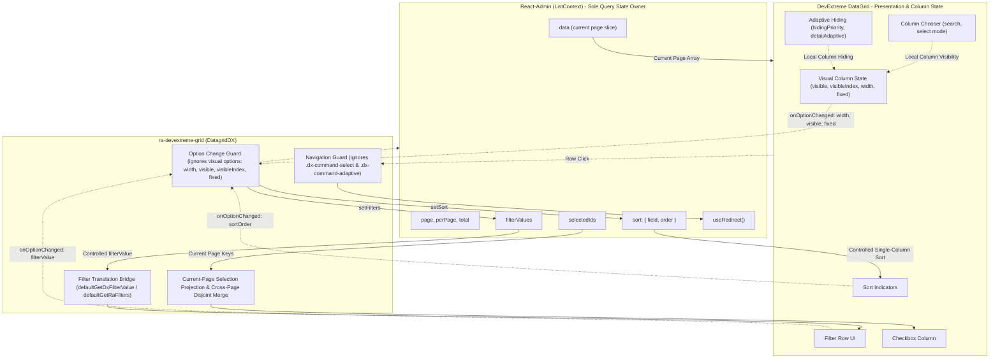

# Requirements

### Overview & Goals

Phase 4A implemented managed React-Admin filtering using DevExtreme's Filter Row.
Phase 4B is deliberately limited to **safe client-side presentation and column-management UX**.

The objective of Phase 4B is to provide first-class column management and responsive layout capabilities in `DatagridDX` while strictly adhering to the core architectural invariant:
> **React-Admin owns list/query state. DevExtreme may own purely visual column state.**

### Scope

#### In Scope
1. **Column Chooser**: Native DevExtreme `columnChooser` pass-through supporting `enabled`, `mode`, `search`, `title`, `position`, etc.
2. **Column Resizing**: Native `allowColumnResizing`, `columnResizingMode`, `columnMinWidth`, and `columnAutoWidth` pass-through.
3. **Column Reordering**: Native `allowColumnReordering` pass-through.
4. **Column Fixing / Pinning**: Native `columnFixing` and per-column `fixed` / `fixedPosition` pass-through.
5. **Adaptive Column Hiding / Responsive Layout**: Native `columnHidingEnabled` and per-column `hidingPriority` pass-through.
6. **Interaction Coexistence**:
   - Column visibility changes must NOT mutate React-Admin filters, sort, page, or selection.
   - Actively filtered columns remain filtered in React-Admin when hidden via Column Chooser; their Filter Row UI restores when unhidden.
   - Actively sorted columns remain sorted in React-Admin when hidden; sort indicators restore when unhidden.
   - Adaptive command column clicks and adaptive detail rows must NOT trigger React-Admin row navigation (`useRedirect`).
   - Column fixing must coexist cleanly with managed multi-row selection.
7. **Phase 4A `remoteOperations` Cleanup**:
   - Remove internal `remoteOperations: { filtering: true }` from `useManagedFiltering.ts` and `DatagridDX.tsx`.
   - DevExtreme locally reapplies `filterValue` to the current page records; `remoteOperations` is misleading and unnecessary in managed array mode.
   - Retain `remoteOperations` as omitted from public `DatagridDXProps`.
8. **State Persistence Exclusion & API Hardening**:
   - Omit native `stateStoring` from `DatagridDXProps` to prevent competing state owners in managed mode.
   - Update repository roadmap to defer state persistence to Phase 9.
9. **Prop Surface Audit**:
   - Formally audit inherited `IDataGridOptions` (`stateStoring`, `editing`, `grouping`, `groupPanel`, `summary`, `rowDragging`, etc.) and document classifications.
10. **Plan Document**:
    - Create `.junie/plans/006-phase-4b-grid-ux.md` before implementation.
11. **Documentation & Example**:
    - Update `examples/basic/App.tsx` demonstrating all safe UX features.
    - Update `README.md` with configuration examples, roadmap correction, and state persistence warnings.

#### Out of Scope
- **State Persistence**: No `localStorage`, `sessionStorage`, `useStore`, `preferences`, saved layouts, or restore layout buttons in Phase 4B (deferred to Phase 9).
- **DataGrid Search Panel**: Native `searchPanel` remains omitted (external React-Admin search UI is supported).
- **Header Filter**: Native `headerFilter` remains omitted (requires complete remote dataset distinct values).
- **Filter Builder**: `filterBuilder`, `filterBuilderPopup`, and `filterPanel` remain omitted.
- **Grouping**: `grouping`, `groupPanel`, `groupIndex` remain omitted/unsupported in managed mode.
- **Summaries**: `summary` remains omitted/unsupported in managed mode.
- **Inline Editing**: Grid editing remains delayed to Phase 10.
- **Remote Operations**: Remote data fetching belongs to Phase 5 (`DatagridDXRemote`).
- **Python Backend**: Python reference backend belongs to Phase 6+.

### User Stories

- **US-1 (Column Chooser)**: As an admin user, I want to show or hide grid columns using DevExtreme's Column Chooser so that I can tailor the table view to my current focus without altering server filters or sorting.
- **US-2 (Column Resizing & Reordering)**: As an admin user, I want to resize column widths and reorder columns by dragging headers so that I can view wide data fields clearly and organize columns by importance.
- **US-3 (Column Fixing)**: As an admin user, I want to freeze critical identifier or status columns so that they remain visible while scrolling horizontally through large datasets.
- **US-4 (Responsive & Adaptive Columns)**: As an admin user on a tablet or small screen, I want less important columns to collapse gracefully into an adaptive detail view without triggering accidental row navigation when expanding/collapsing.
- **US-5 (Query Isolation)**: As an application developer, I want column management actions (resize, reorder, hide, fix) to operate purely as client-side visual state without triggering redundant React-Admin network requests, page resets, or selection drops.

### Acceptance Criteria

1. `DatagridDX` accepts native DevExtreme props: `allowColumnResizing`, `columnResizingMode`, `columnMinWidth`, `columnAutoWidth`, `columnChooser`, `columnFixing`, and `columnHidingEnabled` directly without a wrapper object.
2. In `src/types.ts`, `DatagridDXProps` explicitly omits `stateStoring`, preventing compile-time configuration of native DevExtreme storage.
3. In `src/useManagedFiltering.ts`, `remoteOperations: filtering ? ({ filtering: true } as const) : undefined` is removed, and `<DataGrid>` no longer passes `remoteOperations`. Managed filtering continues to pass all regression tests.
4. Clicking the Column Chooser toolbar button or toggling column visibility does not call `setFilters`, `setSort`, `setPage`, or `onSelect`.
5. When an actively filtered column is hidden via the Column Chooser, its filter remains in React-Admin's `filterValues`. When shown again, the Filter Row displays the filter value.
6. When an actively sorted column is hidden, React-Admin's `sort` remains unchanged. When shown again, the sort indicator is restored.
7. Clicking the adaptive command column button (expand/collapse) in narrow viewports does NOT trigger row navigation when `rowClick="edit"` or `rowClick="show"` is enabled.
8. Adaptive detail rows (`rowType === 'detailAdaptive'`) do NOT trigger row navigation.
9. Ordinary visual option events (`visible`, `visibleIndex`, `width`, `fixed`, `fixedPosition`) do not trigger sort or filter handlers in `handleOptionChanged`, and consumer `onOptionChanged` receives each genuine DevExtreme event exactly once.
10. All 98 existing unit and integration tests continue to pass. New tests validate all scenarios (A through W).
11. `examples/basic/App.tsx` demonstrates safe UX configuration, and `README.md` documents Phase 4B features and roadmap changes.

# Technical Design

### Current Implementation & Context

In Phase 4A, `DatagridDX` established bidirectional synchronization between React-Admin `ListContext` and DevExtreme DataGrid for filtering, single-column sorting, multi-row selection, and row navigation.

Current public props in `src/types.ts`:
```ts
export type DatagridDXProps<RecordType extends RaRecord = RaRecord> = Omit<
  IDataGridOptions<RecordType, RecordType['id']>,
  | 'dataSource'
  | 'keyExpr'
  | 'paging'
  | 'pager'
  | 'sorting'
  | 'remoteOperations'
  | 'selection'
  | 'selectedRowKeys'
  | 'defaultSelectedRowKeys'
  | 'selectionFilter'
  | 'defaultSelectionFilter'
  | 'filterRow'
  | 'filterValue'
  | 'defaultFilterValue'
  | 'filterSyncEnabled'
  | 'headerFilter'
  | 'filterPanel'
  | 'filterBuilder'
  | 'filterBuilderPopup'
  | 'searchPanel'
> & {
  selection?: boolean | DatagridDXSelectionOptions;
  rowClick?: DatagridDXRowClick;
  filtering?: boolean | DatagridDXFilterRowOptions;
  getRaFilters?: DatagridDXGetRaFilters;
  getDxFilterValue?: DatagridDXGetDxFilterValue;
};
```

Because `DatagridDXProps` extends `Omit<IDataGridOptions, ...>`, native DevExtreme props like `columnChooser`, `columnFixing`, `columnHidingEnabled`, `allowColumnResizing`, `columnResizingMode`, `columnAutoWidth`, and `allowColumnReordering` are already technically inherited through `IDataGridOptions`.

### Key Technical Decisions

#### 1. No `gridUx` Abstraction — Direct DevExtreme Prop Passthrough
We do NOT introduce an artificial abstraction like `<DatagridDX gridUx={{ ... }} />`.
*Rationale*:
- DevExtreme already has well-defined, strongly typed props (`allowColumnResizing`, `allowColumnReordering`, `columnChooser`, `columnFixing`, `columnHidingEnabled`).
- Pure visual column state does not require React-Admin translation.
- Maintaining direct passthrough keeps the API surface clean, predictable, and fully aligned with DevExtreme documentation.

#### 2. Removal of Misleading `remoteOperations={{ filtering: true }}`
In Phase 4A, `useManagedFiltering` returned `remoteOperations: filtering ? ({ filtering: true } as const) : undefined`.
*Rationale*:
- When DevExtreme operates on an array `dataSource`, it locally evaluates filter expressions regardless of `remoteOperations.filtering`.
- The flag gave the false impression that DevExtreme had offloaded filtering.
- Removing this internal prop aligns code with architectural reality: React-Admin performs server filtering via `dataProvider.getList()`, and DevExtreme locally reapplies the filter to the current page slice.
- `remoteOperations` remains omitted from `DatagridDXProps`.

#### 3. Omit `stateStoring` from `DatagridDXProps` (API Hardening)
We explicitly add `'stateStoring'` to the `Omit` list in `DatagridDXProps`.
*Rationale*:
- DevExtreme `stateStoring` automatically persists `filterValue`, `selectedRowKeys`, `pageIndex`, `pageSize`, and visual column settings.
- In managed mode, React-Admin already owns filters, selections, paging, and sorting.
- Enabling native `stateStoring` would introduce a competing state owner and corrupt application state.
- Separation of concerns: visual column persistence will be addressed deliberately in Phase 9.

#### 4. Adaptive Navigation Guard in `handleRowClick`
When `columnHidingEnabled` is active and the container narrows, DevExtreme renders an adaptive command column with an expand/collapse button (`.dx-command-adaptive`, `.dx-adaptive-detail-row`, `.dx-datagrid-adaptive-more`).
In `DatagridDX.tsx`:
- `handleRowClick` already ignores non-data rows (`e.rowType !== 'data'`), which automatically guards adaptive detail rows (`rowType === 'detailAdaptive'`).
- For the adaptive toggle button within a data row, `handleRowClick` will check if `e.event?.target` or its ancestors match `.dx-command-adaptive`, `.dx-adaptive-detail-row`, or `.dx-datagrid-adaptive-more`, and return early if matched.

#### 5. Preservation of Hidden Filtered and Sorted Columns
- React-Admin is the single source of truth for query state (`filterValues` and `sort`).
- `getManagedColumnFields` extracts fields based on `allowFiltering !== false` from column props/children. Column visibility changes do not alter column definitions or remove fields from `managedColumns`.
- When a user hides a filtered or sorted column in the Column Chooser, DevExtreme toggles column visibility (`columns[n].visible`). React-Admin's `filterValues` and `sort` remain untouched.
- When the column is unhidden, the Filter Row and sort indicator faithfully reflect the authoritative React-Admin state.

#### 6. Option Changed Event Isolation
`handleOptionChanged` in `DatagridDX.tsx` only intercepts:
1. `e.name === 'filterValue'` for filter sync.
2. `e.name === 'columns' && e.fullName.endsWith('.sortOrder')` for sort sync.
Visual option changes (`visible`, `visibleIndex`, `width`, `fixed`, `fixedPosition`) do not match these conditions and therefore trigger zero React-Admin dispatches. Consumer `onOptionChanged` continues to receive every event.

#### 7. Prop Surface Audit Classification

| Feature / Prop | Classification | Decision |
| :--- | :--- | :--- |
| `columnChooser` | Safe visual passthrough | Supported directly via DevExtreme native options |
| `allowColumnResizing` | Safe visual passthrough | Supported directly |
| `columnResizingMode` | Safe visual passthrough | Supported directly (`'nextColumn'` \| `'widget'`) |
| `columnMinWidth` | Safe visual passthrough | Supported directly |
| `columnAutoWidth` | Safe visual passthrough | Supported directly |
| `allowColumnReordering` | Safe visual passthrough | Supported directly |
| `columnFixing` | Safe visual passthrough | Supported directly |
| `columnHidingEnabled` | Safe visual passthrough | Supported directly with navigation click guard |
| `stateStoring` | Adapter-owned / conflicting | **Omitted** from `DatagridDXProps` (deferred to Phase 9) |
| `remoteOperations` | Adapter-owned / conflicting | **Omitted** from `DatagridDXProps` & removed internally |
| `searchPanel` | Potentially misleading / conflicting | Kept **omitted** (React-Admin external search preferred) |
| `headerFilter` | Potentially misleading / conflicting | Kept **omitted** (requires complete remote distinct values) |
| `filterBuilder`, `filterPanel` | Potentially misleading / conflicting | Kept **omitted** (flat React-Admin query cannot map arbitrary expressions) |
| `grouping`, `groupPanel` | Potentially misleading | Documented as unsupported in managed mode (groups only current page) |
| `summary` | Potentially misleading | Documented as unsupported in managed mode (sums only current page) |
| `editing` | Potentially misleading | Documented as unsupported in managed mode (deferred to Phase 10) |
| `rowDragging` | Potentially misleading | Documented as unsupported in managed mode |

### Architecture Diagram



### File Structure & Changes

- `src/types.ts`:
  - Add `'stateStoring'` to `DatagridDXProps`'s `Omit` list.
  - Document omission and safe visual props.
- `src/useManagedFiltering.ts`:
  - Remove `remoteOperations` property from hook return object.
- `src/DatagridDX.tsx`:
  - Remove `remoteOperations={remoteOperations}` from `<DataGrid>`.
  - Update `handleRowClick` target check to include `.dx-command-adaptive`, `.dx-adaptive-detail-row`, and `.dx-datagrid-adaptive-more`.
- `examples/basic/App.tsx`:
  - Configure `allowColumnResizing`, `allowColumnReordering`, `columnAutoWidth`, `columnChooser`, `columnFixing`, and `columnHidingEnabled`.
  - Set per-column options: `allowHiding={false}`, `fixed`, and `hidingPriority`.
- `README.md`:
  - Update Status, Usage Example, Roadmap, and Unsupported Features sections.
- `.junie/plans/006-phase-4b-grid-ux.md`:
  - Comprehensive architectural plan for Phase 4B.
- `tests/gridUx.test.tsx` (or `tests/DatagridDX.test.tsx`):
  - Comprehensive unit and integration tests covering Scenarios A through W.

# Testing

### Validation Approach

Testing will be conducted using Vitest, `@testing-library/react`, and jsdom.
Because DevExtreme relies on layout measurements for some responsive and drag-and-drop operations that jsdom does not calculate, testing focuses on:
1. Declarative configuration passthrough to the underlying DevExtreme instance.
2. Programmatic DevExtreme events and state verification via grid API instances.
3. DOM event handling for click guards (adaptive command buttons and detail rows).
4. Strict assertion that zero React-Admin query mutations occur during visual column operations.
5. Compile-time type testing to guarantee `stateStoring` is rejected.
6. Interactive verification via `examples/basic`.

### Key Scenarios

#### Group 1: Column Chooser (Scenarios A–G)
- **Scenario A (Disabled by default)**: When `columnChooser` is omitted, `instance.option('columnChooser.enabled')` is `false`.
- **Scenario B (Enabled)**: Setting `columnChooser={{ enabled: true }}` enables the chooser in DevExtreme.
- **Scenario C (Mode & Search)**: Passing `columnChooser={{ enabled: true, mode: 'select', search: { enabled: true } }}` preserves options on the instance.
- **Scenario D (Hiding column without mutation)**: Calling `instance.columnOption('company', 'visible', false)` does not invoke `setFilters`, `setSort`, `setPage`, or `onSelect`.
- **Scenario E (Hidden filtered column)**: Active React-Admin filter `country_q="UK"` remains in `filterValues` when `country` column is hidden (`visible = false`). When unhidden (`visible = true`), Filter Row retains `country_q="UK"`.
- **Scenario F (Hidden sorted column)**: Active React-Admin sort `{ field: 'name', order: 'ASC' }` remains active in `sort` when `name` column is hidden. Unhiding restores sort indicator without redundant `setSort()`.
- **Scenario G (`allowHiding={false}`)**: `<Column dataField="id" allowHiding={false} />` passes `allowHiding: false` to the DevExtreme column instance.

#### Group 2: Column Resizing & Reordering (Scenarios H–L)
- **Scenario H (Resizing enabled)**: Setting `allowColumnResizing={true}` enables resizing on the instance.
- **Scenario I (Resize event isolation)**: Triggering a column width change (`instance.columnOption(0, 'width', 200)`) emits `onOptionChanged` but does not trigger `setSort`, `setFilters`, `setPage`, or `onSelect`.
- **Scenario J (Reordering enabled)**: Setting `allowColumnReordering={true}` enables reordering on the instance.
- **Scenario K (Reorder event isolation)**: Triggering a column `visibleIndex` change emits `onOptionChanged` but does not trigger `setSort`, `setFilters`, `setPage`, or `onSelect`.
- **Scenario L (Consumer `onOptionChanged`)**: Consumer callback receives `width` and `visibleIndex` option change events exactly once.

#### Group 3: Column Fixing (Scenarios M–P)
- **Scenario M (Fixing enabled)**: Setting `columnFixing={{ enabled: true }}` enables column fixing on the instance.
- **Scenario N (Per-column fixing)**: `<Column dataField="id" fixed={true} fixedPosition="left" />` sets `fixed: true` and `fixedPosition: 'left'` on the column instance.
- **Scenario O (Fix option change isolation)**: Changing `fixed` or `fixedPosition` does not call `setSort`, `setFilters`, or `setPage`.
- **Scenario P (Selection command column coexistence)**: Selection checkboxes and `selectedIds` tracking continue operating correctly when column fixing is enabled.

#### Group 4: Adaptive Column Hiding (Scenarios Q–U)
- **Scenario Q (Adaptive hiding enabled)**: Setting `columnHidingEnabled={true}` enables responsive hiding on the instance.
- **Scenario R (`hidingPriority`)**: Setting `hidingPriority` on `<Column>` retains the priority value on the column instance.
- **Scenario S (Adaptive command click navigation guard)**: Clicking an adaptive expand/collapse button (`.dx-command-adaptive` or `.dx-datagrid-adaptive-more`) within a data row when `rowClick="edit"` does NOT trigger `useRedirect` navigation.
- **Scenario T (Adaptive detail row click navigation guard)**: Clicks within an adaptive detail row (`.dx-adaptive-detail-row` or `rowType === 'detailAdaptive'`) do NOT trigger `useRedirect` navigation.
- **Scenario U (Consumer adaptive handler)**: Native `onAdaptiveDetailRowPreparing` callback is invoked cleanly when provided by consumer.

#### Group 5: State Ownership & API Hardening (Scenarios V–W)
- **Scenario V (`stateStoring` rejected by TypeScript)**: Type test verifying `<DatagridDX stateStoring={{ enabled: true }} />` fails TypeScript compilation (`@ts-expect-error`).
- **Scenario W (Comprehensive visual isolation)**: A composite sequence of resize (`width`), reorder (`visibleIndex`), hide (`visible: false`), and fix (`fixed: true`) produces zero calls to `setPage`, `setPerPage`, `setSort`, `setFilters`, or `onSelect`.

#### Group 6: Phase 4A Cleanup & Regression Verification
- **Scenario X (`remoteOperations` cleanup)**: Verifies that managed filtering functions identically without `remoteOperations.filtering = true`, and `<DataGrid>` does not receive `remoteOperations`.
- **Regression Suite**: All 98 existing unit and integration tests continue to pass without regression.

# Delivery Steps

### ✓ Step 1: Draft Phase 4B Architectural Plan
Comprehensive architectural plan is documented in `.junie/plans/006-phase-4b-grid-ux.md` covering all Phase 4B requirements.

- Draft `.junie/plans/006-phase-4b-grid-ux.md` documenting current public prop surface and DevExtreme visual capabilities.
- Document architectural analysis of Column Chooser, resizing, reordering, fixing, and adaptive hiding.
- Document interaction semantics with React-Admin filtering, sorting, selection, and row navigation.
- Include the native DataGrid prop surface audit table and state persistence deferral rationale.
- Specify the test matrix, example application updates, and README synchronization plan.

### ✓ Step 2: Harden Public Types and Clean Up Remote Operations
Public types reject `stateStoring`, `remoteOperations` filtering flag is removed, and native visual props are verified.

- Update `src/types.ts` to add `'stateStoring'` to `DatagridDXProps`'s `Omit` list, preventing consumers from configuring conflicting storage in managed mode.
- Update `src/useManagedFiltering.ts` to remove `remoteOperations: filtering ? ({ filtering: true } as const) : undefined`.
- Update `src/DatagridDX.tsx` to remove `remoteOperations={remoteOperations}` from the `<DataGrid>` component invocation.
- Add compile-time TypeScript type assertions confirming that `stateStoring` and `remoteOperations` are rejected by `DatagridDXProps` while `columnChooser`, `columnFixing`, `columnHidingEnabled`, `allowColumnResizing`, and `allowColumnReordering` remain accepted.

### ✓ Step 3: Implement Adaptive Navigation Guard and Event Isolation
Adaptive command buttons and adaptive detail rows do not trigger React-Admin navigation on data row click.

- Extend `handleRowClick` in `src/DatagridDX.tsx` to guard against clicks originating from adaptive command elements (`.dx-command-adaptive`, `.dx-adaptive-detail-row`, `.dx-datagrid-adaptive-more`).
- Verify that `rowType === 'detailAdaptive'` remains ignored by the existing `e.rowType !== 'data'` condition.
- Verify that visual option changes (`visible`, `visibleIndex`, `width`, `fixed`, `fixedPosition`) in `handleOptionChanged` do not satisfy sort or filter criteria and propagate cleanly to consumer `onOptionChanged`.

### ✓ Step 4: Implement Automated Tests for Grid UX and Regressions
A comprehensive test suite validates all safe column UX features and confirms no unwanted React-Admin list state mutations occur.

- Create `tests/gridUx.test.tsx` (or extend `tests/DatagridDX.test.tsx`) covering Scenarios A through W:
  - Column Chooser disabled by default, enabled, search options, and visibility toggling.
  - Active React-Admin filters and sort indicators surviving column hide/show.
  - Protection of non-hideable columns via `allowHiding={false}`.
  - Column resizing and reordering without React-Admin query mutations.
  - Runtime fixing and per-column fixing without query mutations, coexisting with managed selection.
  - Adaptive column hiding and priority configuration.
  - Isolation of adaptive expand/collapse buttons and detail rows from row navigation.
  - Zero React-Admin mutations (`setPage`, `setPerPage`, `setSort`, `setFilters`, `onSelect`) during visual option changes.
- Add regression tests in `tests/filtering.test.tsx` verifying managed Filter Row functionality operates cleanly without `remoteOperations.filtering`.
- Verify all existing 98 tests pass alongside the new test scenarios.

### ✓ Step 5: Update Example Application to Demonstrate Grid UX
The basic example demonstrates safe presentation features with responsive layout and column management.

- Update `examples/basic/App.tsx` to configure `allowColumnResizing`, `allowColumnReordering`, `columnAutoWidth`, `columnChooser` (with select mode and search enabled), `columnFixing`, and `columnHidingEnabled`.
- Configure representative column attributes: `allowHiding={false}` and `fixed` on ID column, and distributed `hidingPriority` values across Customer Name, Company, City, and Country columns.
- Verify in-browser manual scenarios: horizontal scrolling with sticky columns, column reordering, responsive narrowing with adaptive expander, search in Column Chooser, and coexistence with sorting, filtering, selection, and row navigation.

### ✓ Step 6: Update README and Roadmap Documentation
Documentation reflects Phase 4B features, roadmap corrections, state persistence warnings, and unsupported feature boundaries.

- Update `README.md` Status section and Usage Example to reflect Phase 4B managed UX features.
- Correct the Roadmap section: clarify that Phase 4B is Managed Grid UX (presentation only) and state persistence is deferred to Phase 9 (Grid State Persistence).
- Document that column presentation state is session/instance-only and does not persist across remount/reload.
- Document that `stateStoring` is intentionally omitted from `DatagridDXProps` to prevent competing state ownership.
- Document unsupported managed features (Header Filter, Search Panel, Filter Builder, grouping, summaries, inline editing, remote operations).

### ✓ Step 7: Perform Full Package Verification and Build Validation
All linters, formatters, type checks, unit tests, bundle builds, and packaging checks pass cleanly with zero warnings or regressions.

- Run `pnpm lint` and `pnpm format:check` to ensure code style compliance.
- Run `pnpm typecheck` to verify TypeScript typings.
- Run `pnpm test` to verify 100% passing test suite across all existing and new test suites.
- Run `pnpm build` and verify emitted `dist/index.d.ts` declaration types.
- Run `pnpm build:example` to ensure example builds cleanly.
- Run `pnpm pack --json` to ensure clean artifact packaging without proprietary assets or leaked test files.
- Inspect `git status` and `git diff` to ensure no stray files or unwanted modifications exist.