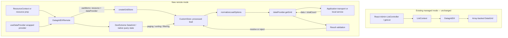

# Requirements

### Goal
Add `DatagridDXRemote` as a separate, read-only remote grid. React-Admin supplies resource identity and the wrapped DataProvider; DevExtreme owns paging, sorting, filtering, loading, and data-error presentation.

**Do not wrap `DatagridDXRemote` in React-Admin `<List>` or `<ListBase>`.** Register it directly as a resource list page. Do not use `DatagridDXPagination` with it.

### Required outcomes
- Export generic `DatagridDXRemote`, its props, and a typed `DatagridDXDataProvider.getGrid(resource, params)` contract.
- Support native `skip`/`take` paging, total count, ordered multi-column sorting, and native Filter Row expressions, including nested Boolean expressions.
- Use only public React-Admin resource/DataProvider hooks and public DevExtreme `CustomStore` APIs. No direct HTTP requests or additional React Query layer in the adapter.
- Preserve store identity during unrelated rerenders; recreate it when the resolved resource or wrapped provider changes.
- Reject executable query functions, unsupported advanced operations, and malformed results with useful errors.
- Preserve native loading and `onDataErrorOccurred` behavior.
- Keep the managed example and add a remote resource backed by an isolated, in-memory `getGrid` implementation operating on the complete customer dataset.
- Preserve all existing managed source behavior and regression tests. The reported baseline is 122 tests; verify the actual final count during implementation rather than assuming it.

### Exclusions
No dual-mode `DatagridDX`, fake `ListContext`, Python/backend service, grouping, group paging, summaries, distinct-value service, advanced filter UI, inline mutations, persistence, React-Admin remote bulk-selection integration, or managed `rowClick` parity. No dependency upgrades or new dependencies are expected. No commits, pushes, tags, or publishing.

### Plan artifact and execution boundary
This submission is the implementation handoff; this planning session does not modify files or claim implementation/test completion. The implementing agent first records the approved design in `.junie/plans/007-phase-5-remote-mode-foundation.md`, before changing implementation code, and then executes the delivery stages.

# Technical Design

### Existing implementation and references
- `src/DatagridDX.tsx` implements managed loading, sorting, selection, and navigation around `ListContext`; `src/useManagedFiltering.ts` and `src/filterUtils.ts` perform managed filter translation. None of that synchronization belongs in remote mode.
- `src/DatagridDXPagination.tsx` is the managed standalone pager; remote mode instead uses DataGrid's native pager.
- `src/types.ts` already derives generic props from `IDataGridOptions<RecordType, RecordType['id']>` with adapter-owned omissions. Follow that pattern without widening existing managed types.
- `tests/integration.test.tsx` demonstrates real `AdminContext`, `TestMemoryRouter`, provider spies, and public DataGrid refs. The remote equivalent substitutes `ResourceContextProvider` for `ListBase`.
- `examples/basic/App.tsx` contains the customer dataset, CRUD provider, and managed pages. `examples/basic/main.tsx` owns theme CSS and uses Strict Mode.
- The numbered plans `000`–`006` establish the two-mode direction and existing feature boundaries. `dist` currently contains separate component/type declarations and declarations for internal managed helpers; new remote validators must not become package exports.
- Installed DevExtreme/React wrappers are **26.1.4**; inspected public declarations include `common/data.d.ts`, `data/custom_store.d.ts`, and the React DataGrid declarations. Installed React-Admin core is **5.15.3**.

### Architecture — confirmed Store Factory


Add:
- `src/DatagridDXRemote.tsx`: context resolution, memoized store identity, generic ref forwarding, native grid configuration.
- `src/remote/types.ts`: library-owned query/result/provider contracts.
- `src/remote/loadOptions.ts`: pure normalization and small validation helpers.
- `src/remote/createGridStore.ts`: non-React factory and result validation.

Update `src/types.ts` and `src/index.ts` for the public props and explicit type/component exports. Do not export factory/validation helpers. Do not introduce a store hook or reorganize managed code for symmetry.

### Public DataProvider contract
```ts
export interface GetGridSortDescriptor {
  selector: string;
  desc: boolean;
}

export interface GetGridLoadOptions {
  skip?: number;
  take?: number;
  requireTotalCount?: boolean;
  sort?: GetGridSortDescriptor[];
  filter?: unknown[] | null;
}

export interface GetGridParams {
  loadOptions: GetGridLoadOptions;
}

export interface GetGridResult<RecordType extends RaRecord = RaRecord> {
  data: RecordType[];
  totalCount?: number;
}

export interface DatagridDXDataProvider extends DataProvider {
  getGrid<RecordType extends RaRecord = RaRecord>(
    resource: string,
    params: GetGridParams
  ): Promise<GetGridResult<RecordType>>;
}
```

`filter` is intentionally an opaque native expression array, not DevExtreme's effectively `any`-typed `FilterDescriptor` and not a new library expression grammar. `unknown` requires provider implementations to narrow values; executable contents remain forbidden at runtime. This preserves nested expressions and values without pretending to statically validate arbitrary backend operators. Document this explicitly beside the declaration.

`GetGridParams`, `GetGridResult`, and `GetGridLoadOptions` are concise names tied directly to `getGrid`; `DatagridDXDataProvider` remains library-specific. Avoid the PRD name `SerializableGridLoadOptions`: the adapter preserves `Date` values and does not promise JSON serialization.

**No `meta` and no `signal` in Phase 5.** There is no `AbortSignal` parameter in the installed `CustomStore.load` contract. Adding `meta` would require separate identity/reload semantics. Neither is fabricated.

### Resource and React lifecycle
- Resolve with public `useResourceContext({ resource })`: explicit nonempty `resource` overrides context. Reject missing/empty resource with a component-specific developer error; strip `resource` before forwarding grid props.
- Obtain `useDataProvider<DatagridDXDataProvider>()` and pass that wrapped provider to the factory.
- Keep the approved dependency boundary explicit:
```ts
const store = useMemo(
  () => createGridStore<RecordType>({ resource, dataProvider }),
  [resource, dataProvider]
);
```
- Forward `DataGridRef<RecordType, RecordType['id']>` using the existing generic component pattern. Do not retain a second page/sort/filter state or use managed synchronization helpers.
- Grid/DataSource owns subscription/disposal lifecycle; do not create an additional DataSource or invent CustomStore cancellation/disposal APIs. In-flight transport work is not promised to abort on resource changes.
- Ordinary rerenders preserve state/store. Strict Mode remounts and real provider-context changes can legitimately produce additional loads; do not promise exactly one initial request.

### Store factory and errors
Internal signature:
```ts
createGridStore<RecordType extends RaRecord>({
  resource,
  dataProvider,
}: {
  resource: string;
  dataProvider: DatagridDXDataProvider;
}): CustomStore<RecordType, RecordType['id']>
```
- Use `CustomStore` from its public module with `key: 'id'`, explicit **`loadMode: 'processed'`**, and an asynchronous `load` callback. No `insert`, `update`, `remove`, or query wrappers.
- Normalize load options, call `dataProvider.getGrid<RecordType>(resource, { loadOptions })`, validate the result, and return `{ data, totalCount }`, omitting an absent optional count.
- Internally type conversion against public `LoadResultObject<RecordType>` from `devextreme/common/data`; do not use deprecated `ResolvedData` or private types.
- Missing-method detection must account for React-Admin's provider **Proxy**: `typeof provider.getGrid === 'function'` alone is insufficient. Use a membership-aware check for a missing method and handle non-callable/misconfigured methods deliberately, verified against real `AdminContext`. Preserve the wrapped invocation rather than calling the raw provider.
- Missing method error: `DatagridDXRemote requires the React-Admin dataProvider to implement getGrid(resource, params).`
- Preserve normal rejected-provider errors through the CustomStore load to `onDataErrorOccurred`; do not replace them with successful empty data or add a notification layer.
- React-Admin authentication handling still runs through its wrapped provider. Its auth-error handling can log out and transform a rejected response; document that not every authentication failure is guaranteed to emerge as the original DevExtreme error. Test normal rejection propagation separately from authentication handling.

### Request normalization and validation
- Copy only supported fields; preserve `skip`, `take`, and `requireTotalCount`, including meaningful zero/false values. Never translate to React-Admin pagination.
- Normalize DevExtreme's single string/object and array sort forms into an ordered array of `{ selector: string, desc: boolean }`; omitted `desc` becomes `false`. Reject invalid/non-string/function selectors and malformed direction flags rather than coercing them silently.
- Preserve filter array structure, nested `and`/`or`/`!`, ordinary objects/values, and `Date` objects unchanged. Do not deep clone through JSON, serialize dates, flatten expressions, or invoke managed suffix converters.
- Recursively reject function values anywhere in supported query input. Keep the check small and cycle-safe; it is not an operator compiler or a security schema.
- Reject active/nonempty `group`, `groupSummary`, `totalSummary`, and `requireGroupCount: true` before field selection. Treat absent/null/empty advanced descriptors and `requireGroupCount: false` as inactive so normal framework defaults do not break loads.
- Audit meaningful unsupported query fields such as `select` and search inputs: fail clearly if they would change request semantics rather than silently dropping active queries. Ignore irrelevant internal bookkeeping such as `userData`; do not expand the public contract or reject benign DataSource defaults indiscriminately.
- Use public-API tests for emitted requests, not tests tied to private DevExtreme controller structures.

### Result validation
- Require a result object with `Array.isArray(result.data)`.
- If `requireTotalCount` is true, require a numeric, finite, non-negative `totalCount`.
- If count is supplied when optional, validate it by the same rules; otherwise omit it.
- Never substitute `data.length` or React-Admin `total`. No deep record validation or schema dependency. `CustomStore.key = 'id'` establishes identity; set adapter-owned `keyExpr='id'` consistently, while recognizing that the store key is authoritative for a store-backed grid.

### Public prop ownership
Derive `DatagridDXRemoteProps<RecordType>` from `IDataGridOptions<RecordType, RecordType['id']>`.

| Category | Decision |
| --- | --- |
| `resource` | Adapter-specific optional override; never forwarded |
| `dataSource`, `keyExpr`, `remoteOperations` | Omitted and supplied internally after consumer spread |
| `paging` | Native options, narrowly omitting `enabled`; adapter enforces `enabled: true` |
| `pager`, `sorting`, `filterRow` | Native typed configuration supported |
| `filterValue`, `defaultFilterValue`, native callbacks | Remain native; no React-Admin synchronization |
| `loadPanel`, `onDataErrorOccurred`, `onRowClick`, public ref | Supported native presentation/events |
| Column chooser, sizing, reordering, fixing, adaptive presentation | Native passthrough where safe |
| `stateStoring` | Omitted; no persistence |
| `grouping`, `groupPanel`, `summary` | Omitted; no current-page imitation of server operations |
| `headerFilter`, `filterBuilder`, `filterBuilderPopup`, `filterPanel`, `searchPanel` | Omitted for Phase 5 |
| `editing` | Omitted; audit editing-related generated aliases and mutation configuration |
| Selection configuration | Omit `selection`, selected-key/filter props, their default/change aliases, and selection-specific callbacks; keep native selection disabled |
| `syncLookupFilterValues` | Adapter-owned false to avoid lookup-driven grouped requests |

Use a small inline native-derived paging type rather than exporting another pagination abstraction. DevExtreme 26.1 paging already defaults to enabled with page size 20; enforcing `enabled` is an explicit API invariant, not a fix for its default. Retain the native page-size default, use 10 in the example, and preserve native pager options and zero-based grid page indexing. No custom page reset code.

Default sorting to `mode: 'multiple'`, with safe native customization. Filter Row remains opt-in through `filterRow={{ visible: true }}`. No managed `filtering` or `rowClick` convenience props are added.

Configure remote operations explicitly:
```ts
{
  paging: true,
  sorting: true,
  filtering: true,
  grouping: false,
  summary: false,
  groupPaging: false,
}
```
DevExtreme documents implied operations, and grouping/summary configuration can alter effective processing. Verify emitted requests under the supported configuration; do not rely on this object alone as a capability firewall. Disable unsupported native feature defaults where appropriate, omit conflicting top-level props, and retain load guards.

Native `<Column>` children, nested option components, and imperative instance calls can bypass top-level omissions. Document grouping properties such as `groupIndex`, summary/advanced-filter nested components, executable remote selectors, and mutation/persistence configuration as unsupported. Add regression coverage for actual advanced load requests. Do not claim a complete runtime sandbox for arbitrary DevExtreme configuration or introduce a general JSX configuration sanitizer.

### Loading and ownership
Use DevExtreme's DataSource/load-panel lifecycle for both initial and later loads. Allow safe `loadPanel` configuration. Do not use `isPending`, `isFetching`, `beginCustomLoading`, or `endCustomLoading`. Consumers needing React-Admin List-dependent components must use managed mode; no compatibility context is fabricated.

### Example and documentation
- Add `RemoteCustomerList` and a clearly labeled `remote-customers` resource in `examples/basic/App.tsx`; leave `customers` managed with its existing CRUD/edit/show behavior.
- Keep a single application DataProvider implementing standard methods plus `getGrid`; map the remote resource explicitly to the same complete customer dataset.
- Add `examples/basic/remoteQuery.ts` for the isolated evaluator/comparator. Processing order is **filter → ordered multi-sort → totalCount → skip/take** over the full dataset. Never read a DataGrid instance or reuse the managed suffix evaluator.
- Demonstrate contains, equality, and numeric comparisons using the existing numeric `id` column. Evaluate `=`, `<>`, `>`, `>=`, `<`, `<=`, `contains`, `notcontains`, `startswith`, `endswith`, and nested `and`/`or`/`!`. State demo null/string/date comparison behavior and reject unsupported operators clearly. Use deterministic stable tie handling without lodash.
- Optional short development-only latency may illustrate loading if trivial; tests use controlled promises, not real sleeps. No production delay.
- Preserve all managed README content. Add a managed/remote ownership table, exact public contract, native pager example, DataProvider extension example, transport/date serialization boundary, lifecycle/error rules, supported operations, selection decision, and limitations.

Representative usage:
```tsx
const RemoteCustomerList = () => (
  <DatagridDXRemote<Customer>
    paging={{ pageSize: 10 }}
    pager={{
      visible: true,
      showPageSizeSelector: true,
      allowedPageSizes: [5, 10, 25],
      showInfo: true,
    }}
    sorting={{ mode: 'multiple' }}
    filterRow={{ visible: true }}
    showBorders
  >
    <Column dataField="id" dataType="number" />
    <Column dataField="name" />
    <Column dataField="company" />
    <Column dataField="country" />
  </DatagridDXRemote>
);

<Resource name="remote-customers" list={RemoteCustomerList} />
```

### PRD refinements and risks
- Replace the broad serializable request sketch with five supported fields, normalized string-only sort descriptors, and an opaque guarded filter array.
- Defer `signal`, `meta`, grouped-result unions, `groupCount`, and summary output.
- Explicitly select processed loading; the documented DataGrid raw-load behavior must not cause page-local shaping of server results.
- Remote mode does not inherit managed list selection/navigation/persistence parity.
- JavaScript date serialization, operator support, field authorization, payload limits, and backend security remain application responsibilities; the small adapter validator is not a security boundary.
- Wrapped provider identity may change with React-Admin context dependencies. Scope the stability guarantee to unrelated rerenders, not remounts/auth-context replacement.
- Keep current peer ranges/dependencies. Check generated declarations against the installed public types; do not claim untested compatibility with every future DevExtreme release.
- Official references: DevExtreme v26.1 DataGrid `remoteOperations` and `paging` documentation, CustomStore `load`/`loadMode` documentation, and React-Admin custom DataProvider/useDataProvider APIs.

# Validation

### Automated coverage
Use the existing Vitest/jsdom setup and public React-Admin/DevExtreme APIs. Preserve all managed tests; do not introduce Playwright solely for this phase.

| Test file | Coverage |
| --- | --- |
| `tests/remoteLoadOptions.test.ts` | Paging fields including zero/false; single/string/multiple sort normalization and ordered descending flags; function selectors and recursively nested functions rejected; nested AND/OR/NOT preserved; no suffix conversion; Date identity preserved; active advanced fields rejected, inactive defaults tolerated |
| `tests/createGridStore.test.ts` | Factory uses key `id` and processed loads; exact resource/params mapping; data/count conversion; missing/non-callable `getGrid`; rejected loads; malformed data; missing/negative/non-numeric/non-finite count; valid zero count; optional absent count |
| `tests/DatagridDXRemote.test.tsx` | Resource context/override/missing resource; records and count reach real DataGrid; initial paging; native page/page-size changes; errors reach consumer callback; deferred loads use native loading lifecycle; store identity/page state preserved on unrelated rerender; resource/provider changes create a fresh store |
| `tests/remoteIntegration.test.tsx` | Real `AdminContext` + resource context, no `ListBase`: `getGrid >= 1`, **`getList = 0`**; native Filter Row single/multiple columns; native multi-sort with sort indexes; combined filter/sort/paging captured after interactions; no managed context dispatches |
| `tests/remoteTypes.test.tsx` and `tests/index.test.ts` | Public exports; record/id/ref/event generics; provider method generic; string-only sort selectors; supported native paging/pager/sorting/filter-row props; all owned/deferred props and relevant generated aliases absent |
| `tests/exampleRemoteQuery.test.ts` | Whole-dataset filtering before paging, count before slicing, ordered tie-breaking, nested Boolean expressions, supported operators, unknown resources/operators, empty results, and no mutation of the source dataset |

Use real Filter Row editor interactions where jsdom is reliable; otherwise use public `columnOption`, `filter`, `pageIndex`, and `pageSize` methods. Do not substitute direct factory calls for every integration test. Wait for meaningful requests rather than asserting a brittle exact initial load count. After a settled unrelated rerender, assert no avoidable reload and preserved store/state.

Use controllable promises for initial/subsequent loading and failures. Verify native DataSource loading state in jsdom; visible overlay appearance and sort indicators require browser evidence. Add an auth-wrapper check separately so ordinary load errors are not confused with logout behavior.

### Build, type, and package gates
During implementation run and fix Phase-5-caused failures in:
```text
pnpm install --frozen-lockfile
pnpm lint
pnpm format:check
pnpm typecheck
pnpm test
pnpm build
pnpm build:example
pnpm pack --json
```
Inspect `dist/index.d.ts`, `dist/types.d.ts`, `dist/DatagridDXRemote.d.ts`, and emitted contract declarations for generic preservation, readable request/result types, omitted conflicting props, and no exported internal helpers/private DevExtreme types.

Verify `vite.config.ts` externalization still covers React, React DOM, React-Admin, DevExtreme, DevExtreme React, and subpaths including `devextreme/data/custom_store`. Inspect built imports and size for accidental peer bundling. Keep theme imports exclusively in the example.

Inspect package contents against the existing `package.json` allowlist: built code/declarations, README, LICENSE, and metadata only. No tests, `.junie`, example output, credentials, local configuration, or proprietary assets. Review existing CI and preserve its checks; adjust only if needed to exercise the new files. Inspect final `git status`/`git diff` without committing.

### Example verification and evidence
Run the example during implementation and use available browser capabilities to check:
- Managed data, pager, single sort, filtering, selection/navigation, and column UX remain functional.
- Remote resource has no `<List>`, loads through `getGrid` only, and changes native page/page size correctly.
- Multi-sort precedence, Filter Row comparisons, combined queries, whole-dataset filtering, and filtered totals behave correctly.
- Loading panel, native error presentation, resizing/reordering/fixing, and consuming-app theme ownership remain correct.

Capture actual paging, multi-sort, filter, and combined request objects from tests or the running example. Clearly separate automated evidence, browser-observed evidence, and anything unverified. If browser interaction is unavailable, report that limitation rather than claiming manual success or silently adding browser infrastructure.

### Completion report
The implementing agent supplies the user's requested structured report: implemented architecture and usage; exact public types; normalization, paging, sorting/filtering with actual captured requests; resource/provider integration; lifecycle/loading/errors; validation and omitted props; `meta`/cancellation/selection decisions; example and tests; exact passing count and managed regressions; one-owner evidence; manual/browser results; exact command outcomes; declaration/bundle/package inspection; deviations, limitations, risks, PRD corrections, and Phase 6 readiness.

Recommend Phase 6 only after the frontend contract and required checks pass, with any remaining contract uncertainty called out explicitly. Do not start Python work in this phase.

# Delivery Steps

### ✓ Step 1: Define the Phase 5 contract and request boundary
The approved Phase 5 plan and a tested, library-owned remote request contract are in place.
- First create `.junie/plans/007-phase-5-remote-mode-foundation.md` from this approved design, before implementation edits.
- Add `src/remote/types.ts` with the provider extension, request/result types, and string-only sort descriptor.
- Implement `src/remote/loadOptions.ts` for supported-field selection, ordered sort normalization, recursive function rejection, and active unsupported-operation guards.
- Preserve nested filter expressions and Date values without serialization or managed conversion.
- Add normalization/type coverage, including inactive DevExtreme defaults and unsupported semantic inputs.

### ✓ Step 2: Implement the independent processed CustomStore factory
Remote loads call the wrapped getGrid method and return validated DevExtreme results or actionable errors.
- Add `src/remote/createGridStore.ts` with generic record/id typing, key `id`, and explicit `loadMode: 'processed'`.
- Use the normalizer and call only `dataProvider.getGrid(resource, { loadOptions })`; do not add HTTP, React Query, mutations, or a wrapper hook.
- Implement proxy-aware missing-method behavior and minimal result/count validation.
- Preserve rejected-provider errors through native load rejection.
- Add factory tests for data/count mapping, malformed results, unsupported requests, and errors.

### ✓ Step 3: Add the resource-aware remote grid and native paging
DatagridDXRemote renders resource data through a stable store without ListContext or getList.
- Add `src/DatagridDXRemote.tsx` using `useResourceContext`, `useDataProvider`, and the confirmed `useMemo([resource, dataProvider])` factory boundary.
- Add generic props/ref forwarding and exports in `src/types.ts` and `src/index.ts`.
- Protect adapter-owned/deferred props, enforce paging enabled, and expose native pager/load-panel/error configuration.
- Configure the explicit supported remote operations and disable unsupported selection/lookup synchronization behavior.
- Add real-context tests for resource resolution, paging/page-size requests, zero `getList` calls, store stability/recreation, loading, and native error callbacks.

### ✓ Step 4: Complete native remote sorting and Filter Row integration
Paging, ordered multi-column sorting, and native filter expressions coexist in real getGrid requests.
- Configure normal multiple sorting and expose native Filter Row configuration without managed synchronization or suffix converters.
- Complete public prop/type restrictions for advanced filter UI, grouping, summaries, persistence, editing, and selection aliases.
- Add native single/multi-sort and Filter Row interaction tests, including nested expressions and combined filter/sort/paging requests.
- Verify effective remote requests do not advertise unsupported operations and add negative advanced-operation coverage.
- Capture representative request evidence and confirm no `setSort`, `setFilters`, or fabricated ListContext dependency.

### ✓ Step 5: Deliver the dual-mode example and documented package API
The example demonstrates the contract end to end, and the built package is documented and validated for Phase 5.
- Extend `examples/basic/App.tsx` with a labeled remote resource and `getGrid` while preserving managed CRUD/list pages.
- Add `examples/basic/remoteQuery.ts` and tests for full-dataset filtering, ordered sorting, total counting, and paging.
- Expand README with both architectures, exact remote usage/provider contract, transport responsibility, and all Phase 5 restrictions and decisions.
- Run required verification commands and available example/browser checks; fix Phase-5-caused failures without weakening managed tests.
- Inspect declarations, peer externalization, package contents, and final Git diff/status; do not commit or publish.
- Produce the requested evidence-based completion report, including exact test count, actual requests, verification limitations, PRD feedback, and Phase 6 readiness.