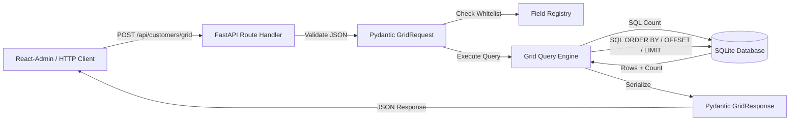

# Requirements

### Overview & Goals
Phase 5 established the frontend remote contract (`DatagridDXRemote`, `createGridStore`, and `dataProvider.getGrid(resource, { loadOptions })`). Phase 6 implements the reference backend in Python using **FastAPI** and **SQLModel** managed exclusively by **UV**.

The primary objective is to maximize developer utility and efficiency by providing a lightweight, robust, and clean reference implementation that demonstrates how server-side paging, multi-column SQL sorting, and conditional total count queries fulfill the React-Admin remote grid contract.

### Scope
- **In Scope**:
  - Python 3.13 project under `examples/remote-fastapi/backend/` managed via UV (`pyproject.toml`, `uv.lock`, `.python-version`).
  - `Customer` SQLModel database model with SQLite file storage for manual execution and isolated in-memory engines for tests.
  - Deterministic, idempotent seed generation (100 customer records).
  - Pydantic v2 wire request and response models mirroring the TypeScript `GetGridParams` / `GetGridResult` contract using camelCase aliases and `extra = "forbid"`.
  - Field registry whitelisting to safely resolve client sort selectors without `getattr()` or dynamic SQL assembly.
  - Database-level single and multi-column sorting with a deterministic `id ASC` tie-breaker.
  - Database-level pagination (`skip`, `take`, bounded server limits: default 20, max 100).
  - Conditional total count queries via SQL `COUNT(*)` when `requireTotalCount: true`.
  - Explicit rejection (HTTP 422) of non-empty filter expressions (deferring remote filter compilation to Phase 7).
  - FastAPI application factory (`create_app`) and modern lifespan management.
  - Comprehensive unit and integration test suites via Pytest and HTTPX `TestClient`.
  - Ruff linting and formatting configuration.
  - GitHub Actions CI integration via `astral-sh/setup-uv`.
  - Comprehensive documentation in `examples/remote-fastapi/README.md` including curl examples and a React-Admin DataProvider integration snippet.
- **Out of Scope**:
  - Filter expression compiler (explicitly deferred to Phase 7).
  - Grouping, summaries, group paging (deferred to Phase 8).
  - Inline editing and mutations (deferred to Phase 10).
  - State persistence (deferred to Phase 9).
  - Authentication, JWT, OAuth, or RBAC.
  - Production database migrations / Alembic (disposable reference SQLite only).
  - PyPI package packaging or distribution.
  - Modifying the committed frontend TypeScript contract in `src/remote/types.ts`.
  - Wiring the existing `examples/basic` browser app to FastAPI (deferred to Phase 7).

### User Stories
- **As a full-stack developer integrating React-Admin with DevExtreme**, I want a functional reference backend endpoint (`POST /api/customers/grid`) so that I can see how `loadOptions` are validated, parsed, and translated into database queries.
- **As a backend developer**, I want server-enforced paging bounds and an explicit field whitelist so that untrusted client input cannot overload the database or perform SQL injection.
- **As a frontend developer**, I want stable deterministic paging and multi-column sorting so that rows with identical sort keys do not shift or duplicate across page boundaries.
- **As a maintainer**, I want fast, isolated CI tests and strict linting so that the reference implementation remains verifiable and does not regress frontend functionality.

### Functional Requirements
1. **Endpoint**:
   - `POST /api/customers/grid` accepting JSON request body with `loadOptions`.
2. **Request Wire Schema (`GridRequest`)**:
   - Accepts `loadOptions` containing:
     - `skip`: optional non-negative integer (default: 0).
     - `take`: optional positive integer (default: 20, maximum: 100).
     - `requireTotalCount`: optional boolean.
     - `sort`: optional array of objects `{ "selector": string, "desc": boolean }`.
     - `filter`: optional null, empty array `[]`, or nested JSON values.
   - Forbids unknown/extra properties at all levels.
3. **Response Wire Schema (`GridResponse`)**:
   - Returns `{ "data": [...] }`.
   - Returns `"totalCount": <int>` if and only if `requireTotalCount` was true.
   - Omits `totalCount` when not requested or false.
   - Exposes customer fields: `id` (integer, non-null), `name`, `company`, `city`, `country`, `active`, `age`, `joined_on`.
4. **Field Registry**:
   - Resolves selectors against an explicit whitelist: `{"id", "name", "company", "city", "country", "active", "age", "joined_on"}`.
   - Any unknown, dotted, dunder, or SQL-like selector raises a client error resulting in HTTP 422.
5. **Database Sorting**:
   - Translates descriptors to SQL `ORDER BY col ASC/DESC`.
   - Maintains descriptor order.
   - Appends `Customer.id.asc()` as a deterministic tie-breaker unless `id` is explicitly included in the sort descriptors.
   - Uses `Customer.id.asc()` as default ordering when no sort descriptors are supplied.
6. **Database Paging**:
   - Executes `OFFSET :skip` and `LIMIT :take` at SQL query level.
7. **Total Count**:
   - Executes `SELECT COUNT(*) FROM customer` only when `requireTotalCount == true`.
8. **Filter Handling**:
   - `null` or `[]` are accepted as no active filter.
   - Non-empty filters fail closed and return HTTP 422 with an explanatory message: *"Remote filtering is not implemented by the Phase 6 reference backend; Phase 7 adds the secure filter compiler."*

### Non-Functional Requirements
- **Performance**: Zero full-table loading into Python memory. Paging, sorting, and counting must execute in SQLite.
- **Compatibility**: Requires Python >= 3.13. Locked via `uv.lock`.
- **Maintainability**: Clean project layout with minimal dependencies (`fastapi`, `sqlmodel`, `uvicorn`, `pytest`, `httpx`, `ruff`).
- **Regression Invariance**: All existing 282 frontend TypeScript tests must remain passing.

# Technical Design

### Current Implementation
The repository contains the React library `ra-devextreme-grid` with:
- `src/remote/types.ts`: TypeScript contracts `GetGridSortDescriptor`, `GetGridLoadOptions`, `GetGridParams`, `GetGridResult`, and `DatagridDXDataProvider`.
- `src/remote/loadOptions.ts`: Client-side normalization validating `skip`, `take`, `sort`, and `requireTotalCount`.
- `examples/basic/remoteQuery.ts`: An in-memory JavaScript reference implementation illustrating filter compilation and sorting.
Currently, there is no Python backend or backend example directory.

### Key Decisions
1. **Python Version**: Pinned to Python 3.13 (`requires-python = ">=3.13"`, `.python-version = "3.13"`).
   - *Rationale*: Modern, stable, officially targeted by the PRD, fully supported by UV and all target dependencies.
2. **Package Management**: Exclusive use of UV (`uv sync --locked`, `uv run`). No pip requirements or Poetry.
   - *Rationale*: Fast, reproducible, modern standard for Python tooling.
3. **Application Factory & Lifespan**: `create_app(engine: Engine | None = None) -> FastAPI` using the `@asynccontextmanager` lifespan handler.
   - *Rationale*: Enables clean, isolated in-memory test databases (`sqlite://` with `StaticPool`) without monkeypatching or shared state with example data.
4. **Wire Model Aliasing & Extra Field Rejection**: Pydantic v2 `model_config = ConfigDict(extra="forbid", populate_by_name=True)` with `Field(alias="...")`.
   - *Rationale*: Guarantees exact JSON wire parity with TypeScript camelCase contracts while preserving Pythonic snake_case internally. Rejects unknown fields immediately to prevent silent contract drift.
5. **Database-Side Query Pipeline**: Queries are composed strictly via SQLAlchemy expressions through SQLModel (`order_by`, `offset`, `limit`, `func.count()`).
   - *Rationale*: Ensures scalability and prevents memory exhaustion from loading entire tables.
6. **Explicit Field Registry**: Static dictionary mapping whitelisted string selectors to SQLModel column attributes.
   - *Rationale*: Complete immunity against SQL injection and attribute traversal attacks (`__dict__`, dotted lookups, etc.).

### Architecture Diagram


### File Structure
```text
examples/remote-fastapi/
├── README.md
└── backend/
    ├── .python-version
    ├── pyproject.toml
    ├── uv.lock
    ├── app/
    │   ├── __init__.py
    │   ├── main.py            # App factory, lifespan, routes, error handlers
    │   ├── database.py        # Engine creation and session dependency
    │   ├── models.py          # CustomerBase, Customer (table), CustomerRead
    │   ├── seed.py            # Idempotent deterministic customer seeder
    │   └── grid/
    │       ├── __init__.py
    │       ├── models.py      # GridRequest, GridLoadOptions, GridResponse, GridSortDescriptor
    │       ├── fields.py      # CUSTOMER_GRID_FIELDS whitelist, GridQueryError
    │       └── query.py       # execute_customer_grid_query (SQL execution)
    └── tests/
        ├── conftest.py        # In-memory test engine fixture, TestClient
        ├── test_api.py        # HTTP endpoint integration tests
        ├── test_grid_models.py# Pydantic parsing and validation unit tests
        ├── test_grid_fields.py# Field registry security tests
        └── test_grid_query.py # SQL sorting, paging, count, and filter rejection tests
```

### Data Models / Contracts

#### Customer Model (`app/models.py`)
```python
from datetime import date
from sqlmodel import Field, SQLModel

class CustomerBase(SQLModel):
    name: str = Field(index=True)
    company: str = Field(index=True)
    city: str = Field(index=True)
    country: str = Field(index=True)
    active: bool = Field(default=True, index=True)
    age: int | None = Field(default=None)
    joined_on: date

class Customer(CustomerBase, table=True):
    id: int | None = Field(default=None, primary_key=True)

class CustomerRead(CustomerBase):
    id: int
```

#### Wire Models (`app/grid/models.py`)
```python
from typing import Any
from pydantic import BaseModel, ConfigDict, Field, JsonValue

DEFAULT_PAGE_SIZE = 20
MAX_PAGE_SIZE = 100

class GridSortDescriptor(BaseModel):
    selector: str = Field(min_length=1)
    desc: bool

class GridLoadOptions(BaseModel):
    model_config = ConfigDict(extra="forbid", populate_by_name=True)

    skip: int | None = Field(default=0, ge=0)
    take: int | None = Field(default=DEFAULT_PAGE_SIZE, gt=0, le=MAX_PAGE_SIZE)
    require_total_count: bool | None = Field(default=None, alias="requireTotalCount")
    sort: list[GridSortDescriptor] | None = None
    filter: list[JsonValue] | None = None

class GridRequest(BaseModel):
    model_config = ConfigDict(extra="forbid", populate_by_name=True)

    load_options: GridLoadOptions = Field(alias="loadOptions")

class GridResponse(BaseModel):
    model_config = ConfigDict(populate_by_name=True)

    data: list[Any]
    total_count: int | None = Field(default=None, alias="totalCount")
```

#### Field Registry (`app/grid/fields.py`)
```python
class GridQueryError(ValueError):
    """Raised when client grid parameters fail business or security validation."""

CUSTOMER_GRID_FIELDS = {
    "id": Customer.id,
    "name": Customer.name,
    "company": Customer.company,
    "city": Customer.city,
    "country": Customer.country,
    "active": Customer.active,
    "age": Customer.age,
    "joined_on": Customer.joined_on,
}
```

### Risks & Mitigations
- **Risk: Full-table scan in Python**: Accidental `session.exec(select(Customer)).all()` before slicing.
  - *Mitigation*: Integration and structural tests verify that `offset`, `limit`, and `order_by` clauses are compiled into the SQL statement.
- **Risk: Test database pollution**: Tests writing to the persistent example SQLite file.
  - *Mitigation*: Application factory `create_app(engine)` allows pytest fixtures to inject an ephemeral `sqlite://` in-memory database using SQLAlchemy `StaticPool`.
- **Risk: Contract drift between frontend and backend**: Mismatched casing or extra properties.
  - *Mitigation*: Strict Pydantic v2 `extra="forbid"` configuration, exact field aliases, and comprehensive unit tests matching `src/remote/types.ts`.

# Testing

### Validation Approach
Verification employs a multi-tiered strategy:
1. **Pydantic Unit Tests**: Verify JSON parsing, casing aliases, validation constraints, and rejection of unknown fields.
2. **Field Registry Security Tests**: Verify allowed fields resolve and hostile selector inputs are rejected without executing SQL.
3. **Database Query Integration Tests**: Verify sorting, multi-column ordering, tie-breakers, offset/limit paging, and count queries against an isolated in-memory SQLite database.
4. **FastAPI HTTP Endpoint Tests**: Verify HTTP status codes, headers, response JSON shapes, and 422 error details using `httpx` / `TestClient`.
5. **SQL Execution Sanity**: Assert that SQL statements execute sorting, paging, and counting inside the database rather than in Python memory.
6. **Frontend Regression Suite**: Execute the full existing pnpm verification suite to ensure all 282 tests pass.

### Key Scenarios
- **Paging**:
  - Request with no `skip`/`take`: returns default 20 records.
  - Explicit `skip=10, take=5`: returns records 11 through 15.
  - Large skip past end of dataset: returns empty `data: []` without error.
  - `take > MAX_PAGE_SIZE` (e.g. 101): rejected with 422.
  - Negative `skip` or non-positive `take`: rejected with 422.
- **Total Count**:
  - `requireTotalCount=true`: returns `totalCount: 100` alongside `data`.
  - `requireTotalCount=false`: returns `data` with `totalCount` omitted from JSON.
  - `requireTotalCount` omitted: returns `data` with `totalCount` omitted.
  - Total count reflects full matching dataset size, unaffected by `take` limit.
- **Sorting**:
  - Default sort (no descriptors): orders by `id ASC`.
  - Single sort (`country ASC`): records ordered by country ascending with `id ASC` tie-breaker.
  - Single descending (`company DESC`): records ordered by company descending with `id ASC` tie-breaker.
  - Multi-column sort (`country ASC`, `company ASC`, `name DESC`): preserves descriptor precedence.
  - Explicit `id DESC`: respects user sort without appending conflicting `id ASC`.
  - Duplicate sort keys page deterministically across page boundaries.
- **Filter Rejection**:
  - `filter=null` or `filter=[]`: accepted as no-op.
  - `filter=["country", "=", "USA"]`: rejected with HTTP 422 and Phase 7 guidance message.
  - Nested expressions: rejected with HTTP 422.
- **Security & Field Registry**:
  - Unknown selector (e.g., `password_hash`): rejected with 422.
  - SQL injection payload (e.g., `name; DROP TABLE customer`): rejected with 422.
  - Dunder selector (`__class__`): rejected with 422.
  - Dotted selector (`customer.name`): rejected with 422.
  - Extra unknown wire field: rejected with 422.

### CI & Automated Tooling Checks
- `uv run ruff check .`
- `uv run ruff format --check .`
- `uv run pytest`
- `pnpm lint`
- `pnpm format:check`
- `pnpm typecheck`
- `pnpm test` (all 282 existing tests pass)
- `pnpm build`
- `pnpm build:example`
- `pnpm pack --json`

# Delivery Steps

### ✓ Step 1: Configure UV project layout, dependencies, and gitignore
The backend directory `examples/remote-fastapi/backend` has a working UV configuration with Python 3.13, locked dependencies, Ruff and Pytest settings, and updated repository `.gitignore`.

- Create the directory structure `examples/remote-fastapi/backend` with `.python-version` set to `3.13`.
- Configure `pyproject.toml` with `requires-python = ">=3.13"`, runtime dependencies (`fastapi`, `sqlmodel`, `uvicorn`), and development dependencies (`pytest`, `httpx`, `ruff`).
- Configure Ruff in `pyproject.toml` with standard linting rules, import sorting, and code formatting.
- Configure Pytest in `pyproject.toml` for test discovery under `tests/`.
- Generate `uv.lock` using `uv lock` / `uv sync`.
- Update root `.gitignore` to ignore Python cache files (`__pycache__/`, `.pytest_cache/`, `.ruff_cache/`, `*.pyc`), virtual environments (`.venv/`), and SQLite local data directories (`examples/remote-fastapi/backend/data/`).

### ✓ Step 2: Implement SQLModel customer models, database engine, and deterministic seed data
The `Customer` SQLModel and read models are defined, the SQLite engine and session factory are set up, and deterministic seed data is populated idempotently.

- Create `app/models.py` defining `CustomerBase`, table model `Customer` with `id: int | None = Field(default=None, primary_key=True)`, indexed search/sort fields (`name`, `company`, `city`, `country`, `active`), `age: int | None`, and `joined_on: date`.
- Define `CustomerRead` response model ensuring `id: int` is never null for persisted rows.
- Create `app/database.py` defining SQLite engine creation and FastAPI `get_session` dependency.
- Create `app/seed.py` generating 100 deterministic customer records using fixed lists and predictable attribute combinations.
- Implement an idempotent seed check that only inserts records when the customer table is empty, preventing record duplication across restarts.

### ✓ Step 3: Implement Pydantic wire models, field registry, and SQL grid query engine
The Pydantic wire contract, customer field registry, and SQL-level query execution engine are implemented with explicit filter-rejection safeguards.

- Create `app/grid/models.py` defining strict Pydantic v2 models with `extra = "forbid"` and camelCase aliases: `GridSortDescriptor` (`selector`, `desc`), `GridLoadOptions` (`skip`, `take`, `requireTotalCount`, `sort`, `filter: list[JsonValue] | None`), `GridRequest` (`loadOptions`), and `GridResponse` (`data`, `totalCount`).
- Define paging bounds with `DEFAULT_PAGE_SIZE = 20` and `MAX_PAGE_SIZE = 100`.
- Create `app/grid/fields.py` with an immutable whitelist mapping allowed field selectors (`id`, `name`, `company`, `city`, `country`, `active`, `age`, `joined_on`) to `Customer` table columns.
- Define a framework-light internal exception `GridQueryError(ValueError)`.
- Create `app/grid/query.py` implementing `execute_customer_grid_query(session, load_options)`:
  - If `load_options.filter` is non-empty, raise `GridQueryError` rejecting remote filtering until Phase 7.
  - If `require_total_count` is true, execute a SQL `COUNT(*)` query.
  - Apply multi-column SQL `ORDER BY` according to sort descriptors, with an automatic `Customer.id.asc()` deterministic tie-breaker (unless `id` is already explicitly sorted).
  - Apply SQL `OFFSET(skip)` and `LIMIT(take)` directly to the query.
  - Return `(records, total_count)`.

### ✓ Step 4: Implement FastAPI endpoint, app factory, and comprehensive test suite
The FastAPI application factory is implemented, the grid endpoint is mounted with 422 error translation, and comprehensive unit and integration test suites are created.

- Create `app/main.py` with `create_app(engine: Engine | None = None) -> FastAPI`, configuring the application lifespan to create tables and seed initial data.
- Mount `POST /api/customers/grid` handling `GridRequest` and returning `GridResponse` with `totalCount` excluded when null or not requested.
- Add an exception handler translating `GridQueryError` to HTTP 422 responses.
- In `tests/conftest.py`, configure an isolated in-memory SQLite engine with `StaticPool` and seeded test rows for fast, deterministic test isolation.
- Implement tests covering wire model parsing, camelCase aliases, rejection of extra fields, paging validation boundaries, field registry whitelisting and hostile string rejection, multi-column sorting and deterministic tie-breakers, total count calculation, non-empty filter rejection, and endpoint responses.
- Add an architectural test verifying that `order_by`, `offset`, `limit`, and `count` happen at the SQL query level rather than in Python memory.

### ✓ Step 5: Add documentation, update root README, and configure GitHub Actions CI
Integration documentation and examples are published, root README is updated, and GitHub Actions CI workflow runs Python checks alongside existing pnpm checks.

- Create `examples/remote-fastapi/README.md` documenting architecture, UV setup, `uv run uvicorn` execution, curl request/response examples, React-Admin `dataProvider.getGrid()` integration code, resource mapping semantics, and Phase 6 limitations.
- Update root `README.md` to reference the Phase 6 FastAPI backend in `examples/remote-fastapi/` and clarify that Phase 7 delivers the secure remote filter compiler.
- Extend `.github/workflows/ci.yml` with a Python job using `astral-sh/setup-uv@v5`, running `uv sync --locked`, `uv run ruff check .`, `uv run ruff format --check .`, and `uv run pytest` inside `examples/remote-fastapi/backend`.
- Execute full local verification: both `pnpm` suite (all 282 frontend tests, linting, packaging) and `uv` suite (Ruff, formatting check, Pytest).
- Record the finalized design in `.junie/plans/008-phase-6-fastapi-sqlmodel-backend.md`.