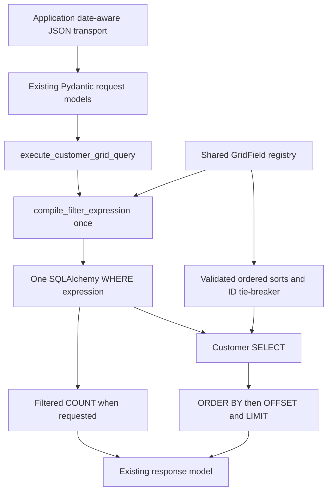

# Requirements

### Goal
Replace Phase 6’s rejection of non-empty filters with a secure, independently testable DevExtreme-to-SQLAlchemy compiler for `POST /api/customers/grid`.

### Agreed decisions
- Use one recursive traversal for structural validation, metadata resolution, value conversion, complexity accounting, and SQLAlchemy expression construction. No intermediate AST or separate validation pass.
- Accept only `YYYY-MM-DD` for `joined_on`. Reject timestamps; normalize native dates in the application transport, never in the generic npm package.
- Restrict nullable NOT using the conservative subtree-reference rule in the proposed blueprint: reject NOT over any subtree referencing nullable `age`, including explicit null checks. Direct nullable comparisons and null checks remain supported. NOT over non-nullable fields remains supported.
- Support native two-item equality shorthand by array length. `["country", "="]` means equality with the literal string `"="`, not a missing operand.

### Required behavior
- Preserve `filter?: unknown[] | null` and `filter: list[JsonValue] | None`, existing endpoint/aliases, `extra="forbid"`, response shape, and optional `totalCount`.
- Compile once; apply the same WHERE expression to records and conditional count. Filter before counting, sorting, and paging.
- Preserve ordered multi-sort, default `id ASC`, ID tie-breaking, `DEFAULT_PAGE_SIZE=20`, `MAX_PAGE_SIZE=100`, and existing paging validation.
- Resolve selectors exclusively through one explicit registry shared by sorting and filtering. Validate operators and values by field type; bind all values through SQLAlchemy.
- Return deliberate validation failures through the existing `GridQueryError` HTTP 422 handler. Do not blanket-convert unexpected exceptions into 422.

### Scope boundaries
No grouping, summaries, group paging, `anyof`/`noneof`, direct `between`, Header Filter distinct values, Search Panel, Filter Builder UI enablement, editing, persistence, authentication, relationship traversal, generic resource framework, package extraction, database-specific indexes, CORS, or browser-to-FastAPI application wiring. No core TypeScript behavior changes or dependency upgrades are planned.

### Implementation artifacts
Before source implementation, save this approved design and investigation findings to `.junie/plans/009-phase-7-secure-filter-compiler.md`. Update the FastAPI README, minimally update the root README, and produce `docs/phase-7-report.md` plus a structured completion summary. This planning session has not created or modified project files; Git status remained clean.

# Technical Design

### Existing implementation
Backend paths below are relative to `examples/remote-fastapi/backend/`.
- `app/grid/fields.py` contains `GridQueryError`, eight bare-column registry entries, and `get_customer_sort_column()`.
- `app/grid/query.py::execute_customer_grid_query()` rejects non-empty filters, conditionally counts all customers, and assembles deterministic SQL sorting/paging.
- `app/grid/models.py` already accepts nested JSON filters; `app/main.py::create_app()` already handles `GridQueryError` as 422.
- `app/models.py` declares string fields, Boolean `active`, nullable integer `age`, and DATE `joined_on`; persisted `id` is non-null despite its optional pre-insert Python annotation.
- Tests use isolated SQLite/`StaticPool` fixtures in `tests/conftest.py`. Existing rejection tests in `test_grid_query.py` and `test_api.py` must be converted, not deleted.
- `examples/basic/remoteQuery.ts` offers a small recursive example, but its JavaScript value semantics and limits are not the backend specification. `src/remote/loadOptions.ts` preserves native expressions and rejects executable functions; it remains unchanged.

### Shared field metadata
Evolve `app/grid/fields.py` using a small enum and immutable metadata:
```python
@dataclass(frozen=True, slots=True)
class GridField:
    expression: ColumnElement[Any]
    value_type: GridValueType
    sortable: bool = True
    filterable: bool = True
    nullable: bool = False
```
`GridValueType` has exactly `STRING`, `INTEGER`, `BOOLEAN`, and `DATE`. Explicit registry assignments:

| Fields | Type | Nullable |
|---|---|---|
| `id` | INTEGER | No |
| `name`, `company`, `city`, `country` | STRING | No |
| `active` | BOOLEAN | No |
| `age` | INTEGER | Yes |
| `joined_on` | DATE | No |

All current fields remain sortable/filterable. Keep `get_customer_sort_column()` compatible by returning the registered `.expression` after checking `sortable`. Filtering checks `filterable` in the same registry. No automatic SQLModel introspection, `getattr()` traversal, or separate filtering whitelist. Keep the existing exception location to avoid unnecessary module churn.

### Compiler boundary
Add `app/grid/filtering.py`:
```python
def compile_filter_expression(
    expression: list[JsonValue] | None,
    fields: Mapping[str, GridField],
) -> ColumnElement[bool] | None:
    ...
```
The compiler imports no FastAPI application code and executes no database queries. `None` and top-level `[]` return `None`; other inputs either produce a Boolean SQLAlchemy expression or raise `GridQueryError`.

Use a small recursive helper with depth and shared node-count state, plus focused condition/group/NOT/value helpers. Internal results carry the clause and nullable-field reference metadata, sufficient to identify the offending selector in NOT errors. This is compilation metadata, not an AST hierarchy.

### Exact grammar
```text
condition := [selector, value]
           | [selector, operator, value]
not       := ["!", expression]
group     := [expression]
           | [expression, "and", expression, ...]
           | [expression, "or", expression, ...]
           | [expression, expression, ...]
expression := condition | not | group
```
- Recognize reserved unary `!` first and require exactly one expression operand.
- For conditions, determine two-item shorthand versus explicit three-item form by length before interpreting the second element.
- A group parser alternates child expressions and exact connector tokens; adjacent children supply implicit `and`. Explicit and implicit AND can coexist. Any OR combined with AND, including implicit AND, at the same level rejects; nest different connector types explicitly.
- Permit single-expression wrappers and count them toward limits. Reject nested empty arrays, non-array children, leading/trailing/repeated connectors, invalid arity, invalid selector/operator types, and unsupported value structures.
- Accept only lowercase `and`, `or`, and unary `!`; do not normalize aliases or arbitrary operator text.
- Reject direct `between`, `anyof`, `noneof`, `LIKE`, `ILIKE`, `REGEXP`, `IN`, `EXEC`, `contains_raw`, custom operations, and all unknown selectors—including managed suffix names.
- Following the shorthand clarification, both `["country", "="]` and `["!", ["country", "="]]` are valid. One-item conditions remain invalid.

### Operator/type matrix
| Operator | String | Integer | Boolean | Date |
|---|---|---|---|---|
| `=` | Yes | Yes | Yes | Yes |
| `<>` | Yes | Yes | Yes | Yes |
| `>` | No | Yes | No | Yes |
| `>=` | No | Yes | No | Yes |
| `<` | No | Yes | No | Yes |
| `<=` | No | Yes | No | Yes |
| `contains` | Yes | No | No | No |
| `notcontains` | Yes | No | No | No |
| `startswith` | Yes | No | No | No |
| `endswith` | Yes | No | No | No |

### Value conversion and nulls
- String: actual JSON string only; do not stringify other values.
- Integer: actual JSON integer, explicitly excluding booleans and floats; no numeric-string coercion. Reject values outside the SQLite signed-64-bit storage/binding range rather than leaking a binding overflow as a server error.
- Boolean: actual JSON Boolean only; reject `0`, `1`, and strings.
- Date: require exact ASCII `YYYY-MM-DD`, then parse to Python `date` and reject impossible dates. Reject timestamps, offsets, whitespace variants, non-padded dates, and wrong JSON types. SQL receives a typed date, not an unchecked string.
- Null: allowed only with `=`/`<>` on nullable fields; use `.is_(None)`/`.is_not(None)`. Reject null on non-nullable fields and with every other operator.
- Ordinary non-null comparisons on `age` retain SQL semantics. In particular, `age <> 30` excludes NULL, whereas DevExtreme local filtering includes NULL; document this intentional difference.
- Propagate nullable-reference metadata through every group and NOT. Reject NOT containing nullable references before returning its clause, including double negation and apparently guarded nullable subtrees. Do not perform null-complement rewrites or logical proofs. Error example: `Unary NOT is not supported for nullable field 'age' because DevExtreme and SQL NULL semantics differ.`

### SQL expression construction
- Use registered column expressions, fixed operator dispatch, and SQLAlchemy comparison/composition APIs only: `and_`, `or_`, `not_` and typed comparisons.
- String `=`/`<>`: compare `func.lower(column)` with `func.lower(bound_value)` so case behavior is explicit on both operands.
- String searches: use SQLAlchemy `icontains`, `istartswith`, and `iendswith` with `autoescape=True`; implement `notcontains` as SQL negation of the escaped case-insensitive contains expression.
- Test literal `%`, `_`, and the escape character itself. Values—including quotes and SQL-looking text—remain bound data.
- Never use SQL text fragments, client-selected `.op()` operators, `eval`, `exec`, dynamic imports, arbitrary model traversal, Python Boolean operators on clauses, or clause truthiness.

### Complexity protection
Use these named limits in `filtering.py`:
- `MAX_FILTER_DEPTH = 16`: top-level nonempty expression is depth 1; every nested expression array increments depth. This accommodates normal nested admin filters while staying well below Python recursion limits.
- `MAX_FILTER_NODES = 200`: count every condition, NOT, and group/wrapper once, including the root; connectors and scalar operands are not separate nodes. This bounds generated clauses and binds conservatively below typical SQLite limits.
- `MAX_FILTER_STRING_LENGTH = 1024`: maximum individual string filter value in characters, enough for Filter Row input without multi-megabyte terms.

Check budgets before descending/building the next node and stop immediately on failure. Avoid prebuilding unbounded child collections. The compiler must not rely on catching `RecursionError`. JSON/Pydantic parsing occurs earlier: these are compiler limits, not an HTTP request-body-size guarantee; document upstream body-size controls as a deployment responsibility.

### Query integration
Resolve sort clauses and compile the filter before executing either statement. Apply `filter_clause` using an explicit `is not None` check to the conditional count and records query. Do not mutate or recompile it.


### Example date transport
Add a small example-only `examples/remote-fastapi/dateOnlyFilter.ts` helper and use it in the existing README’s `getGrid()` HTTP snippet. It is not exported by the npm package and does not wire a browser application.
- Non-mutating traversal of native expression arrays; recognize known DATE selector `joined_on` and condition arity, including shorthand and nested groups/NOT.
- Convert Date operands before `JSON.stringify()` using local `getFullYear()`, `getMonth()`, and `getDate()` components; validate Date validity and four-digit supported calendar years.
- Preserve already date-only strings. Do not truncate timestamps, derive dates using `toISOString().slice(0, 10)`, or normalize unrelated fields. Unsupported grammar remains for backend rejection, not transport interpretation.
- Preserve DevExtreme’s emitted operators and day boundaries, including exclusive next-day bounds. Explain that future datetime/timestamp fields need separate contracts.

### Risks and mitigations
- SQLite `lower()` is not full Unicode case folding; document the difference from JavaScript and suggest production collations, PostgreSQL `citext`, provider-specific operators, and matching indexes. Add no vendor-specific optimization here.
- Function-based comparisons may reduce ordinary-index usefulness; document rather than prematurely optimize.
- Conservative nullable NOT restriction is intentionally stricter than mathematically safe special cases; make it visible in documentation/errors.
- Native package behavior may change across versions; retain a few public-API conformance tests pinned by the existing lockfile, not imports of private implementation modules.
- Compiler limits do not make unbounded JSON bodies safe before semantic validation.
- Test fixtures must exercise genuine sort precedence: seeded UK customers all share one company, so use an additional varied fixture rather than relying solely on that seed subset.

# DevExtreme Findings

### Investigation performed
Read the supplied phase material, current backend and tests, remote adapter contracts, example grid configuration, package scripts, and existing CI. Executed disposable, read-only Node probes against installed **DevExtreme 26.1.4** using `ArrayStore` and a native DataGrid with processed `CustomStore` under the installed `jsdom`. No project files or dependencies were changed.

The current `RemoteCustomerList` in `examples/basic/App.tsx` contains numeric ID and string columns, not `joined_on`; date/Boolean columns were added only to the disposable investigation grid. These are native public-API behavior observations, not a visual browser or live FastAPI verification.

### Grammar and scalar findings
- Two-item equality is supported. `m_utils.js::normalizeBinaryCriterion` also confirms length-based equality normalization. Phase 7 deliberately excludes its permissive one-item and extra-item behavior.
- Adjacent expressions imply AND; explicit/implicit mixing with OR raises DevExtreme `E4019`. `m_array_query.js::compileGroup` corroborates this.
- Unary `!` works recursively.
- Numeric Filter Row `>= 30` reaches `CustomStore.load()` as numeric `30`, not a string. Boolean equality carries actual `true`.
- Numeric Filter Row `between [20,40]` reaches the store as `[["age",">=",20],"and",["age","<=",40]]`.
- Direct `between` fails in `ArrayStore` with `E4003`. No direct backend `between` operator is justified.

### String case and literals
On rows `Smith`, `SMITH`, `Jones`, and `sm%_ith`, default ArrayStore behavior was case-insensitive for all six requested string operators. `contains "%_"` matched only the literal `%_` row. The source uses comparable-value normalization and literal JavaScript substring operations, not SQL wildcard semantics.

The backend will intentionally use SQL-side lower-case comparisons and escaped search operations. ASCII examples should agree; broad Unicode/collation parity is not claimed.

### NULL findings
For rows with ages `[null, 30, 40, 20]`:

| Expression | DevExtreme matching positions/IDs | Backend policy |
|---|---|---|
| `age >= 30` | `2, 3` | SQL comparison |
| `age < 30` | `4` | SQL comparison |
| `age = null` | `1` | `IS NULL` |
| `age <> null` | `2, 3, 4` | `IS NOT NULL` |
| `age <> 30` | `1, 3, 4` | Normal SQL excludes null; expected `3, 4` |
| `NOT(age > 30)` | `1, 2, 4` | Reject under the approved nullable-NOT restriction |

The installed evaluator explicitly negates two-valued JavaScript results, unlike SQL UNKNOWN propagation. No unsafe SQL rewriting will attempt to imitate that behavior. SQL-side expected results will be verified during implementation; they were not executed during planning.

### Date Filter Row output
With native Date input for January 15, 2024, the store receives Date objects, not date-only strings. Because `normalizeLoadOptions()` preserves the filter reference, the application DataProvider retains those Date objects.

| Filter Row operation | Native comparison shape, shown as calendar dates |
|---|---|
| `= Jan 15` | `>= Jan 15 AND < Jan 16` |
| `<> Jan 15` | `< Jan 15 OR >= Jan 16` |
| `> Jan 15` | `>= Jan 16` |
| `>= Jan 15` | `>= Jan 15` |
| `< Jan 15` | `< Jan 15` |
| `<= Jan 15` | `< Jan 16` |
| `between Jan 15–17` | `>= Jan 15 AND < Jan 18` |

The compiler should consume these native comparison groups without re-expanding or adjusting their boundaries.

Normal JSON serialization produced UTC timestamps. Repeating the native-grid probe with `TZ=Asia/Tokyo` produced:
```text
Local January 15 midnight → 2024-01-14T15:00:00.000Z
Local-component normalization → 2024-01-15
```
For date equality, the normalized filter was:
```json
[["joined_on", ">=", "2024-01-15"], "and", ["joined_on", "<", "2024-01-16"]]
```
This directly supports the approved date-only contract. The existing FastAPI README incorrectly illustrates `JSON.stringify(Date)` as a date-only value and must be corrected.

### Investigation limits
DevExtreme emitted trial/license and jsdom theme warnings; the probes completed. Python tests, full frontend gates, and live API tests have not been run in this planning session. The IDE reports an existing backend virtual environment but no attached interpreter; no IDE/project configuration was modified to run Python.

# Validation & Reporting

### Compiler and SQL tests
Add `examples/remote-fastapi/backend/tests/test_grid_filtering.py`, separating pure validation tests from execution tests. Extend registry, query, and endpoint tests using existing isolated SQLite fixtures plus a small explicit dataset with mixed case, literal wildcard/quote text, varied sort keys, nullable ages, Booleans, and date boundaries.

Cover:
- Every allowed operator/type pair and every prohibited pair; equality/inequality across string, integer, Boolean, date, and null categories.
- Shorthand `["country","UK"]`, `["country","="]`, `["active",true]`, `["age",null]`, and equivalence with explicit conditions. Test literal operator-looking values to prevent arity regressions.
- Numeric/date comparison boundaries, signed-integer bounds, bool-versus-int rejection, numeric strings, floats, objects/arrays, invalid/impossible dates, and full-timestamp rejection.
- Case-insensitive string equality/inequality and all four searches; empty text, `%`, `_`, escape character, apostrophe, quote, and SQL-looking text. Inspect bound parameters and execute results; avoid large SQL snapshots or `literal_binds` assertions for security tests.
- AND/OR with two and multiple terms, implicit AND, single-child wrappers, nested expressions with fixed expected IDs, non-nullable NOT, nested/double NOT, and conservative rejection of every nullable-reference NOT subtree.
- Top-level `None`/`[]`; nested empties, one-item conditions, extra operands, malformed NOT, non-string selectors/operators, dangling/repeated/unknown connectors, and mixed flat groups. Update obsolete malformed cases that are now valid shorthand.
- Unknown/dotted/dunder/SQL-looking selectors; managed suffix selectors; unknown operators and custom structures, including `between`, `anyof`, and `noneof`.
- Depth exactly 16 and 17; nodes near/exactly 200 and 201, counting wrappers; string values exactly 1024 and 1025 characters. Over-limit direct calls raise `GridQueryError`, not runtime indexing/type/recursion errors.
- Hostile values behave as literal data, cannot broaden the result unexpectedly, and leave the Customer table and row count intact. Do not execute destructive SQL.
- Registry tests prove sort/filter flags are respected and all eight configured fields have correct types/nullability. Prefer expression identity checks over SQL-expression truthiness.

### Query and endpoint tests
- Replace the Phase 6 non-empty-filter rejection tests with successful simple/nested filtering and targeted malformed-filter 422 cases.
- Verify compilation happens once; statements share the same WHERE condition; validation happens before execution; no COUNT runs unless requested.
- Prove filtering precedes count, sort, offset, and limit using result IDs and lightweight statement instrumentation. Retain all existing deterministic sorting/paging tests.
- Seed example: `country = UK`, `take=5`, `requireTotalCount=true` should return five rows and `totalCount=10`, not 100 or 5. Confirm this expectation by execution before documenting it as an actual result.
- Test the requested active-UK filter with `company ASC`, `name DESC`, `skip=5`, `take=5`; repeat for determinism. Add a varied fixture so both sort priorities genuinely affect ordering, including ties requiring ID order.
- Cover zero matches, skips beyond the filtered result, absent/false count, explicit ID descending, and default ordering.
- Verify malformed filters, unknown selectors, invalid type/operator combinations, prohibited nullable NOT, and complexity violations return the existing 422 shape without SQL/connection/stack details.
- Retain extra-field rejection, page-size safeguards, aliases, and OpenAPI tests. Unexpected programming/database failures must not be caught as grid-query errors.

### Native and transport evidence tests
Add a small `tests/remoteFilteringSemantics.test.tsx` using existing real-grid test patterns and public DevExtreme APIs to retain representative ArrayStore and processed-store evidence: case, numeric/Boolean transport, shorthand, implicit AND, mixed-group rejection, numeric/date range expansion, and Date preservation. Use a handful of fixtures, not a second evaluator or cross-language framework.

Add `tests/dateOnlyFilter.test.ts` for the example helper: local-component preservation, positive/negative timezone evidence, nested arrays, shorthand, exclusive next-day bounds, invalid Dates, immutability, and no conversion of unrelated fields. Run deterministic non-UTC probes rather than relying on the machine’s timezone. Cross-check representative backend result IDs against the observed local dataset and explicitly record the accepted NULL/Unicode differences.

### Live HTTP verification
After automated backend tests, run a temporary Uvicorn process and issue actual requests for:
1. Simple string filter.
2. Numeric comparison.
3. Boolean filter.
4. Nested AND/OR.
5. Filtered total count.
6. Combined filtering, multi-sort, and paging.
7. Malformed filter returning 422.
8. Unknown selector returning 422.
9. Hostile value behaving as data.

Also smoke-test date-only success/timestamp rejection and nullable-NOT rejection. Use isolated temporary data, capture actual statuses/counts/IDs, and stop the server cleanly in guaranteed cleanup.

### Required verification gates
From repository root:
```text
pnpm install --frozen-lockfile
pnpm lint
pnpm format:check
pnpm typecheck
pnpm test
pnpm build
pnpm build:example
pnpm pack --json
```
From `examples/remote-fastapi/backend`:
```text
uv sync --locked
uv run ruff check .
uv run ruff format --check .
uv run pytest
```
Finally run `git diff --check`, `git status`, and `git diff`; inspect the package contents and remove only generated verification artifacts. Do not commit, push, tag, or publish. Keep `.github/workflows/ci.yml`: its existing Python job automatically discovers the new tests, and the frontend job remains unchanged.

The historical baselines are 35 Python and approximately 282 frontend tests, not results from this session. Report exact final counts and command outcomes, including warnings or blockers, rather than assuming those numbers.

### Documentation and completion report
- FastAPI README: supported grammar/operator table, registry/value rules, conservative nullable NOT, ordinary nullable inequality caveat, date transport helper and native day-range output, deliberate case behavior, LIKE escaping, limits, 422 examples, query pipeline, performance/deployment caveats, and successful simple/nested curl requests using seeded UK/France values.
- Root README: minimally mark secure remote filtering as implemented and link to the example documentation.
- `docs/phase-7-report.md`: retain every requested report category—implementation/grammar/operators; metadata/value conversion; mandatory date/case/NULL investigations and parity evidence; SQL/binds/escaping/parser/limits; filtered count and actual combined request results; errors/security review; files/tests/exact counts; live HTTP and every verification command; unchanged type/OpenAPI shape; deviations/limitations/risks; PRD feedback; Phase 7B recommendation; Phase 8 readiness.
- Explicitly audit registry-only SQL structure, operator/type whitelists, binding, escaping, NULL/date rules, budgets, malformed nesting, compile-once/shared-WHERE behavior, deterministic paging, strict request validation, and absence of accidentally enabled advanced features. Resolve findings within Phase 7 scope.
- Record PRD feedback without rewriting the PRD: native grammar needs explicit date transport, NULL restrictions, and collation qualifications rather than blanket parity claims.
- Recommend a small **Phase 7B — Browser-to-FastAPI End-to-End Example** before Phase 8 to exercise the date transport and real Filter Row/network/error flow. State its separate CORS/launch/documentation cost; do not implement it here.
- Assess whether the registry/compiler/query split is ready for grouping and summaries, identifying unresolved verification or semantic issues first. Do not begin Phase 8.

# Delivery Steps

### ✓ Step 1: Introduce the shared typed field registry
Sorting continues unchanged through an explicit registry that also defines filtering types and capabilities.
- Before source changes, write the approved design and observed DevExtreme evidence to `.junie/plans/009-phase-7-secure-filter-compiler.md`.
- Add `GridValueType` and immutable `GridField` metadata in backend `app/grid/fields.py`; assign all eight Customer fields explicitly, with only `age` nullable.
- Preserve `get_customer_sort_column()` as a compatible resolver returning `.expression` and checking `sortable`.
- Extend `tests/test_grid_fields.py` for types, flags, nullability, expression identity, and hostile selectors; retain sorting regression coverage.

### ✓ Step 2: Compile typed conditions into bound SQL expressions
The dedicated compiler securely handles explicit and shorthand conditions across all four field types.
- Add backend `app/grid/filtering.py` with the agreed `compile_filter_expression()` boundary, top-level no-filter handling, and shared validation/value helpers.
- Distinguish shorthand by arity, resolve registered fields, enforce the operator/type matrix, and reject malformed/unsupported inputs with `GridQueryError`.
- Implement strict integer/Boolean/string/date conversion, signed-integer storage bounds, date-only rejection rules, explicit null predicates, and the string-value limit.
- Build comparisons and intentionally case-insensitive escaped searches exclusively with SQLAlchemy APIs and bound values.
- Add pure compiler and SQLite execution tests in `tests/test_grid_filtering.py`, including shorthand literal `"="`, every operator category, wildcards, wrong types, and hostile values.

### ✓ Step 3: Add bounded recursive Boolean compilation
Nested native Boolean filters compile in one traversal with deterministic grammar and targeted nullable-NOT rejection.
- Extend `filtering.py` with small group/NOT helpers, shared node accounting, depth checks, and nullable-reference metadata propagation.
- Support homogeneous AND/OR, implicit AND, single-child wrappers, and nested non-nullable NOT; reject mixed groups, malformed children, nested empties, and any NOT subtree referencing a nullable field.
- Enforce depth 16 and 200 expression nodes before descending or building further clauses; keep no AST or second tree-validation pass.
- Add boundary, malformed/security, expected-ID Boolean, and nullable-NOT tests; retain selected DevExtreme public-API behavior probes in `tests/remoteFilteringSemantics.test.tsx`.

### ✓ Step 4: Apply one compiled filter to count and paged queries
The endpoint returns filtered totals and correctly ordered pages using one compiled WHERE expression.
- Replace Phase 6 rejection in backend `app/grid/query.py`; validate sorting and compile filtering before database execution.
- Reuse the clause in conditional count and Customer SELECT, preserving descriptor order, ID tie-breaking, OFFSET/LIMIT, and response-count omission.
- Convert existing rejection tests in `test_grid_query.py` and `test_api.py`; add combined filter/sort/page fixtures, count correctness, compile-once/no-unrequested-count checks, and representative 422 cases.
- Retain strict wire/OpenAPI and page-size tests; run the complete backend pytest/Ruff gates.
- Perform the specified real Uvicorn HTTP smoke checks with isolated data and guaranteed server cleanup, recording actual results for the report.

### ✓ Step 5: Deliver date transport guidance and verified Phase 7 documentation
The reference documentation demonstrates safe date-only transport and reports verified filtering behavior without adding a browser application.
- Add the small example-only `examples/remote-fastapi/dateOnlyFilter.ts` helper and `tests/dateOnlyFilter.test.ts`; normalize known DATE operands using local calendar components before JSON serialization without modifying core package code.
- Update the FastAPI README’s existing `getGrid()` snippet, date explanation, native grammar, SQL/null/case/security rules, limits, caveats, and successful seeded curl examples; minimally update the root status and link.
- Run all required frontend install/lint/format/typecheck/test/build/example/package gates and final backend checks; inspect package contents and final diff cleanliness without committing or publishing.
- Complete `docs/phase-7-report.md` with actual counts, API outcomes, mandatory investigations, security/architecture audit, deviations, and limitations.
- Record PRD feedback and a separate Phase 7B recommendation; assess Phase 8 readiness without implementing either later phase.